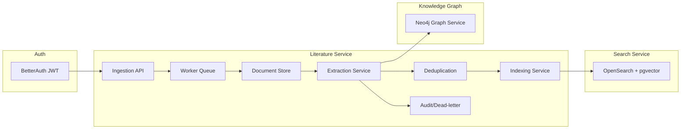
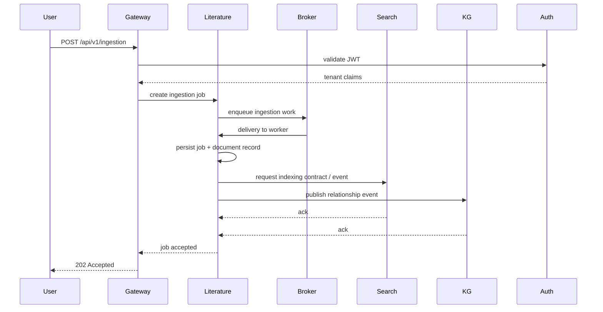

# Literature Intelligence Architecture v2

## Purpose
The Literature Intelligence service ingests, enriches, and normalizes biomedical literature while enabling safe search, knowledge graph population, and downstream AI workflows.

This version adds production readiness, scaling, resilience, security, and explicit integration contracts to support implementation.

## What Changed in v2
- Added deployment, scaling, operational, and monitoring requirements.
- Defined event transport fallback and schema expectations.
- Clarified search embedding ownership and contract.
- Completed tenant isolation requirements for all owned tables.
- Added external-source reliability, retry, and dead-letter handling.
- Added audit / data governance and retention expectations.

## Design Principles
- Own literature ingestion, extraction, canonicalization, and indexing orchestration.
- Reuse existing services for auth (`services/auth`), search (`services/search`), and knowledge graph (`services/kg`).
- Never duplicate auth, search query, or Neo4j persistence APIs.
- Keep domain state in literature Postgres tables and push search index changes through the search service.
- Keep event schemas explicit, versioned, idempotent, and secure.
- Build for horizontal scale and failure isolation.

## Folder Structure
The Literature Intelligence service remains in `services/literature` with the following internal structure:

- `services/literature/`
  - `app/`
    - `core/`
      - `config.py`
      - `security.py`
      - `db.py`
      - `events.py`
      - `auditing.py`
    - `routers/`
      - `ingestion.py`
      - `papers.py`
      - `entities.py`
      - `relationships.py`
      - `duplicates.py`
      - `status.py`
    - `services/`
      - `ingestion_service.py`
      - `document_service.py`
      - `extraction_service.py`
      - `duplicate_service.py`
      - `annotation_service.py`
      - `indexing_service.py`
      - `retry_service.py`
    - `models/`
      - `schemas.py`
      - `db_models.py`
      - `events.py`
    - `pipelines/`
      - `ingestion_pipeline.py`
      - `extraction_pipeline.py`
      - `metadata_pipeline.py`
    - `integrations/`
      - `auth_client.py`
      - `search_client.py`
      - `kg_client.py`
      - `llm_client.py`
      - `external_sources.py`
    - `workers/`
      - `ingestion_worker.py`
      - `extraction_worker.py`
      - `deduplication_worker.py`
      - `indexing_worker.py`
      - `dead_letter_worker.py`
    - `utils/`
      - `logging.py`
      - `tenant.py`
      - `metrics.py`
      - `schemas.py`
      - `validation.py`
  - `Dockerfile`
  - `requirements.txt`
  - `README.md`
  - `RUNBOOK.md`

## Internal Modules

### `core`
- `config.py`: loads environment settings including Postgres, Redis, event broker, JWT verification keys, service URLs, and operational thresholds.
- `db.py`: owns literature Postgres connection, connection pool sizing, schema migration helpers, and transaction hints for bulk ingestion.
- `security.py`: validates JWT tokens and extracts tenant claims; supports local token validation and auth-service introspection.
- `events.py`: emits versioned, typed events with tenant metadata and producer audit tags.
- `auditing.py`: writes audit records for ingestion, extraction, and event publishing.

### `routers`
- `ingestion.py`: handles ingestion job creation, status, cancellation, and manual retry endpoints.
- `papers.py`: exposes paper lookup, search metadata, and document retrieval with summary and citation details.
- `entities.py`: exposes extracted entities with filtering and pagination.
- `relationships.py`: exposes extracted relationship candidates and evidence.
- `duplicates.py`: exposes duplicate detection and resolution actions.
- `status.py`: health checks, readiness, and dependency self-assessment.

### `services`
- `ingestion_service.py`: orchestrates source ingestion, job lifecycle, ingestion batching, and dedup-safe persistence.
- `document_service.py`: owns document creation, normalization, chunked text storage, summary generation, and metadata enrichment.
- `extraction_service.py`: orchestrates NER, relation extraction, citation extraction, and evidence ranking.
- `duplicate_service.py`: detects duplicates by canonical keys, dedup group scoring, and canonical resolution.
- `annotation_service.py`: manages manual corrections, provenance annotations, and audit history.
- `indexing_service.py`: pushes embeddings and search metadata to the search service, using bulk and incremental upsert semantics.
- `retry_service.py`: encapsulates external-source retries, backoff, circuit-breaker, and dead-letter enqueueing.

### `models`
- `schemas.py`: FastAPI request/response models, sorting, paging, and tenant DTOs.
- `db_models.py`: database table schemas and row mapping definitions.
- `events.py`: event payload models and version schemas.

### `pipelines`
- `ingestion_pipeline.py`: fetches content from source adapters, normalizes IDs, and writes documents incrementally.
- `extraction_pipeline.py`: decomposes content into chunks, extracts entities/relations, and stores structured output.
- `metadata_pipeline.py`: enriches with DOI normalization, citation extraction, entity canonicalization, and external metadata lookups.

### `integrations`
- `auth_client.py`: validates tokens, optionally introspects sessions, and fetches tenant metadata from auth service.
- `search_client.py`: calls `services/search` for query and embedding upsert; defines the exact contract for `GET /api/v1/search` and `POST /api/v1/search`.
- `kg_client.py`: publishes relationship events and supports synchronous graph import endpoints only when required.
- `llm_client.py`: interacts with existing `apps/ai-services` or external LLMs for summarization and extraction.
- `external_sources.py`: implements source-specific adapters, rate limit management, and fetcher health.

### `workers`
- `ingestion_worker.py`: processes ingestion work items from queue or broker.
- `extraction_worker.py`: processes extraction jobs in isolation and supports autoscaling.
- `deduplication_worker.py`: canonicalizes duplicates and updates document status.
- `indexing_worker.py`: flushes bulk search/index updates and monitors indexing latency.
- `dead_letter_worker.py`: inspects and retries or escalates failed messages.

### `utils`
- `tenant.py`: tenant propagation helpers, session variables, and RLS-enforced query filters.
- `validation.py`: schema validation, source input sanitation, and external URL filtering.
- `logging.py`: structured JSON logs with correlation IDs, tenant IDs, and pathway tags.
- `metrics.py`: application metrics, SLA counters, and exporter helpers.
- `schemas.py`: shared schema helpers for page, sort, and filter definitions.

## Production Requirements
The service must support:
- containerized deployments with environment-driven configuration
- horizontal scaling of ingestion, extraction, and indexing workers
- health checks, readiness probes, and dependency checks
- metrics for throughput, error rates, latency, and backlog
- structured audit trails and request tracing
- tenant-aware access control and row-level security
- per-source rate limiting, retry, and dead-letter handling
- encrypted transport for events and secrets
- retention and archival policies for documents and extracted artifacts

## Operational & Deployment Model
- Deploy as separate service in Kubernetes / container platform.
- Use CPU/memory autoscaling based on queue backlog and worker utilization.
- Use a shared Postgres instance with separate schema; apply connection pooling and statement timeout defaults.
- Use a broker-backed queue or Kafka topic for work distribution.
- Define self-healing: readiness fails when Postgres, auth, search, or event broker are unavailable.
- Use `RUNBOOK.md` to capture run, rollback, and incident steps.

## Resilience & Failure Handling
- Ingestion and extraction are async by default; use queues to decouple API from work.
- External-source calls are wrapped in retries with exponential backoff, jitter, and source-specific rate limits.
- Failed ingestion chunks move to dead-letter storage with failure reason and retry count.
- Search indexing uses bulk upsert and retries with delegation to the search service.
- Extraction failures are recorded per-document and do not block unrelated jobs.
- Provide manual retry and resume APIs for failed ingestion and extraction jobs.

## Observability
- Emit metrics:
  - ingestion jobs created, succeeded, failed
  - documents ingested, processed, indexed
  - extraction latency and queue wait time
  - dead-letter count and retry rates
  - search upsert success/failure
- Expose health endpoints:
  - `/healthz` (live)
  - `/readyz` (ready)
  - `/status` (dependency overview)
- Correlate logs with `request_id`, `tenant_id`, `job_id`, and `document_id`.
- Use structured logging and trace context for all external calls.
- Define alert conditions for service errors, broker backlog, Postgres pool exhaustion, and external source failures.

## Data Governance
- Persist only the literature and extracted artifacts required for search and graph workflows.
- Support configurable retention policies for raw text, metadata, and entity/relationship artifacts.
- Provide audit records for ingestion actions, duplicate resolutions, and event publications.
- Support redaction of sensitive identifiers before indexing or graph publication.

## Security Model
- Authenticate every request with `Authorization: Bearer <token>`.
- Accept only validated JWTs signed by the trusted auth issuer or verified via auth-service introspection.
- Derive `organization_id`, `workspace_id`, `project_id`, and roles from auth claims.
- Enforce tenant isolation with query-level filters and Postgres RLS.
- Encrypt all service-to-service traffic and event transport.
- Limit sensitive tenant metadata in event payloads and use topic-level access control.
- Enforce least privilege on service credentials and external-source keys.

## Tenant Isolation
- All owned tables include `organization_id`, `workspace_id`, and `project_id`.
- Authorization decisions are enforced inside the service, regardless of gateway behavior.
- Search and graph integrations propagate tenant metadata explicitly.
- Postgres session variables and RLS policies are used where supported.

## Search Contract Clarification
- `services/search` remains the canonical search layer.
- Literature service calls:
  - `GET /api/v1/search?q=<text>&scope=literature` for keyword search
  - `POST /api/v1/search` with payload `{ query, embedding, filters, tenant }` for hybrid search
  - `POST /api/v1/search/index` or equivalent for document embedding upsert if supported by search service
- Search upsert is idempotent and scoped by `document_id`, `organization_id`, and `workspace_id`.
- If the search service cannot accept direct upsert, literature must publish an indexing event instead.

## Knowledge Graph Contract
- `services/kg` remains graph persistence owner.
- Literature publishes versioned, typed events for candidate entities and relationships.
- Event consumers must handle idempotent delivery and partial ordering.
- The literature service may support a synchronous import endpoint only as fallback, but primary integration uses event-driven exchange.

## Event Transport & Fallback
- Preferred: Kafka topics with encryption, authentication, and authorization.
- Fallback: durable internal queue with persistent retry and dead-letter storage.
- Events are typed and versioned with schema fields:
  - `event_id`
  - `event_type`
  - `version`
  - `tenant` metadata
  - `document_id`
  - `payload`
  - `timestamp`
  - `trace_id`
- Event payloads explicitly omit raw document body unless required.

## Data Flow Diagram

## Sequence Diagram

## Compliance with Existing Repo
- Keeps `services/literature` as the ownership boundary.
- Reuses `services/search` vector store and `services/auth` tenant model.
- Avoids adding new Neo4j tables; graph ingestion is event-driven and handled by `services/kg`.
- Avoids duplicating auth APIs by using the same token model.
- Uses the existing `services/literature` endpoint names and extends them rather than replacing.
- Adds production-grade operational, security, and integration contracts needed for implementation.
