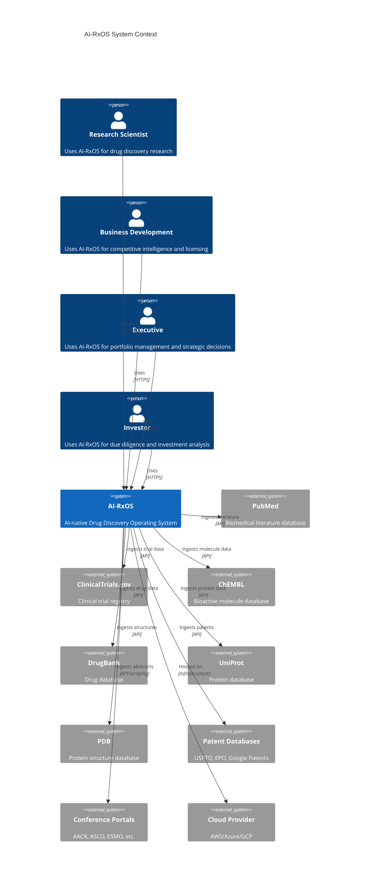
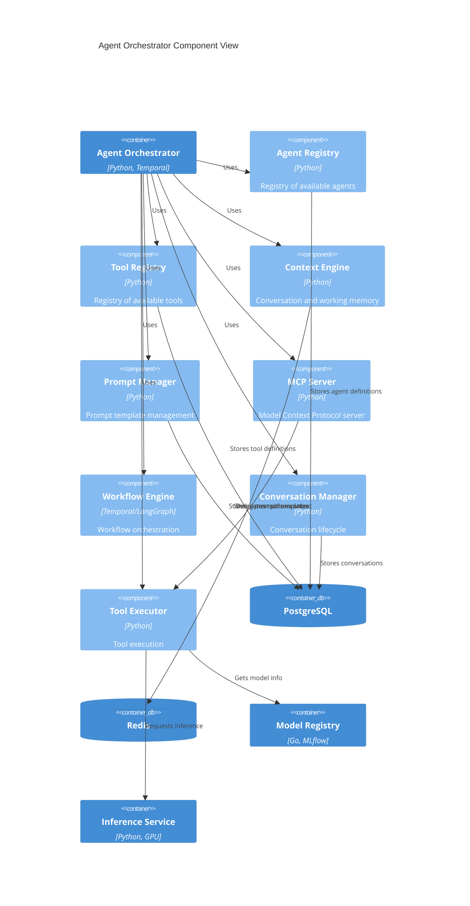
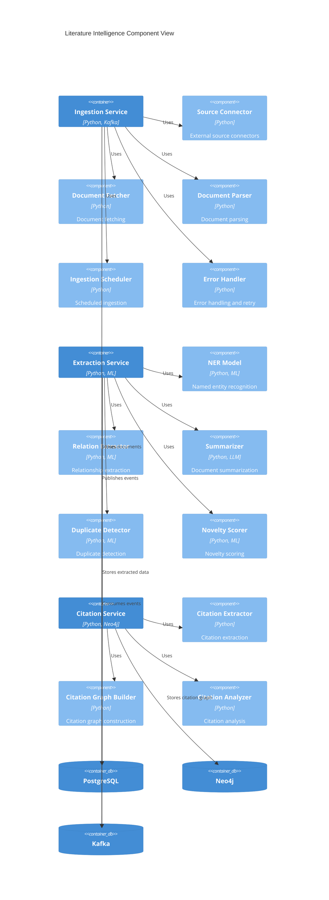
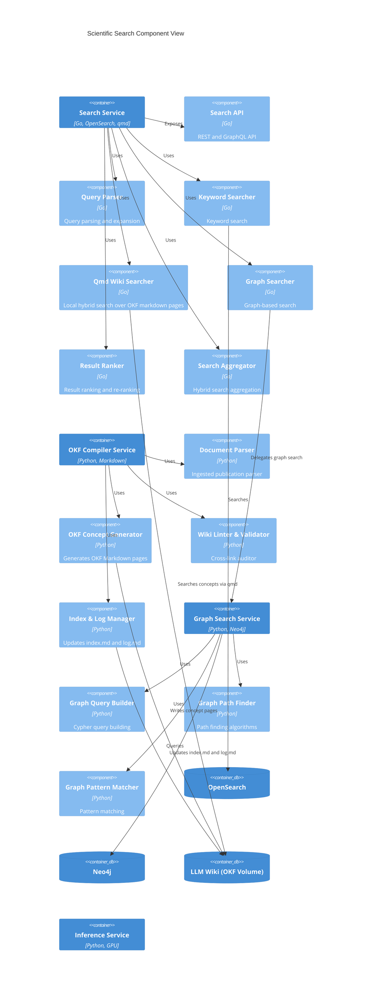
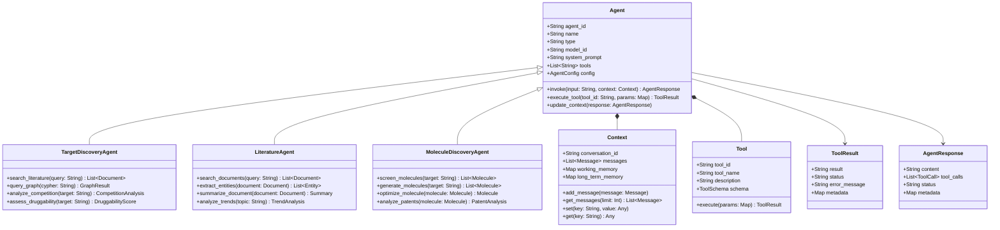
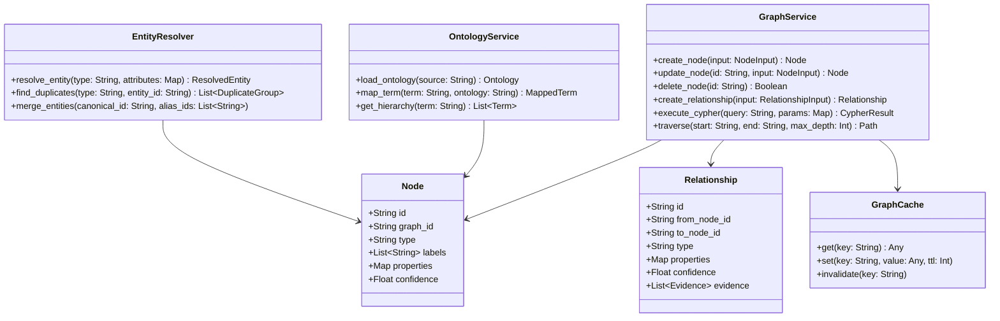
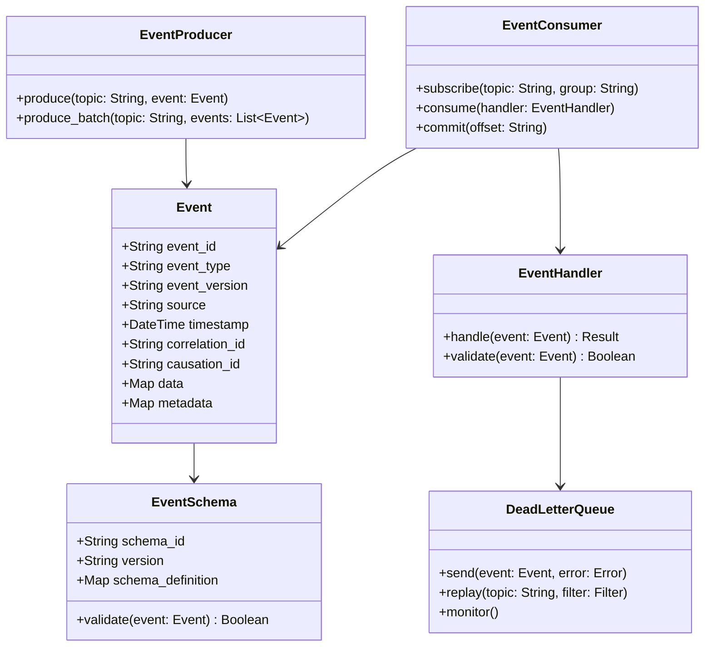
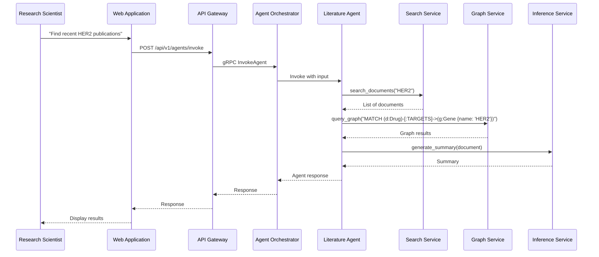

# C4 Model Diagrams - AI-RxOS

## Overview
C4 model diagrams provide a hierarchical view of the AI-RxOS system architecture across four levels of abstraction.

---

## C4 Level 1: System Context

### System Context Diagram



### System Context Description

**AI-RxOS** is an AI-native drug discovery operating system that enables pharmaceutical companies, biotechnology firms, and academic institutions to accelerate drug discovery through AI agents, knowledge graphs, and automated literature intelligence.

**External Users:**
- **Research Scientist**: Uses the platform for literature review, target discovery, and molecule design
- **Business Development**: Uses the platform for competitive intelligence and licensing opportunities
- **Executive**: Uses the platform for portfolio management and strategic decision-making
- **Investor**: Uses the platform for due diligence and investment analysis

**External Systems:**
- **PubMed**: Source of biomedical literature
- **ClinicalTrials.gov**: Source of clinical trial data
- **ChEMBL**: Source of bioactive molecule data
- **DrugBank**: Source of drug information
- **UniProt**: Source of protein information
- **PDB**: Source of protein structures
- **Patent Databases**: Source of patent information
- **Conference Portals**: Source of conference abstracts
- **Cloud Provider**: Infrastructure hosting

---

## C4 Level 2: Container View

### Container Diagram

```mermaid
C4Container
    title AI-RxOS Container View
    
    Person(user, "Research Scientist")
    
    Container_Boundary(web_application, "Web Application") {
        Container(web_app, "Web Application", "Next.js, React, TypeScript", "User interface for AI-RxOS")
        Container(mobile_app, "Mobile Application", "React Native", "Mobile interface for AI-RxOS")
    }
    
    Container_Boundary(api_layer, "API Layer") {
        Container(api_gateway, "API Gateway", "Kong/Envoy", "API routing, rate limiting, authentication")
        Container(bff, "Backend for Frontend", "Node.js/Go", "API aggregation, GraphQL federation")
    }
    
    Container_Boundary(identity_access, "Identity & Access") {
        Container(auth_service, "Auth Service", "Node.js, PostgreSQL", "Authentication, authorization, and tenant management (Better Auth)")
    }
    
    Container_Boundary(knowledge_graph, "Knowledge Graph") {
        Container(graph_service, "Graph Service", "Go, Neo4j", "Graph operations, querying")
        Container(entity_resolution, "Entity Resolution Service", "Python, ML", "Entity deduplication")
        Container(ontology_service, "Ontology Service", "Python, Neo4j", "Ontology management")
    }
    
    Container_Boundary(literature_intelligence, "Literature Intelligence") {
        Container(ingestion_service, "Ingestion Service", "Python, Kafka", "Document ingestion")
        Container(extraction_service, "Extraction Service", "Python, ML", "Entity extraction, NLP")
        Container(citation_service, "Citation Service", "Python, Neo4j", "Citation network")
    }
    
    Container_Boundary(ai_orchestration, "AI Orchestration") {
        Container(agent_orchestrator, "Agent Orchestrator", "Python, Temporal", "Agent coordination")
        Container(model_registry, "Model Registry", "Go, MLflow", "Model versioning")
        Container(inference_service, "Inference Service", "Python, GPU", "AI model inference")
        Container(prompt_service, "Prompt Service", "Go, PostgreSQL", "Prompt management")
    }
    
    Container_Boundary(scientific_search, "Scientific Search") {
        Container(search_service, "Search Service", "Go, OpenSearch, qmd", "Unified search over keyword and OKF wiki")
        Container(okf_compiler, "OKF Compiler Service", "Python, Markdown", "Compiles ingested data into OKF markdown pages")
        Container(graph_search, "Graph Search Service", "Python, Neo4j", "Graph-based search")
    }
    
    Container_Boundary(molecule_discovery, "Molecule Discovery") {
        Container(molecule_service, "Molecule Service", "Python, RDKit", "Molecular data")
        Container(docking_service, "Docking Service", "Python, GPU", "Molecular docking")
        Container(admet_service, "ADMET Service", "Python, GPU", "ADMET prediction")
        Container(generative_chemistry, "Generative Chemistry", "Python, GPU", "Molecule generation")
    }
    
    Container_Boundary(clinical_intelligence, "Clinical Intelligence") {
        Container(clinical_trial_service, "Clinical Trial Service", "Go, PostgreSQL", "Clinical trial data")
        Container(clinical_prediction, "Clinical Prediction", "Python, GPU", "Clinical predictions")
    }
    
    Container_Boundary(competitive_intelligence, "Competitive Intelligence") {
        Container(competitor_service, "Competitor Service", "Go, PostgreSQL", "Competitor tracking")
        Container(market_intelligence, "Market Intelligence", "Python", "Market analysis")
    }
    
    Container_Boundary(portfolio_management, "Portfolio Management") {
        Container(portfolio_service, "Portfolio Service", "Go, PostgreSQL", "Portfolio management")
        Container(scoring_engine, "Scoring Engine", "Python, ML", "Asset scoring")
    }
    
    Container_Boundary(collaboration, "Collaboration") {
        Container(notebook_service, "Notebook Service", "Go, PostgreSQL", "Scientific notebooks")
        Container(document_service, "Document Service", "Go, S3", "Document management")
        Container(report_service, "Report Service", "Python", "Report generation")
    }
    
    Container_Boundary(data_integration, "Data Integration") {
        Container(connector_service, "Connector Service", "Go", "External data connectors")
        Container(transformation_service, "Transformation Service", "Python", "Data transformation")
    }
    
    Container_Boundary(observability, "Observability") {
        Container(logging_service, "Logging Service", "Go, Elasticsearch", "Centralized logging")
        Container(metrics_service, "Metrics Service", "Go, Prometheus", "Metrics collection")
        Container(tracing_service, "Tracing Service", "Go, Jaeger", "Distributed tracing")
        Container(health_check, "Health Check Service", "Go", "Health monitoring")
    }
    
    ContainerDb(postgres, "PostgreSQL", "Relational database")
    ContainerDb(neo4j, "Neo4j", "Graph database")
    ContainerDb(redis, "Redis", "Cache, session store")
    ContainerDb(opensearch, "OpenSearch", "Search engine")
    ContainerDb(kafka, "Kafka", "Event bus")
    ContainerDb(s3, "S3", "Object storage")
    ContainerDb(okf_wiki, "LLM Wiki (OKF Volume)", "Shared Storage", "Compounded markdown concepts and log files")
    
    System_Ext(pubmed, "PubMed")
    System_Ext(clinical_trials_gov, "ClinicalTrials.gov")
    System_Ext(chembl, "ChEMBL")
    
    Rel(user, web_app, "Uses", "HTTPS")
    Rel(user, mobile_app, "Uses", "HTTPS")
    
    Rel(web_app, api_gateway, "API calls", "HTTPS")
    Rel(mobile_app, api_gateway, "API calls", "HTTPS")
    
    Rel(api_gateway, bff, "Routes to", "gRPC")
    Rel(bff, auth_service, "Fetches session / JWKS", "HTTPS")
    Rel(bff, graph_service, "Queries (locally validates JWT)", "GraphQL/gRPC")
    Rel(bff, search_service, "Searches (locally validates JWT)", "GraphQL/gRPC")
    Rel(bff, agent_orchestrator, "Invokes agents (locally validates JWT)", "WebSocket/gRPC")
    
    Rel(auth_service, postgres, "Stores data (user, session, keys, org)", "JDBC")
    
    Rel(graph_service, neo4j, "Stores graph", "Bolt")
    Rel(entity_resolution, neo4j, "Stores graph", "Bolt")
    Rel(ontology_service, neo4j, "Stores graph", "Bolt")
    
    Rel(ingestion_service, kafka, "Publishes events", "Kafka")
    Rel(extraction_service, kafka, "Consumes events", "Kafka")
    Rel(extraction_service, postgres, "Stores data", "JDBC")
    
    Rel(agent_orchestrator, inference_service, "Requests inference", "gRPC")
    Rel(inference_service, model_registry, "Gets model", "gRPC")
    Rel(agent_orchestrator, postgres, "Stores conversations", "JDBC")
    
    Rel(search_service, opensearch, "Searches", "HTTP")
    Rel(search_service, okf_wiki, "Queries concepts (via qmd)", "File I/O")
    Rel(okf_compiler, okf_wiki, "Compiles concepts to", "File I/O")
    
    Rel(docking_service, s3, "Stores structures", "S3 API")
    Rel(docking_service, postgres, "Stores results", "JDBC")
    
    Rel(notebook_service, postgres, "Stores notebooks", "JDBC")
    Rel(document_service, s3, "Stores files", "S3 API")
    
    Rel(ingestion_service, pubmed, "Ingests", "API")
    Rel(ingestion_service, clinical_trials_gov, "Ingests", "API")
    Rel(connector_service, chembl, "Connects to", "API")
```



### Container Description

**Web Application Layer:**
- **Web Application**: Next.js-based web application for desktop users
- **Mobile Application**: React Native application for mobile users

**API Layer:**
- **API Gateway**: Kong-based gateway for routing, rate limiting, and authentication
- **BFF**: Backend for Frontend for API aggregation and GraphQL federation

**Identity & Access:**
- **Auth Service**: Consolidated authentication and authorization service utilizing the Better Auth framework with its official `organization`, `admin` (RBAC), and `api-key` plugins to replace the old independent microservices.

**Knowledge Graph:**
- **Graph Service**: Core graph operations and Cypher querying
- **Entity Resolution Service**: Entity deduplication and canonical ID assignment
- **Ontology Service**: Ontology ingestion and management

**Literature Intelligence:**
- **Ingestion Service**: Ingests documents from external sources
- **Extraction Service**: Extracts entities and relationships from text
- **Citation Service**: Manages citation networks

**AI Orchestration:**
- **Agent Orchestrator**: Coordinates AI agents and tool execution
- **Model Registry**: Manages AI model versions and deployments
- **Inference Service**: Executes AI model inference on GPU
- **Prompt Service**: Manages prompt templates

**Scientific Search:**
- **Search Service**: Unified search across documents, graph, and embeddings
- **Indexing Service**: Indexes documents and generates embeddings
- **Graph Search Service**: Graph-based search operations

**Molecule Discovery:**
- **Molecule Service**: Molecular data management and property calculation
- **Docking Service**: Molecular docking calculations
- **ADMET Service**: ADMET property prediction
- **Generative Chemistry**: AI-powered molecule generation

**Clinical Intelligence:**
- **Clinical Trial Service**: Clinical trial data management
- **Clinical Prediction**: Clinical success prediction

**Competitive Intelligence:**
- **Competitor Service**: Competitor and pipeline tracking
- **Market Intelligence**: Market analysis and opportunity identification

**Portfolio Management:**
- **Portfolio Service**: Portfolio and asset management
- **Scoring Engine**: Multi-dimensional asset scoring

**Collaboration:**
- **Notebook Service**: Scientific notebook management
- **Document Service**: Document and file management
- **Report Service**: Report generation

**Data Integration:**
- **Connector Service**: External data source connectors
- **Transformation Service**: Data transformation and validation

**Observability:**
- **Logging Service**: Centralized logging
- **Metrics Service**: Metrics collection
- **Tracing Service**: Distributed tracing
- **Health Check Service**: Health monitoring

**Databases:**
- **PostgreSQL**: Relational data storage
- **Neo4j**: Knowledge graph storage
- **Redis**: Caching and session storage
- **OpenSearch**: Full-text search
- **Kafka**: Event streaming
- **S3**: Object storage

---

## C4 Level 3: Component View

### Component Diagram: Agent Orchestrator



### Component Diagram: Knowledge Graph

```mermaid
C4Component
    title Knowledge Graph Component View
    
    Container(graph_service, "Graph Service", "Go, Neo4j")
    
    Component(graph_api, "Graph API", "Go", "REST and GraphQL API")
    Component(cypher_executor, "Cypher Executor", "Go", "Cypher query execution")
    Component(graph_traverser, "Graph Traverser", "Go", "Graph traversal algorithms")
    Component(graph_validator, "Graph Validator", "Go", "Graph validation")
    Component(graph_versioner, "Graph Versioner", "Go", "Graph versioning")
    Component(graph_cache, "Graph Cache", "Go", "Query result caching")
    
    Container(entity_resolution, "Entity Resolution Service", "Python, ML")
    Component(entity_matcher, "Entity Matcher", "Python", "Entity matching algorithm")
    Component(duplicate_detector, "Duplicate Detector", "Python", "Duplicate detection")
    Component(canonical_id_assigner, "Canonical ID Assigner", "Python", "Canonical ID assignment")
    
    Container(ontology_service, "Ontology Service", "Python, Neo4j")
    Component(ontology_loader, "Ontology Loader", "Python", "Ontology ingestion")
    Component(ontology_mapper, "Ontology Mapper", "Python", "Ontology mapping")
    Component(ontology_query, "Ontology Query", "Python", "Ontology querying")
    
    ContainerDb(neo4j, "Neo4j")
    ContainerDb(postgres, "PostgreSQL")
    
    Rel(graph_service, graph_api, "Exposes")
    Rel(graph_service, cypher_executor, "Uses")
    Rel(graph_service, graph_traverser, "Uses")
    Rel(graph_service, graph_validator, "Uses")
    Rel(graph_service, graph_versioner, "Uses")
    Rel(graph_service, graph_cache, "Uses")
    
    Rel(cypher_executor, neo4j, "Executes queries")
    Rel(graph_traverser, neo4j, "Traverses")
    Rel(graph_cache, redis, "Caches results")
    
    Rel(entity_resolution, entity_matcher, "Uses")
    Rel(entity_resolution, duplicate_detector, "Uses")
    Rel(entity_resolution, canonical_id_assigner, "Uses")
    Rel(entity_resolution, neo4j, "Stores mappings")
    Rel(entity_resolution, postgres, "Stores mappings")
    
    Rel(ontology_service, ontology_loader, "Uses")
    Rel(ontology_service, ontology_mapper, "Uses")
    Rel(ontology_service, ontology_query, "Uses")
    Rel(ontology_service, neo4j, "Stores ontologies")
```

### Component Diagram: Literature Intelligence



### Component Diagram: Scientific Search



### Component Diagram: Molecule Discovery

```mermaid
C4Component
    title Molecule Discovery Component View
    
    Container(molecule_service, "Molecule Service", "Python, RDKit")
    
    Component(molecule_api, "Molecule API", "Python", "REST API")
    Component(molecule_validator, "Molecule Validator", "Python", "SMILES validation")
    Component(property_calculator, "Property Calculator", "Python, RDKit", "Molecular property calculation")
    Component(structure_searcher, "Structure Searcher", "Python, RDKit", "Structure and similarity search")
    Component(molecule_cache, "Molecule Cache", "Python", "Molecule caching")
    
    Container(docking_service, "Docking Service", "Python, GPU")
    
    Component(docking_api, "Docking API", "Python", "gRPC API")
    Component(docking_scheduler, "Docking Scheduler", "Python", "Job scheduling")
    Component(docking_executor, "Docking Executor", "Python, AutoDock", "Docking execution")
    Component(pose_analyzer, "Pose Analyzer", "Python", "Binding pose analysis")
    Component(interaction_predictor, "Interaction Predictor", "Python", "Protein-ligand interaction prediction")
    
    Container(admet_service, "ADMET Service", "Python, GPU")
    
    Component(admet_api, "ADMET API", "Python", "gRPC API")
    Component(absorption_predictor, "Absorption Predictor", "Python, ML", "Absorption prediction")
    Component(distribution_predictor, "Distribution Predictor", "Python, ML", "Distribution prediction")
    Component(metabolism_predictor, "Metabolism Predictor", "Python, ML", "Metabolism prediction")
    Component(excretion_predictor, "Excretion Predictor", "Python, ML", "Excretion prediction")
    Component(toxicity_predictor, "Toxicity Predictor", "Python, ML", "Toxicity prediction")
    Component(bbb_predictor, "BBB Predictor", "Python, ML", "BBB penetration prediction")
    
    Container(generative_chemistry, "Generative Chemistry", "Python, GPU")
    
    Component(generation_api, "Generation API", "Python", "gRPC API")
    Component(molecule_generator, "Molecule Generator", "Python, ML", "De novo molecule generation")
    Component(scaffold_hopper, "Scaffold Hopper", "Python, ML", "Scaffold hopping")
    Component(lead_optimizer, "Lead Optimizer", "Python, ML", "Lead optimization")
    Component(constraint_engine, "Constraint Engine", "Python", "Constrained generation")
    
    ContainerDb(postgres, "PostgreSQL")
    ContainerDb(s3, "S3")
    ContainerDb(redis, "Redis")
    
    Rel(molecule_service, molecule_api, "Exposes")
    Rel(molecule_service, molecule_validator, "Uses")
    Rel(molecule_service, property_calculator, "Uses")
    Rel(molecule_service, structure_searcher, "Uses")
    Rel(molecule_service, molecule_cache, "Uses")
    
    Rel(molecule_service, postgres, "Stores molecules")
    Rel(molecule_cache, redis, "Caches molecules")
    
    Rel(docking_service, docking_api, "Exposes")
    Rel(docking_service, docking_scheduler, "Uses")
    Rel(docking_service, docking_executor, "Uses")
    Rel(docking_service, pose_analyzer, "Uses")
    Rel(docking_service, interaction_predictor, "Uses")
    
    Rel(docking_service, s3, "Stores structures")
    Rel(docking_service, postgres, "Stores results")
    
    Rel(admet_service, admet_api, "Exposes")
    Rel(admet_service, absorption_predictor, "Uses")
    Rel(admet_service, distribution_predictor, "Uses")
    Rel(admet_service, metabolism_predictor, "Uses")
    Rel(admet_service, excretion_predictor, "Uses")
    Rel(admet_service, toxicity_predictor, "Uses")
    Rel(admet_service, bbb_predictor, "Uses")
    
    Rel(admet_service, postgres, "Stores predictions")
    
    Rel(generative_chemistry, generation_api, "Exposes")
    Rel(generative_chemistry, molecule_generator, "Uses")
    Rel(generative_chemistry, scaffold_hopper, "Uses")
    Rel(generative_chemistry, lead_optimizer, "Uses")
    Rel(generative_chemistry, constraint_engine, "Uses")
    
    Rel(generative_chemistry, postgres, "Stores generated molecules")
```



---

## C4 Level 4: Code View

### Code Diagram: Agent Class Structure



### Code Diagram: Knowledge Graph Classes



### Code Diagram: Event System Classes



---

## Deployment Diagram

```mermaid
C4Deployment
    title AI-RxOS Deployment Diagram
    
    Deployment_Node(aws_us_east, "AWS us-east-1", "Cloud Provider") {
        Deployment_Node(k8s_cluster, "Kubernetes Cluster", "EKS") {
            Container(api_gateway, "API Gateway", "Kong", "3 replicas")
            Container(auth_service, "Auth Service", "Node.js", "3 replicas")
            Container(graph_service, "Graph Service", "Go", "3 replicas")
            Container(agent_orchestrator, "Agent Orchestrator", "Python", "6 replicas")
            Container(inference_service, "Inference Service", "Python", "4 replicas on GPU nodes")
            Container(search_service, "Search Service", "Go", "6 replicas")
            Container(docking_service, "Docking Service", "Python", "4 replicas on GPU nodes")
        }
        
        ContainerDb(rds_postgres, "PostgreSQL", "RDS", "Multi-AZ")
        ContainerDb(elasticache_redis, "Redis", "ElastiCache", "Cluster mode")
        ContainerDb(opensearch, "OpenSearch", "AWS OpenSearch", "6 nodes")
        ContainerDb(s3, "S3", "Object Storage", "Multi-region")
    }
    
    Deployment_Node(aws_us_west, "AWS us-west-2", "DR Region") {
        Deployment_Node(k8s_cluster_dr, "Kubernetes Cluster", "EKS") {
            Container(api_gateway_dr, "API Gateway", "Kong", "2 replicas")
            Container(auth_service_dr, "Auth Service", "Node.js", "2 replicas")
            Container(graph_service_dr, "Graph Service", "Go", "2 replicas")
        }
        
        ContainerDb(rds_postgres_dr, "PostgreSQL", "RDS", "Read replica")
        ContainerDb(s3_dr, "S3", "Object Storage", "Cross-region replica")
    }
    
    Rel(k8s_cluster, rds_postgres, "Connects to")
    Rel(k8s_cluster, elasticache_redis, "Connects to")
    Rel(k8s_cluster, opensearch, "Connects to")
    Rel(k8s_cluster, s3, "Connects to")
    
    Rel(rds_postgres, rds_postgres_dr, "Replicates to")
    Rel(s3, s3_dr, "Replicates to")
```

---

## Runtime Diagram


