# ER Diagrams - AI-RxOS

## Overview
This document contains Entity-Relationship (ER) diagrams for all databases in AI-RxOS: PostgreSQL, Neo4j, and Redis data structures.

---

## 1. PostgreSQL ER Diagrams

### 1.1 Identity & Access Schema

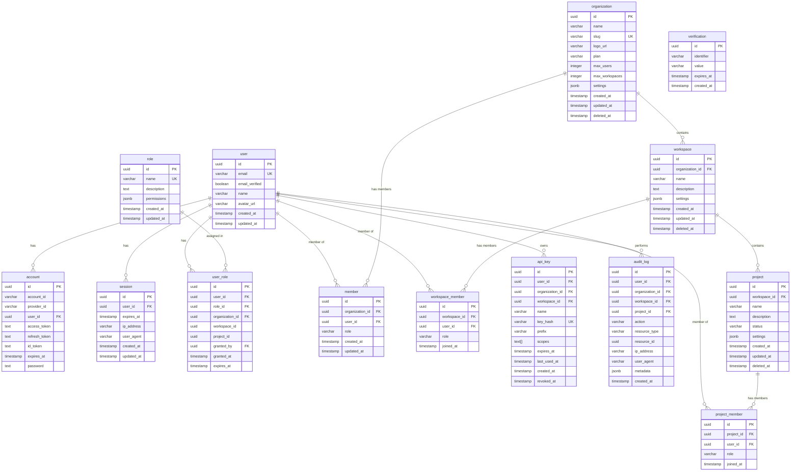

---

### 1.2 Knowledge Graph Schema

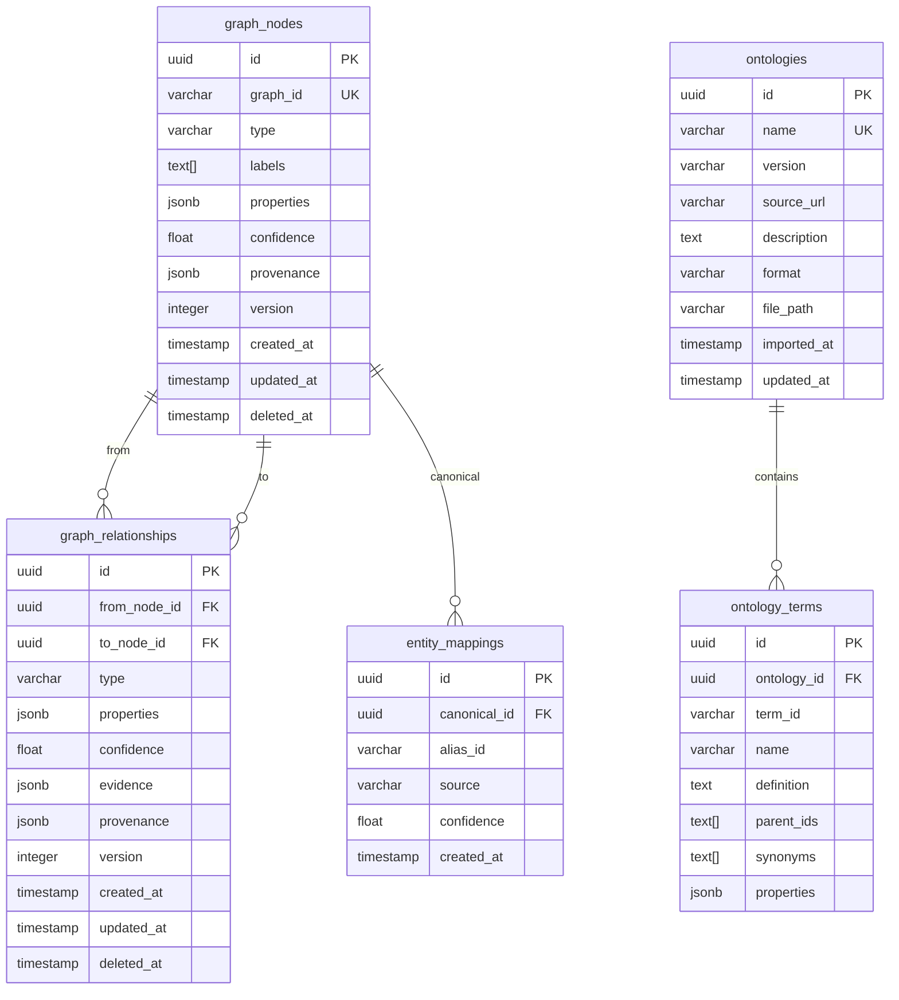

---

### 1.3 Literature Intelligence Schema

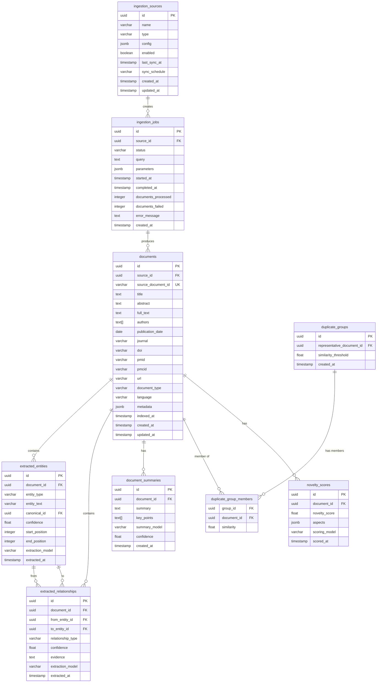

---

### 1.4 AI Orchestration Schema

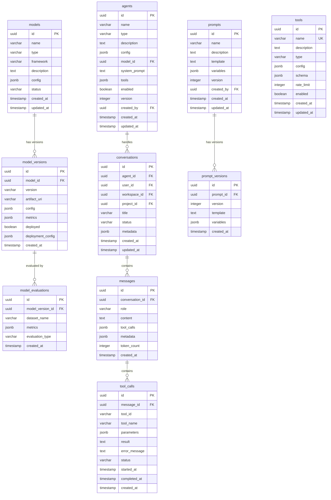

---

### 1.5 Molecule Discovery Schema

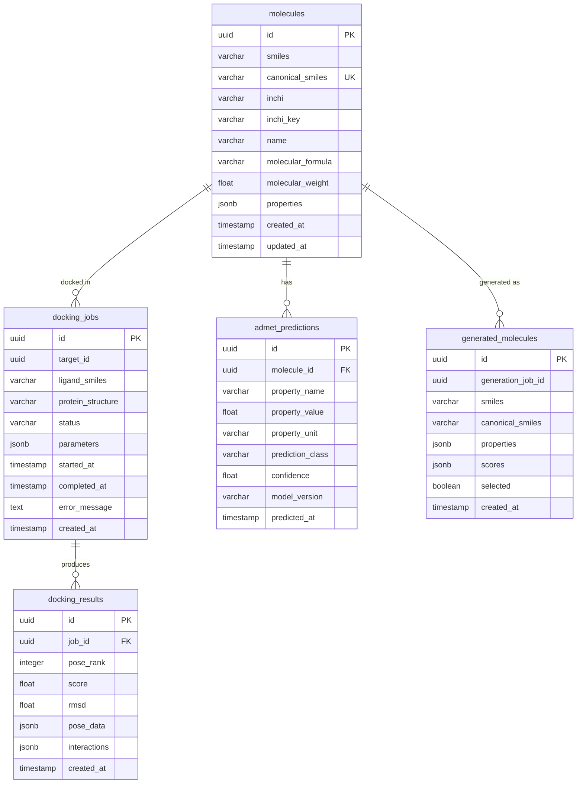

---

### 1.6 Clinical Intelligence Schema

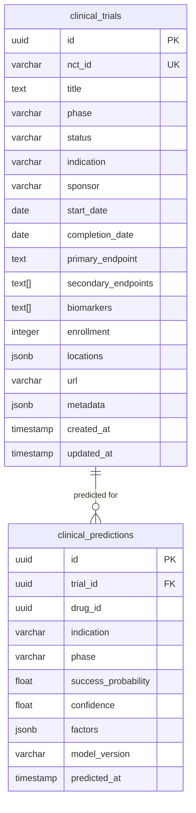

---

### 1.7 Competitive Intelligence Schema

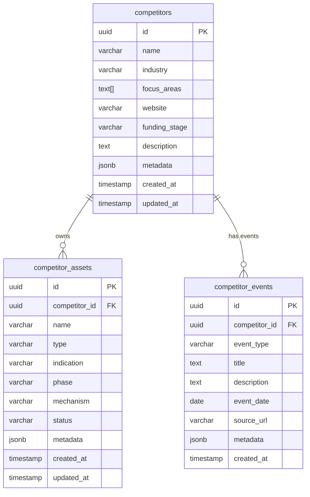

---

### 1.8 Portfolio Management Schema

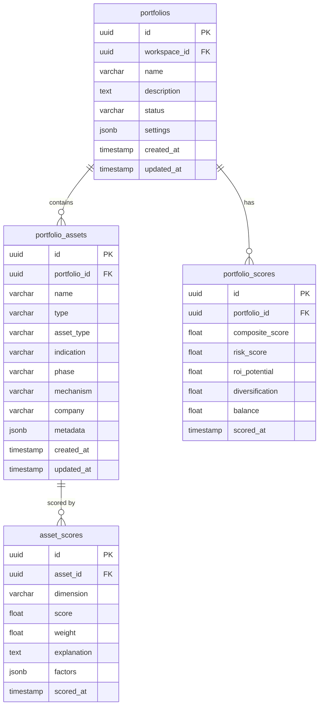

---

### 1.9 Collaboration Schema

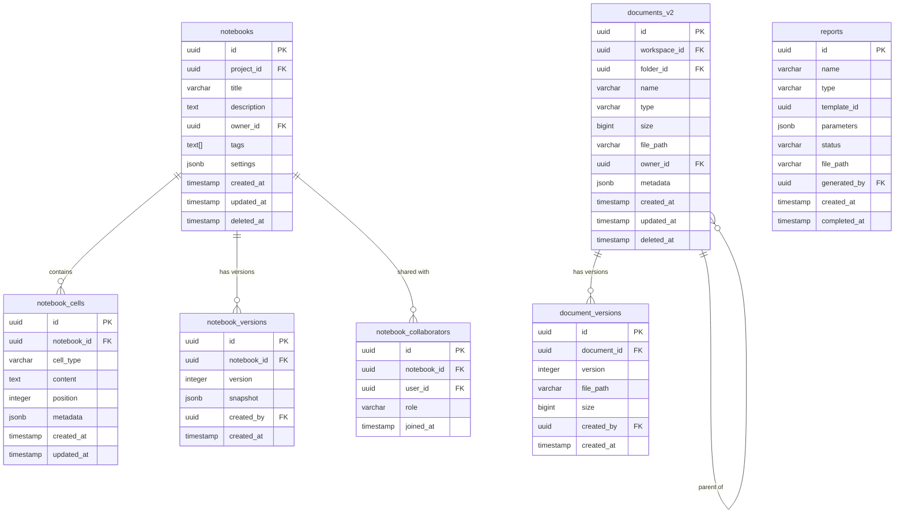

---

### 1.10 Data Integration Schema

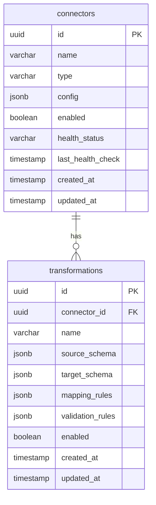

---

### 1.11 Observability Schema

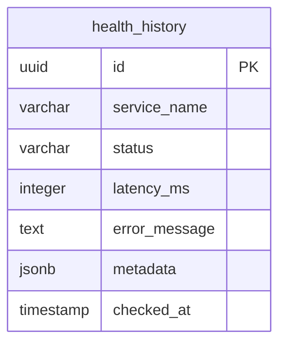

---

## 2. Neo4j Graph Schema

### 2.1 Graph Node Types

```mermaid
erDiagram
    Gene ||--o{ Protein : "encodes"
    Protein ||--o{ Drug : "targets"
    Drug ||--o{ Disease : "treats"
    Disease ||--o{ ClinicalTrial : "trial for"
    Company ||--o{ Drug : "develops"
    Company ||--o{ Patent : "owns"
    Publication ||--o{ Patent : "cites"
    Conference ||--o{ Publication : "presents"
    Biomarker ||--o{ Disease : "biomarker for"
    Pathway ||--o{ Protein : "contains"
    Mutation ||--o{ Gene : "mutation of"
    
    Gene {
        string id PK
        string canonical_id UK
        string name
        string symbol
        string entrez_id
        string ensembl_id
        string chromosome
        integer start_position
        integer end_position
        string strand
        float confidence
        jsonb provenance
        timestamp created_at
        timestamp updated_at
    }
    
    Protein {
        string id PK
        string canonical_id UK
        string name
        string uniprot_id
        string gene_id
        string sequence
        float confidence
        jsonb provenance
        timestamp created_at
        timestamp updated_at
    }
    
    Disease {
        string id PK
        string canonical_id UK
        string name
        string icd10
        string mesh_id
        text[] synonyms
        float confidence
        jsonb provenance
        timestamp created_at
        timestamp updated_at
    }
    
    Drug {
        string id PK
        string canonical_id UK
        string name
        string generic_name
        text[] brand_names
        string drug_type
        string mechanism
        string fda_status
        date approval_date
        float confidence
        jsonb provenance
        timestamp created_at
        timestamp updated_at
    }
    
    Company {
        string id PK
        string canonical_id UK
        string name
        string industry
        text[] focus_areas
        string website
        string funding_stage
        float confidence
        jsonb provenance
        timestamp created_at
        timestamp updated_at
    }
    
    Publication {
        string id PK
        string canonical_id UK
        string title
        text abstract
        text[] authors
        date publication_date
        string journal
        string doi
        string pmid
        string pmcid
        float confidence
        jsonb provenance
        timestamp created_at
        timestamp updated_at
    }
    
    Patent {
        string id PK
        string canonical_id UK
        string title
        string patent_number
        date filing_date
        date grant_date
        string assignee
        text[] claims
        float confidence
        jsonb provenance
        timestamp created_at
        timestamp updated_at
    }
    
    ClinicalTrial {
        string id PK
        string canonical_id UK
        string nct_id
        string title
        string phase
        string status
        string indication
        string sponsor
        date start_date
        date completion_date
        text primary_endpoint
        text[] secondary_endpoints
        text[] biomarkers
        float confidence
        jsonb provenance
        timestamp created_at
        timestamp updated_at
    }
    
    Conference {
        string id PK
        string canonical_id UK
        string name
        date start_date
        date end_date
        string location
        float confidence
        jsonb provenance
        timestamp created_at
        timestamp updated_at
    }
    
    Biomarker {
        string id PK
        string canonical_id UK
        string name
        string type
        string associated_disease
        float confidence
        jsonb provenance
        timestamp created_at
        timestamp updated_at
    }
    
    Pathway {
        string id PK
        string canonical_id UK
        string name
        string source
        text[] genes
        text[] proteins
        float confidence
        jsonb provenance
        timestamp created_at
        timestamp updated_at
    }
    
    Mutation {
        string id PK
        string canonical_id UK
        string name
        string gene_id
        string position
        string change
        string impact
        float confidence
        jsonb provenance
        timestamp created_at
        timestamp updated_at
    }
```

### 2.2 Graph Relationship Types

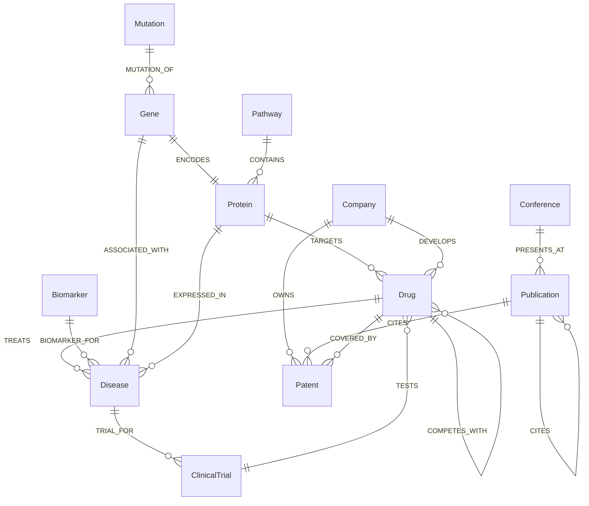

---

## 3. Redis Data Structures

### 3.1 Key-Value Patterns

```mermaid
erDiagram
    Session {
        string key PK "session:{session_id}"
        string user_id
        timestamp created_at
        timestamp expires_at
        jsonb metadata
        integer TTL "3600"
    }
    
    RateLimit {
        string key PK "ratelimit:{user_id}:{endpoint}"
        integer count_value
        integer TTL "60"
    }
    
    Cache {
        string key PK "cache:{service}:{resource_id}"
        string json_value
        integer TTL "300"
    }
    
    Collaboration {
        string key PK "collab:{notebook_id}:{user_id}"
        integer cursor_position
        jsonb selection
        timestamp last_activity
        integer TTL "3600"
    }
    
    AgentContext {
        string key PK "agent:context:{conversation_id}"
        jsonb messages
        jsonb tools
        jsonb variables
        integer TTL "86400"
    }
    
    InferenceCache {
        string key PK "inference:{model}:{hash_prompt}"
        string json_response
        integer TTL "3600"
    }
```

---

## 4. Cross-Database Relationships

### 4.1 PostgreSQL ↔ Neo4j

```mermaid
erDiagram
    PostgreSQL ||--|| Neo4j : "Entity Resolution"
    
    PostgreSQL {
        uuid id
        varchar canonical_id
    }
    
    Neo4j {
        string id
        string canonical_id
    }
    
    PostgreSQL "canonical_id" -- Neo4j "canonical_id" : "Mapped via entity_mappings table"
```

### 4.2 File System ↔ LLM Wiki (OKF v0.1)

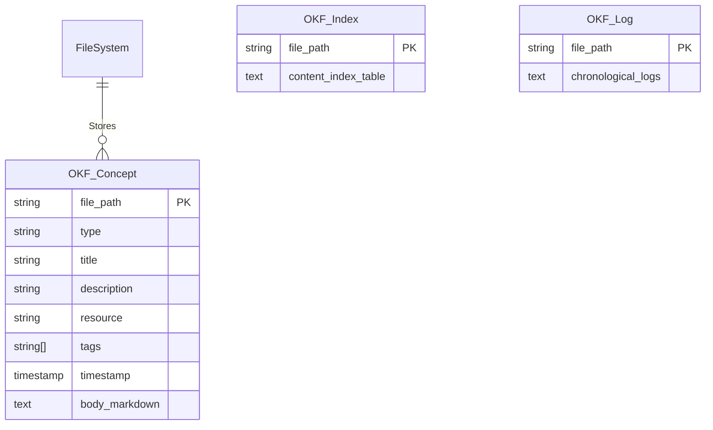

### 4.3 PostgreSQL ↔ Redis

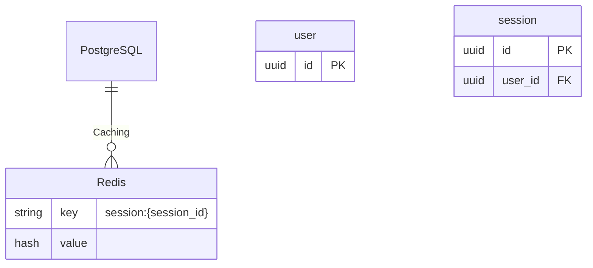

### 4.4 PostgreSQL ↔ S3

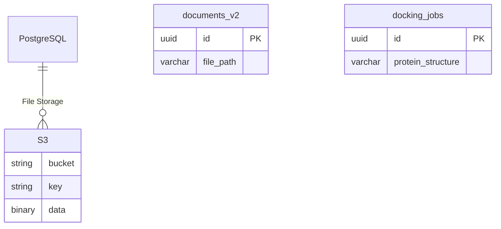

---

## 5. Data Flow Diagrams

### 5.1 Literature Ingestion Flow

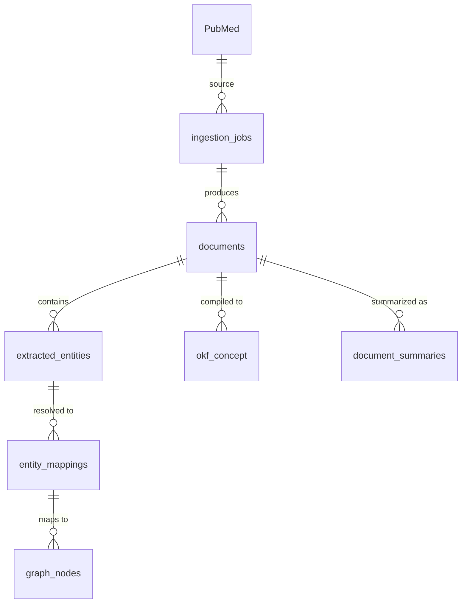

### 5.2 Agent Conversation Flow

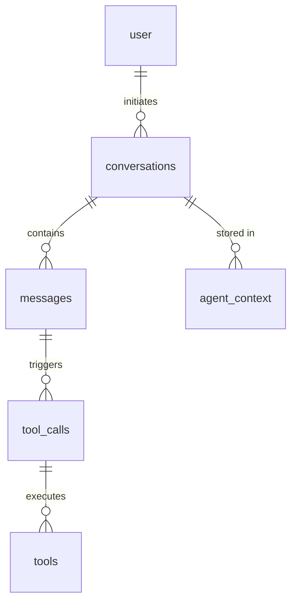

### 5.3 Molecule Discovery Flow

```mermaid
erDiagram
    molecules ||--o{ docking_jobs : "docked in"
    docking_jobs ||--o{ docking_results : "produces"
    molecules ||--o{ admet_predictions : "predicted for"
    molecules ||--o{ generated_molecules : "generated as"
    generated_molecules ||--o{ portfolio_assets : "added to"
    portfolio_assets ||--o{ asset_scores : "scored by"
```

---

## 6. Index Strategy

### 6.1 PostgreSQL Indexes

| Table | Index | Type | Purpose |
|-------|-------|------|---------|
| user | idx_user_email | B-tree | Email lookup |
| session | idx_session_user_id | B-tree | User sessions |
| session | idx_session_expires_at | B-tree | Expired sessions |
| graph_nodes | idx_graph_nodes_graph_id | B-tree | Canonical ID lookup |
| graph_nodes | idx_graph_nodes_type | B-tree | Type filtering |
| graph_nodes | idx_graph_nodes_labels | GIN | Label search |
| graph_nodes | idx_graph_nodes_properties | GIN | Property search |
| documents | idx_documents_source_doc_id | B-tree | Source document lookup |
| documents | idx_documents_pmid | B-tree | PMID lookup |
| documents | idx_documents_publication_date | B-tree | Date range queries |
| extracted_entities | idx_extracted_entities_doc_id | B-tree | Document entities |
| extracted_entities | idx_extracted_entities_type | B-tree | Entity type filtering |
| conversations | idx_conversations_agent_id | B-tree | Agent conversations |
| conversations | idx_conversations_user_id | B-tree | User conversations |
| molecules | idx_molecules_canonical_smiles | B-tree | SMILES lookup |
| molecules | idx_molecules_inchi_key | B-tree | InChI key lookup |
| clinical_trials | idx_clinical_trials_nct_id | B-tree | NCT ID lookup |
| clinical_trials | idx_clinical_trials_phase | B-tree | Phase filtering |

### 6.2 Neo4j Indexes

| Label | Property | Index Type | Purpose |
|-------|-----------|------------|---------|
| Gene | canonical_id | Unique | Canonical ID lookup |
| Gene | name | Full-text | Name search |
| Drug | canonical_id | Unique | Canonical ID lookup |
| Drug | name | Full-text | Name search |
| Disease | canonical_id | Unique | Canonical ID lookup |
| Disease | name | Full-text | Name search |
| ClinicalTrial | nct_id | Unique | NCT ID lookup |
| Publication | pmid | Unique | PMID lookup |
| Publication | doi | Unique | DOI lookup |


---

## 7. Data Integrity Constraints

### 7.1 PostgreSQL Constraints

```sql
-- Foreign Key Constraints
ALTER TABLE session ADD CONSTRAINT fk_session_user_id 
    FOREIGN KEY (user_id) REFERENCES user(id) ON DELETE CASCADE;

ALTER TABLE graph_relationships ADD CONSTRAINT fk_graph_rels_from 
    FOREIGN KEY (from_node_id) REFERENCES graph_nodes(id) ON DELETE CASCADE;

ALTER TABLE graph_relationships ADD CONSTRAINT fk_graph_rels_to 
    FOREIGN KEY (to_node_id) REFERENCES graph_nodes(id) ON DELETE CASCADE;

-- Unique Constraints
ALTER TABLE user ADD CONSTRAINT uq_user_email UNIQUE (email);
ALTER TABLE graph_nodes ADD CONSTRAINT uq_graph_nodes_graph_id UNIQUE (graph_id);
ALTER TABLE documents ADD CONSTRAINT uq_documents_source_doc_id UNIQUE (source_document_id);

-- Check Constraints
ALTER TABLE user ADD CONSTRAINT chk_user_email 
    CHECK (email ~* '^[A-Za-z0-9._%+-]+@[A-Za-z0-9.-]+\.[A-Za-z]{2,}$');

ALTER TABLE molecules ADD CONSTRAINT chk_molecules_molecular_weight 
    CHECK (molecular_weight > 0);

ALTER TABLE clinical_predictions ADD CONSTRAINT chk_clinical_predictions_probability 
    CHECK (success_probability >= 0 AND success_probability <= 1);
```

### 7.2 Neo4j Constraints

```cypher
// Uniqueness Constraints
CREATE CONSTRAINT canonical_id_unique FOR (n:Gene) REQUIRE n.canonical_id IS UNIQUE;
CREATE CONSTRAINT canonical_id_unique FOR (n:Drug) REQUIRE n.canonical_id IS UNIQUE;
CREATE CONSTRAINT canonical_id_unique FOR (n:Disease) REQUIRE n.canonical_id IS UNIQUE;
CREATE CONSTRAINT canonical_id_unique FOR (n:Company) REQUIRE n.canonical_id IS UNIQUE;
CREATE CONSTRAINT canonical_id_unique FOR (n:Publication) REQUIRE n.canonical_id IS UNIQUE;
CREATE CONSTRAINT canonical_id_unique FOR (n:Patent) REQUIRE n.canonical_id IS UNIQUE;
CREATE CONSTRAINT canonical_id_unique FOR (n:ClinicalTrial) REQUIRE n.canonical_id IS UNIQUE;
CREATE CONSTRAINT nct_id_unique FOR (n:ClinicalTrial) REQUIRE n.nct_id IS UNIQUE;
CREATE CONSTRAINT pmid_unique FOR (n:Publication) REQUIRE n.pmid IS UNIQUE;
CREATE CONSTRAINT doi_unique FOR (n:Publication) REQUIRE n.doi IS UNIQUE;

// Node Existence Constraints
CREATE CONSTRAINT node_exists FOR (n:Gene) REQUIRE n.id IS NOT NULL;
CREATE CONSTRAINT node_exists FOR (n:Drug) REQUIRE n.id IS NOT NULL;
CREATE CONSTRAINT node_exists FOR (n:Disease) REQUIRE n.id IS NOT NULL;
```

---

## 8. Data Partitioning Strategy

### 8.1 PostgreSQL Partitioning

```sql
-- Partition audit_log by date
CREATE TABLE audit_log (
    id UUID,
    user_id UUID,
    action VARCHAR(100),
    created_at TIMESTAMP WITH TIME ZONE
) PARTITION BY RANGE (created_at);

CREATE TABLE audit_log_2024_q1 PARTITION OF audit_log
    FOR VALUES FROM ('2024-01-01') TO ('2024-04-01');

CREATE TABLE audit_log_2024_q2 PARTITION OF audit_log
    FOR VALUES FROM ('2024-04-01') TO ('2024-07-01');

-- Partition documents by publication date
CREATE TABLE documents (
    id UUID,
    publication_date DATE,
    title TEXT
) PARTITION BY RANGE (publication_date);

CREATE TABLE documents_2023 PARTITION OF documents
    FOR VALUES FROM ('2023-01-01') TO ('2024-01-01');

CREATE TABLE documents_2024 PARTITION OF documents
    FOR VALUES FROM ('2024-01-01') TO ('2025-01-01');
```

### 8.2 Kafka Partitioning

| Topic | Partition Key | Partitions | Rationale |
|-------|---------------|------------|-----------|
| literature.document.ingested | document_id | 12 | Document-level ordering |
| graph.node.created | node_id | 12 | Node-level ordering |
| ai.agent.invoked | conversation_id | 12 | Conversation-level ordering |
| molecule.docking.job.submitted | job_id | 6 | Job-level ordering |
| clinical.trial.ingested | trial_id | 6 | Trial-level ordering |
