# Sequence Diagrams - AI-RxOS

## Overview
This document contains sequence diagrams for key workflows in AI-RxOS, illustrating the interactions between components, services, and databases.

---

## 1. User Authentication Flow

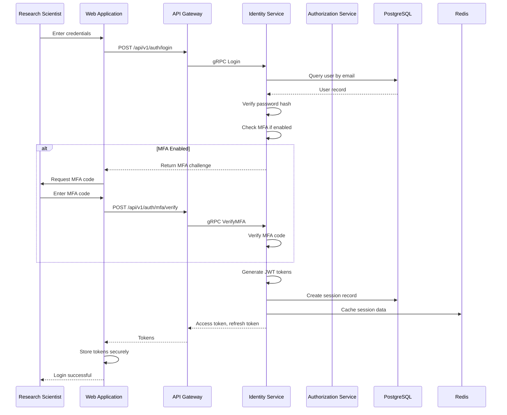
```mermaid
sequenceDiagram
    participant User as Research Scientist
    participant WebApp as Web Application
    participant APIGateway as API Gateway
    participant IdentityService as Identity Service
    participant AuthorizationService as Authorization Service
    participant PostgreSQL as PostgreSQL
    participant Redis as Redis
    
    User->>WebApp: Enter credentials
    WebApp->>APIGateway: POST /api/v1/auth/login
    APIGateway->>IdentityService: gRPC Login
    IdentityService->>PostgreSQL: Query user by email
    PostgreSQL-->>IdentityService: User record
    IdentityService->>IdentityService: Verify password hash
    IdentityService->>IdentityService: Check MFA if enabled
    
    alt MFA Enabled
        IdentityService-->>WebApp: Return MFA challenge
        WebApp->>User: Request MFA code
        User->>WebApp: Enter MFA code
        WebApp->>APIGateway: POST /api/v1/auth/mfa/verify
        APIGateway->>IdentityService: gRPC VerifyMFA
        IdentityService->>IdentityService: Verify MFA code
    end
    
    IdentityService->>IdentityService: Generate JWT tokens
    IdentityService->>PostgreSQL: Create session record
    IdentityService->>Redis: Cache session data
    IdentityService-->>APIGateway: Access token, refresh token
    APIGateway-->>WebApp: Tokens
    WebApp->>WebApp: Store tokens securely
    WebApp-->>User: Login successful
```

---

## 2. Literature Ingestion Flow

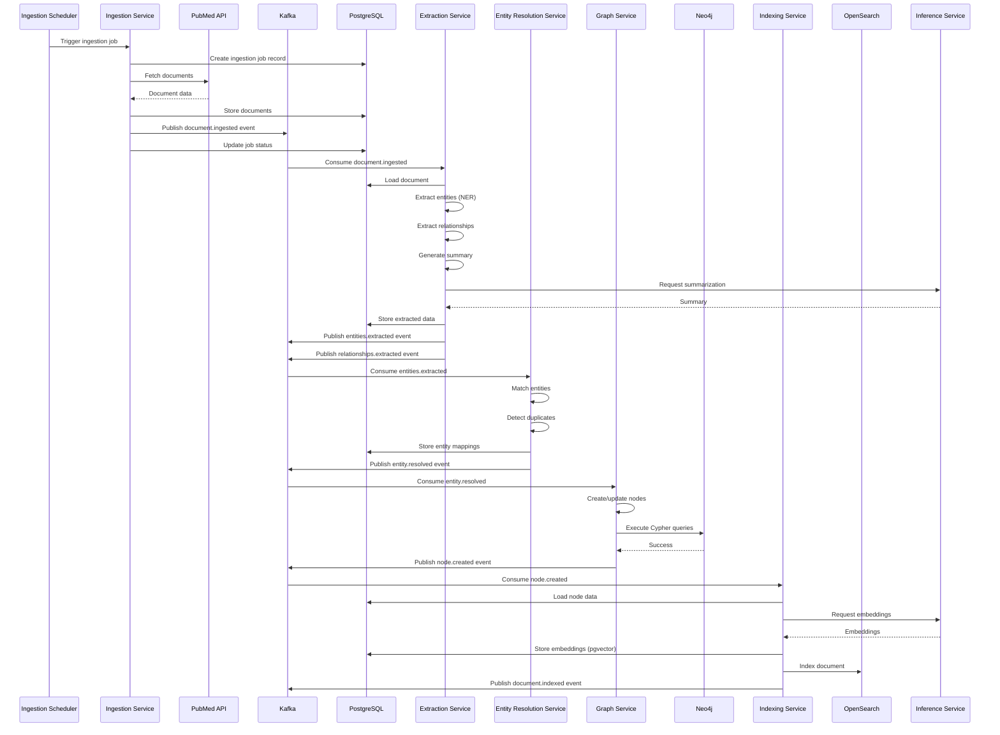
```mermaid
sequenceDiagram
    participant Scheduler as Ingestion Scheduler
    participant IngestionService as Ingestion Service
    participant PubMed as PubMed API
    participant Kafka as Kafka
    participant PostgreSQL as PostgreSQL
    participant ExtractionService as Extraction Service
    participant EntityResolution as Entity Resolution Service
    participant GraphService as Graph Service
    participant Neo4j as Neo4j
    participant IndexingService as Indexing Service
    participant OpenSearch as OpenSearch
    participant InferenceService as Inference Service
    
    Scheduler->>IngestionService: Trigger ingestion job
    IngestionService->>PostgreSQL: Create ingestion job record
    IngestionService->>PubMed: Fetch documents
    PubMed-->>IngestionService: Document data
    IngestionService->>PostgreSQL: Store documents
    IngestionService->>Kafka: Publish document.ingested event
    IngestionService->>PostgreSQL: Update job status
    
    Kafka->>ExtractionService: Consume document.ingested
    ExtractionService->>PostgreSQL: Load document
    ExtractionService->>ExtractionService: Extract entities (NER)
    ExtractionService->>ExtractionService: Extract relationships
    ExtractionService->>ExtractionService: Generate summary
    ExtractionService->>InferenceService: Request summarization
    InferenceService-->>ExtractionService: Summary
    ExtractionService->>PostgreSQL: Store extracted data
    ExtractionService->>Kafka: Publish entities.extracted event
    ExtractionService->>Kafka: Publish relationships.extracted event
    
    Kafka->>EntityResolution: Consume entities.extracted
    EntityResolution->>EntityResolution: Match entities
    EntityResolution->>EntityResolution: Detect duplicates
    EntityResolution->>PostgreSQL: Store entity mappings
    EntityResolution->>Kafka: Publish entity.resolved event
    
    Kafka->>GraphService: Consume entity.resolved
    GraphService->>GraphService: Create/update nodes
    GraphService->>Neo4j: Execute Cypher queries
    Neo4j-->>GraphService: Success
    GraphService->>Kafka: Publish node.created event
    
    Kafka->>IndexingService: Consume node.created
    IndexingService->>PostgreSQL: Load node data
    IndexingService->>InferenceService: Request embeddings
    InferenceService-->>IndexingService: Embeddings
    IndexingService->>PostgreSQL: Store embeddings (pgvector)
    IndexingService->>OpenSearch: Index document
    IndexingService->>Kafka: Publish document.indexed event
```

---

## 3. AI Agent Conversation Flow

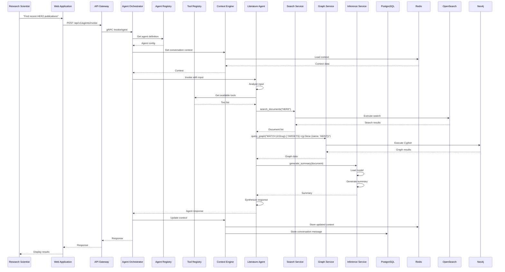
```mermaid
sequenceDiagram
    participant User as Research Scientist
    participant WebApp as Web Application
    participant APIGateway as API Gateway
    participant AgentOrchestrator as Agent Orchestrator
    participant AgentRegistry as Agent Registry
    participant ToolRegistry as Tool Registry
    participant ContextEngine as Context Engine
    participant LiteratureAgent as Literature Agent
    participant SearchService as Search Service
    participant GraphService as Graph Service
    participant InferenceService as Inference Service
    participant PostgreSQL as PostgreSQL
    participant Redis as Redis
    
    User->>WebApp: "Find recent HER2 publications"
    WebApp->>APIGateway: POST /api/v1/agents/invoke
    APIGateway->>AgentOrchestrator: gRPC InvokeAgent
    
    AgentOrchestrator->>AgentRegistry: Get agent definition
    AgentRegistry-->>AgentOrchestrator: Agent config
    
    AgentOrchestrator->>ContextEngine: Get conversation context
    ContextEngine->>Redis: Load context
    Redis-->>ContextEngine: Context data
    ContextEngine-->>AgentOrchestrator: Context
    
    AgentOrchestrator->>LiteratureAgent: Invoke with input
    LiteratureAgent->>LiteratureAgent: Analyze input
    LiteratureAgent->>ToolRegistry: Get available tools
    ToolRegistry-->>LiteratureAgent: Tool list
    
    LiteratureAgent->>SearchService: search_documents("HER2")
    SearchService->>OpenSearch: Execute search
    OpenSearch-->>SearchService: Search results
    SearchService-->>LiteratureAgent: Document list
    
    LiteratureAgent->>GraphService: query_graph("MATCH (d:Drug)-[:TARGETS]->(g:Gene {name: 'HER2'})")
    GraphService->>Neo4j: Execute Cypher
    Neo4j-->>GraphService: Graph results
    GraphService-->>LiteratureAgent: Graph data
    
    LiteratureAgent->>InferenceService: generate_summary(document)
    InferenceService->>InferenceService: Load model
    InferenceService->>InferenceService: Generate summary
    InferenceService-->>LiteratureAgent: Summary
    
    LiteratureAgent->>LiteratureAgent: Synthesize response
    LiteratureAgent-->>AgentOrchestrator: Agent response
    
    AgentOrchestrator->>ContextEngine: Update context
    ContextEngine->>Redis: Store updated context
    ContextEngine->>PostgreSQL: Store conversation message
    
    AgentOrchestrator-->>APIGateway: Response
    APIGateway-->>WebApp: Response
    WebApp-->>User: Display results
```

---

## 4. Molecule Discovery Flow

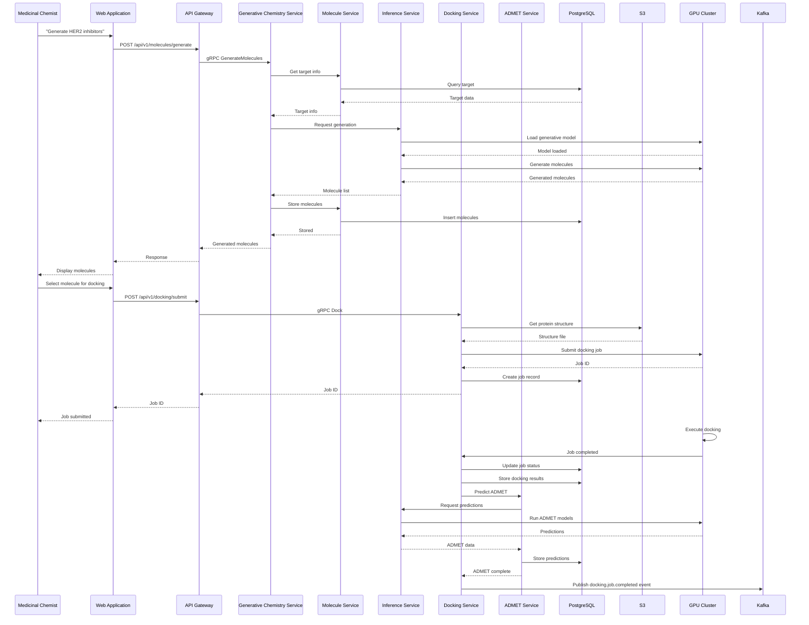
```mermaid
sequenceDiagram
    participant User as Medicinal Chemist
    participant WebApp as Web Application
    participant APIGateway as API Gateway
    participant GenerativeChemistry as Generative Chemistry Service
    participant MoleculeService as Molecule Service
    participant InferenceService as Inference Service
    participant DockingService as Docking Service
    participant ADMETService as ADMET Service
    participant PostgreSQL as PostgreSQL
    participant S3 as S3
    participant GPUCluster as GPU Cluster
    
    User->>WebApp: "Generate HER2 inhibitors"
    WebApp->>APIGateway: POST /api/v1/molecules/generate
    APIGateway->>GenerativeChemistry: gRPC GenerateMolecules
    
    GenerativeChemistry->>MoleculeService: Get target info
    MoleculeService->>PostgreSQL: Query target
    PostgreSQL-->>MoleculeService: Target data
    MoleculeService-->>GenerativeChemistry: Target info
    
    GenerativeChemistry->>InferenceService: Request generation
    InferenceService->>GPUCluster: Load generative model
    GPUCluster-->>InferenceService: Model loaded
    InferenceService->>GPUCluster: Generate molecules
    GPUCluster-->>InferenceService: Generated molecules
    InferenceService-->>GenerativeChemistry: Molecule list
    
    GenerativeChemistry->>MoleculeService: Store molecules
    MoleculeService->>PostgreSQL: Insert molecules
    MoleculeService-->>GenerativeChemistry: Stored
    
    GenerativeChemistry-->>APIGateway: Generated molecules
    APIGateway-->>WebApp: Response
    WebApp-->>User: Display molecules
    
    User->>WebApp: Select molecule for docking
    WebApp->>APIGateway: POST /api/v1/docking/submit
    APIGateway->>DockingService: gRPC Dock
    
    DockingService->>S3: Get protein structure
    S3-->>DockingService: Structure file
    DockingService->>GPUCluster: Submit docking job
    GPUCluster-->>DockingService: Job ID
    
    DockingService->>PostgreSQL: Create job record
    DockingService-->>APIGateway: Job ID
    APIGateway-->>WebApp: Job ID
    WebApp-->>User: Job submitted
    
    GPUCluster->>GPUCluster: Execute docking
    GPUCluster->>DockingService: Job completed
    DockingService->>PostgreSQL: Update job status
    DockingService->>PostgreSQL: Store docking results
    
    DockingService->>ADMETService: Predict ADMET
    ADMETService->>InferenceService: Request predictions
    InferenceService->>GPUCluster: Run ADMET models
    GPUCluster-->>InferenceService: Predictions
    InferenceService-->>ADMETService: ADMET data
    ADMETService->>PostgreSQL: Store predictions
    
    ADMETService-->>DockingService: ADMET complete
    DockingService->>Kafka: Publish docking.job.completed event
```

---

## 5. Knowledge Graph Query Flow

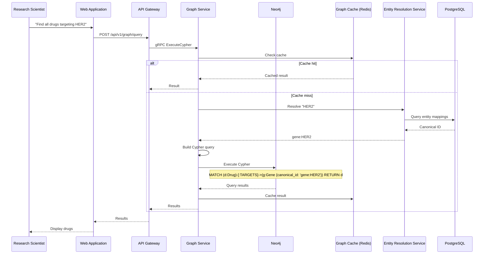
```mermaid
sequenceDiagram
    participant User as Research Scientist
    participant WebApp as Web Application
    participant APIGateway as API Gateway
    participant GraphService as Graph Service
    participant Neo4j as Neo4j
    participant GraphCache as Graph Cache (Redis)
    participant EntityResolution as Entity Resolution Service
    participant PostgreSQL as PostgreSQL
    
    User->>WebApp: "Find all drugs targeting HER2"
    WebApp->>APIGateway: POST /api/v1/graph/query
    APIGateway->>GraphService: gRPC ExecuteCypher
    
    GraphService->>GraphCache: Check cache
    alt Cache hit
        GraphCache-->>GraphService: Cached result
        GraphService-->>APIGateway: Result
    else Cache miss
        GraphService->>EntityResolution: Resolve "HER2"
        EntityResolution->>PostgreSQL: Query entity mappings
        PostgreSQL-->>EntityResolution: Canonical ID
        EntityResolution-->>GraphService: gene:HER2
        
        GraphService->>GraphService: Build Cypher query
        GraphService->>Neo4j: Execute Cypher
        Note over Neo4j: MATCH (d:Drug)-[:TARGETS]->(g:Gene {canonical_id: 'gene:HER2'}) RETURN d
        
        Neo4j-->>GraphService: Query results
        GraphService->>GraphCache: Cache result
        GraphService-->>APIGateway: Results
    end
    
    APIGateway-->>WebApp: Results
    WebApp-->>User: Display drugs
```

---

## 6. Scientific Search Flow

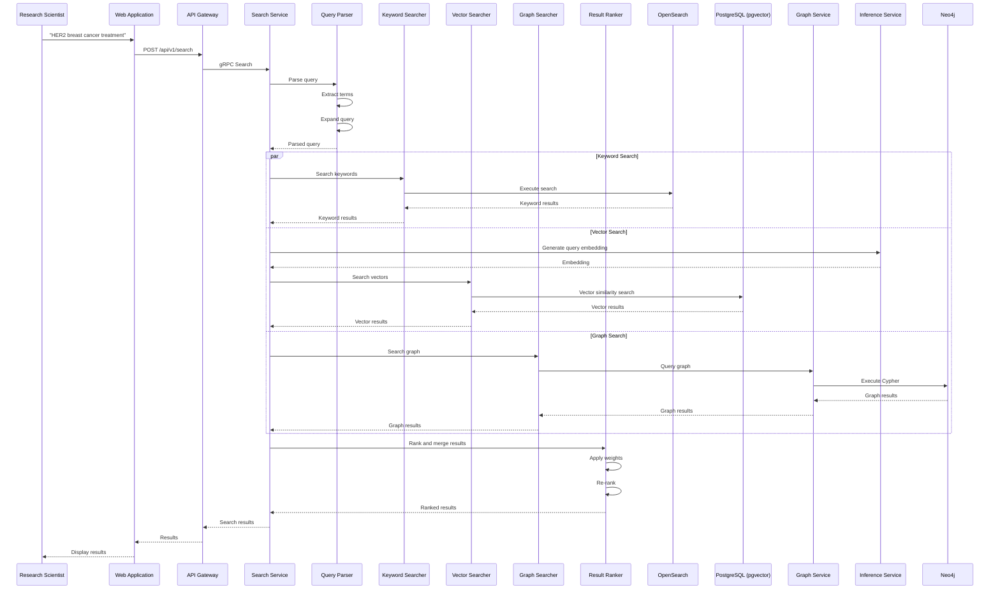
```mermaid
sequenceDiagram
    participant User as Research Scientist
    participant WebApp as Web Application
    participant APIGateway as API Gateway
    participant SearchService as Search Service
    participant QueryParser as Query Parser
    participant KeywordSearcher as Keyword Searcher
    participant VectorSearcher as Vector Searcher
    participant GraphSearcher as Graph Searcher
    participant ResultRanker as Result Ranker
    participant OpenSearch as OpenSearch
    participant PostgreSQL as PostgreSQL (pgvector)
    participant GraphService as Graph Service
    participant InferenceService as Inference Service
    
    User->>WebApp: "HER2 breast cancer treatment"
    WebApp->>APIGateway: POST /api/v1/search
    APIGateway->>SearchService: gRPC Search
    
    SearchService->>QueryParser: Parse query
    QueryParser->>QueryParser: Extract terms
    QueryParser->>QueryParser: Expand query
    QueryParser-->>SearchService: Parsed query
    
    par Keyword Search
        SearchService->>KeywordSearcher: Search keywords
        KeywordSearcher->>OpenSearch: Execute search
        OpenSearch-->>KeywordSearcher: Keyword results
        KeywordSearcher-->>SearchService: Keyword results
    and Vector Search
        SearchService->>InferenceService: Generate query embedding
        InferenceService-->>SearchService: Embedding
        SearchService->>VectorSearcher: Search vectors
        VectorSearcher->>PostgreSQL: Vector similarity search
        PostgreSQL-->>VectorSearcher: Vector results
        VectorSearcher-->>SearchService: Vector results
    and Graph Search
        SearchService->>GraphSearcher: Search graph
        GraphSearcher->>GraphService: Query graph
        GraphService->>Neo4j: Execute Cypher
        Neo4j-->>GraphService: Graph results
        GraphService-->>GraphSearcher: Graph results
        GraphSearcher-->>SearchService: Graph results
    end
    
    SearchService->>ResultRanker: Rank and merge results
    ResultRanker->>ResultRanker: Apply weights
    ResultRanker->>ResultRanker: Re-rank
    ResultRanker-->>SearchService: Ranked results
    
    SearchService-->>APIGateway: Search results
    APIGateway-->>WebApp: Results
    WebApp-->>User: Display results
```

---

## 7. Clinical Trial Prediction Flow

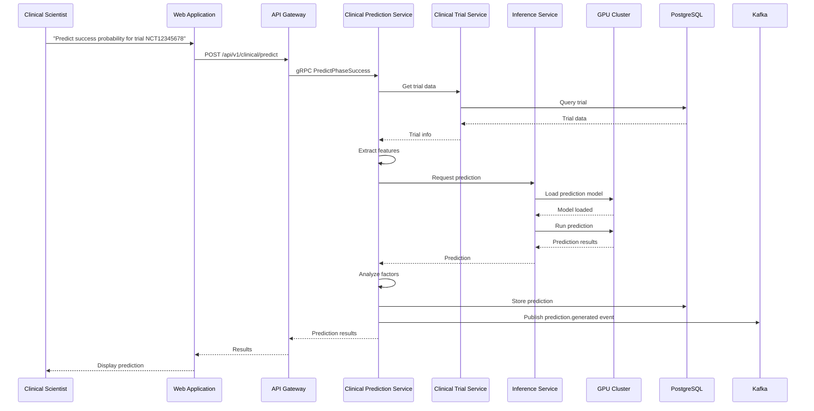
```mermaid
sequenceDiagram
    participant User as Clinical Scientist
    participant WebApp as Web Application
    participant APIGateway as API Gateway
    participant ClinicalPredictionService as Clinical Prediction Service
    participant ClinicalTrialService as Clinical Trial Service
    participant InferenceService as Inference Service
    participant GPUCluster as GPU Cluster
    participant PostgreSQL as PostgreSQL
    participant Kafka as Kafka
    
    User->>WebApp: "Predict success probability for trial NCT12345678"
    WebApp->>APIGateway: POST /api/v1/clinical/predict
    APIGateway->>ClinicalPredictionService: gRPC PredictPhaseSuccess
    
    ClinicalPredictionService->>ClinicalTrialService: Get trial data
    ClinicalTrialService->>PostgreSQL: Query trial
    PostgreSQL-->>ClinicalTrialService: Trial data
    ClinicalTrialService-->>ClinicalPredictionService: Trial info
    
    ClinicalPredictionService->>ClinicalPredictionService: Extract features
    ClinicalPredictionService->>InferenceService: Request prediction
    InferenceService->>GPUCluster: Load prediction model
    GPUCluster-->>InferenceService: Model loaded
    InferenceService->>GPUCluster: Run prediction
    GPUCluster-->>InferenceService: Prediction results
    InferenceService-->>ClinicalPredictionService: Prediction
    
    ClinicalPredictionService->>ClinicalPredictionService: Analyze factors
    ClinicalPredictionService->>PostgreSQL: Store prediction
    ClinicalPredictionService->>Kafka: Publish prediction.generated event
    
    ClinicalPredictionService-->>APIGateway: Prediction results
    APIGateway-->>WebApp: Results
    WebApp-->>User: Display prediction
```

---

## 8. Portfolio Scoring Flow

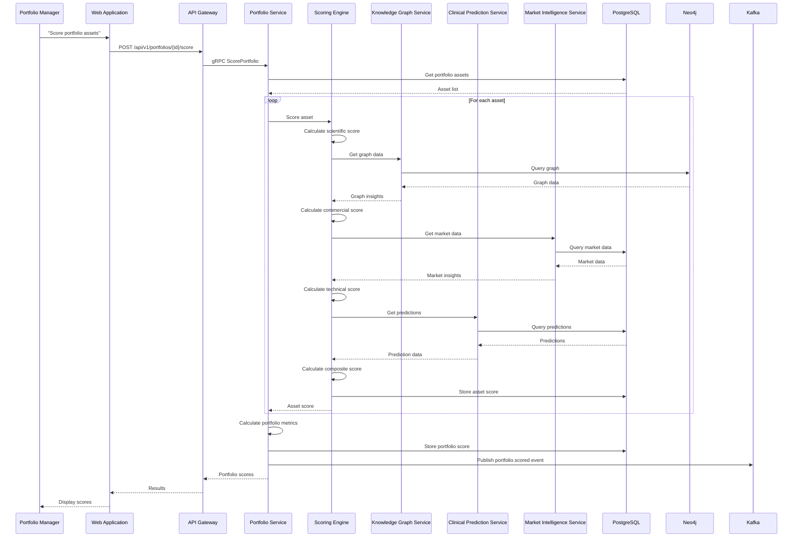
```mermaid
sequenceDiagram
    participant User as Portfolio Manager
    participant WebApp as Web Application
    participant APIGateway as API Gateway
    participant PortfolioService as Portfolio Service
    participant ScoringEngine as Scoring Engine
    participant KnowledgeGraph as Knowledge Graph Service
    participant ClinicalPrediction as Clinical Prediction Service
    participant MarketIntelligence as Market Intelligence Service
    participant PostgreSQL as PostgreSQL
    participant Neo4j as Neo4j
    
    User->>WebApp: "Score portfolio assets"
    WebApp->>APIGateway: POST /api/v1/portfolios/{id}/score
    APIGateway->>PortfolioService: gRPC ScorePortfolio
    
    PortfolioService->>PostgreSQL: Get portfolio assets
    PostgreSQL-->>PortfolioService: Asset list
    
    loop For each asset
        PortfolioService->>ScoringEngine: Score asset
        ScoringEngine->>ScoringEngine: Calculate scientific score
        ScoringEngine->>KnowledgeGraph: Get graph data
        KnowledgeGraph->>Neo4j: Query graph
        Neo4j-->>KnowledgeGraph: Graph data
        KnowledgeGraph-->>ScoringEngine: Graph insights
        
        ScoringEngine->>ScoringEngine: Calculate commercial score
        ScoringEngine->>MarketIntelligence: Get market data
        MarketIntelligence->>PostgreSQL: Query market data
        PostgreSQL-->>MarketIntelligence: Market data
        MarketIntelligence-->>ScoringEngine: Market insights
        
        ScoringEngine->>ScoringEngine: Calculate technical score
        ScoringEngine->>ClinicalPrediction: Get predictions
        ClinicalPrediction->>PostgreSQL: Query predictions
        PostgreSQL-->>ClinicalPrediction: Predictions
        ClinicalPrediction-->>ScoringEngine: Prediction data
        
        ScoringEngine->>ScoringEngine: Calculate composite score
        ScoringEngine->>PostgreSQL: Store asset score
        ScoringEngine-->>PortfolioService: Asset score
    end
    
    PortfolioService->>PortfolioService: Calculate portfolio metrics
    PortfolioService->>PostgreSQL: Store portfolio score
    PortfolioService->>Kafka: Publish portfolio.scored event
    
    PortfolioService-->>APIGateway: Portfolio scores
    APIGateway-->>WebApp: Results
    WebApp-->>User: Display scores
```

---

## 9. Competitive Intelligence Flow

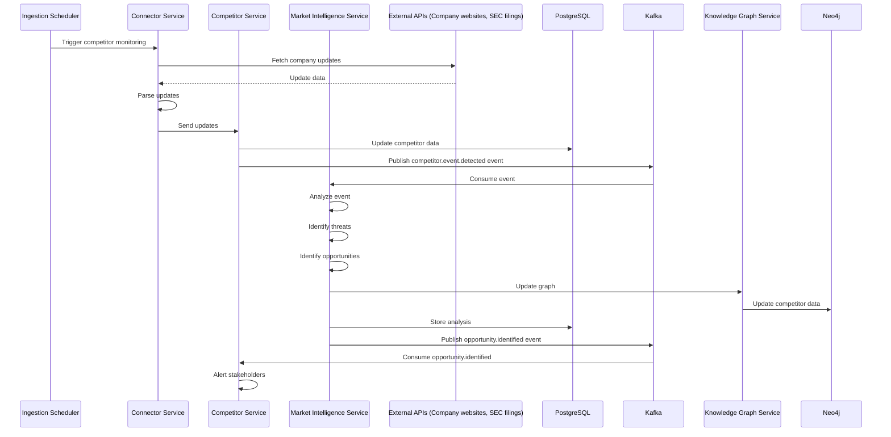
```mermaid
sequenceDiagram
    participant Scheduler as Ingestion Scheduler
    participant ConnectorService as Connector Service
    participant CompetitorService as Competitor Service
    participant MarketIntelligence as Market Intelligence Service
    participant ExternalAPIs as External APIs (Company websites, SEC filings)
    participant PostgreSQL as PostgreSQL
    participant Kafka as Kafka
    participant KnowledgeGraph as Knowledge Graph Service
    
    Scheduler->>ConnectorService: Trigger competitor monitoring
    ConnectorService->>ExternalAPIs: Fetch company updates
    ExternalAPIs-->>ConnectorService: Update data
    
    ConnectorService->>ConnectorService: Parse updates
    ConnectorService->>CompetitorService: Send updates
    CompetitorService->>PostgreSQL: Update competitor data
    CompetitorService->>Kafka: Publish competitor.event.detected event
    
    Kafka->>MarketIntelligence: Consume event
    MarketIntelligence->>MarketIntelligence: Analyze event
    MarketIntelligence->>MarketIntelligence: Identify threats
    MarketIntelligence->>MarketIntelligence: Identify opportunities
    MarketIntelligence->>KnowledgeGraph: Update graph
    KnowledgeGraph->>Neo4j: Update competitor data
    MarketIntelligence->>PostgreSQL: Store analysis
    MarketIntelligence->>Kafka: Publish opportunity.identified event
    
    Kafka->>CompetitorService: Consume opportunity.identified
    CompetitorService->>CompetitorService: Alert stakeholders
```

---

## 10. Document Collaboration Flow

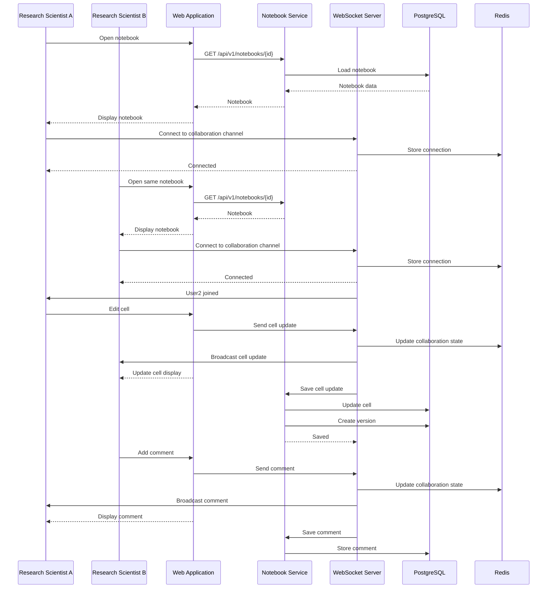
```mermaid
sequenceDiagram
    participant User1 as Research Scientist A
    participant User2 as Research Scientist B
    participant WebApp as Web Application
    participant NotebookService as Notebook Service
    participant WebSocket as WebSocket Server
    participant PostgreSQL as PostgreSQL
    participant Redis as Redis
    
    User1->>WebApp: Open notebook
    WebApp->>NotebookService: GET /api/v1/notebooks/{id}
    NotebookService->>PostgreSQL: Load notebook
    PostgreSQL-->>NotebookService: Notebook data
    NotebookService-->>WebApp: Notebook
    WebApp-->>User1: Display notebook
    
    User1->>WebSocket: Connect to collaboration channel
    WebSocket->>Redis: Store connection
    WebSocket-->>User1: Connected
    
    User2->>WebApp: Open same notebook
    WebApp->>NotebookService: GET /api/v1/notebooks/{id}
    NotebookService-->>WebApp: Notebook
    WebApp-->>User2: Display notebook
    
    User2->>WebSocket: Connect to collaboration channel
    WebSocket->>Redis: Store connection
    WebSocket-->>User2: Connected
    WebSocket->>User1: User2 joined
    
    User1->>WebApp: Edit cell
    WebApp->>WebSocket: Send cell update
    WebSocket->>Redis: Update collaboration state
    WebSocket->>User2: Broadcast cell update
    WebApp-->>User2: Update cell display
    
    WebSocket->>NotebookService: Save cell update
    NotebookService->>PostgreSQL: Update cell
    NotebookService->>PostgreSQL: Create version
    NotebookService-->>WebSocket: Saved
    
    User2->>WebApp: Add comment
    WebApp->>WebSocket: Send comment
    WebSocket->>Redis: Update collaboration state
    WebSocket->>User1: Broadcast comment
    WebApp-->>User1: Display comment
    
    WebSocket->>NotebookService: Save comment
    NotebookService->>PostgreSQL: Store comment
```

---

## 11. Report Generation Flow

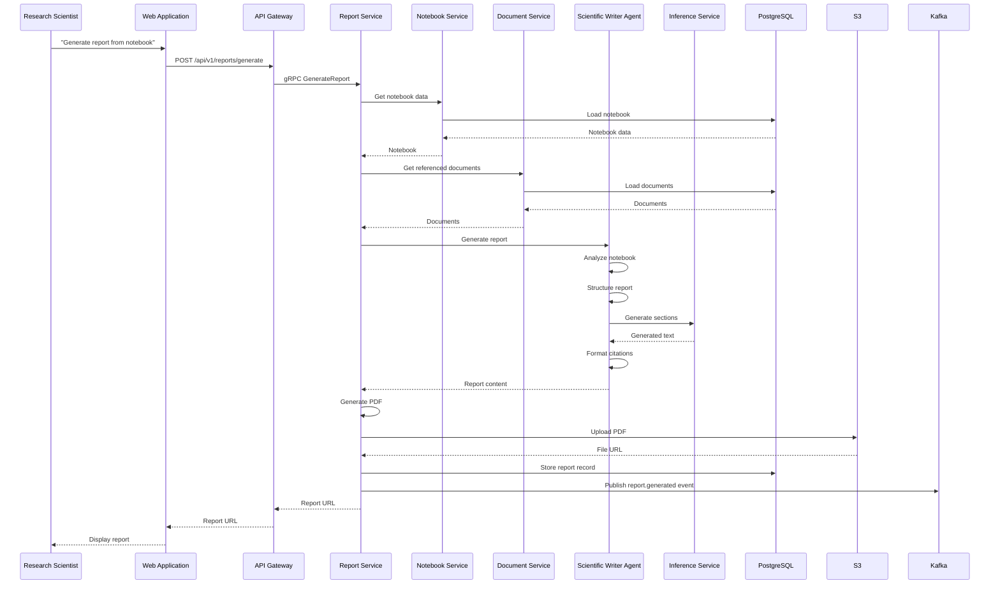
```mermaid
sequenceDiagram
    participant User as Research Scientist
    participant WebApp as Web Application
    participant APIGateway as API Gateway
    participant ReportService as Report Service
    participant NotebookService as Notebook Service
    participant DocumentService as Document Service
    participant ScientificWriter as Scientific Writer Agent
    participant InferenceService as Inference Service
    participant PostgreSQL as PostgreSQL
    participant S3 as S3
    
    User->>WebApp: "Generate report from notebook"
    WebApp->>APIGateway: POST /api/v1/reports/generate
    APIGateway->>ReportService: gRPC GenerateReport
    
    ReportService->>NotebookService: Get notebook data
    NotebookService->>PostgreSQL: Load notebook
    PostgreSQL-->>NotebookService: Notebook data
    NotebookService-->>ReportService: Notebook
    
    ReportService->>DocumentService: Get referenced documents
    DocumentService->>PostgreSQL: Load documents
    PostgreSQL-->>DocumentService: Documents
    DocumentService-->>ReportService: Documents
    
    ReportService->>ScientificWriter: Generate report
    ScientificWriter->>ScientificWriter: Analyze notebook
    ScientificWriter->>ScientificWriter: Structure report
    ScientificWriter->>InferenceService: Generate sections
    InferenceService-->>ScientificWriter: Generated text
    ScientificWriter->>ScientificWriter: Format citations
    ScientificWriter-->>ReportService: Report content
    
    ReportService->>ReportService: Generate PDF
    ReportService->>S3: Upload PDF
    S3-->>ReportService: File URL
    ReportService->>PostgreSQL: Store report record
    ReportService->>Kafka: Publish report.generated event
    
    ReportService-->>APIGateway: Report URL
    APIGateway-->>WebApp: Report URL
    WebApp-->>User: Display report
```

---

## 12. Multi-Agent Workflow Flow

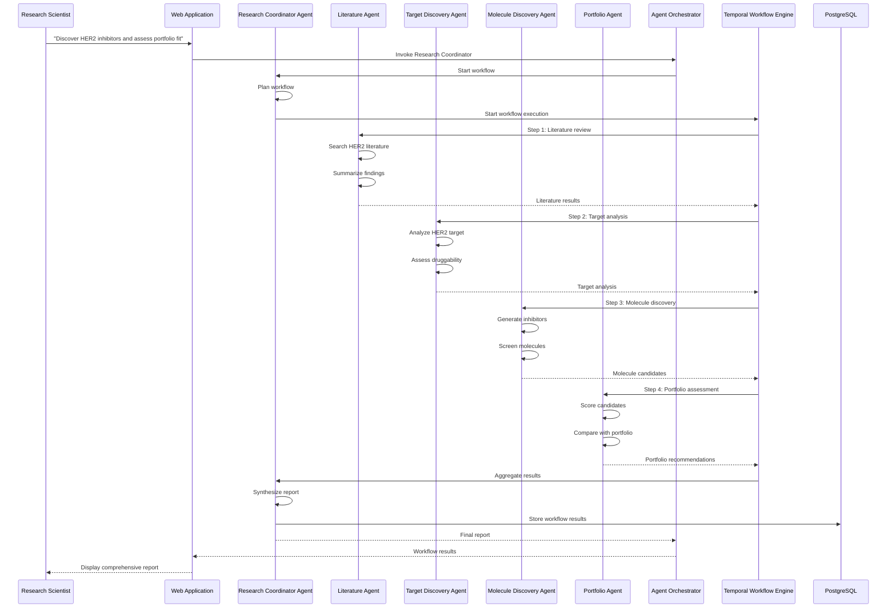
```mermaid
sequenceDiagram
    participant User as Research Scientist
    participant WebApp as Web Application
    participant ResearchCoordinator as Research Coordinator Agent
    participant LiteratureAgent as Literature Agent
    participant TargetDiscoveryAgent as Target Discovery Agent
    participant MoleculeDiscoveryAgent as Molecule Discovery Agent
    participant PortfolioAgent as Portfolio Agent
    participant AgentOrchestrator as Agent Orchestrator
    participant Temporal as Temporal Workflow Engine
    participant PostgreSQL as PostgreSQL
    
    User->>WebApp: "Discover HER2 inhibitors and assess portfolio fit"
    WebApp->>AgentOrchestrator: Invoke Research Coordinator
    AgentOrchestrator->>ResearchCoordinator: Start workflow
    
    ResearchCoordinator->>ResearchCoordinator: Plan workflow
    ResearchCoordinator->>Temporal: Start workflow execution
    
    Temporal->>LiteratureAgent: Step 1: Literature review
    LiteratureAgent->>LiteratureAgent: Search HER2 literature
    LiteratureAgent->>LiteratureAgent: Summarize findings
    LiteratureAgent-->>Temporal: Literature results
    
    Temporal->>TargetDiscoveryAgent: Step 2: Target analysis
    TargetDiscoveryAgent->>TargetDiscoveryAgent: Analyze HER2 target
    TargetDiscoveryAgent->>TargetDiscoveryAgent: Assess druggability
    TargetDiscoveryAgent-->>Temporal: Target analysis
    
    Temporal->>MoleculeDiscoveryAgent: Step 3: Molecule discovery
    MoleculeDiscoveryAgent->>MoleculeDiscoveryAgent: Generate inhibitors
    MoleculeDiscoveryAgent->>MoleculeDiscoveryAgent: Screen molecules
    MoleculeDiscoveryAgent-->>Temporal: Molecule candidates
    
    Temporal->>PortfolioAgent: Step 4: Portfolio assessment
    PortfolioAgent->>PortfolioAgent: Score candidates
    PortfolioAgent->>PortfolioAgent: Compare with portfolio
    PortfolioAgent-->>Temporal: Portfolio recommendations
    
    Temporal->>ResearchCoordinator: Aggregate results
    ResearchCoordinator->>ResearchCoordinator: Synthesize report
    ResearchCoordinator->>PostgreSQL: Store workflow results
    ResearchCoordinator-->>AgentOrchestrator: Final report
    
    AgentOrchestrator-->>WebApp: Workflow results
    WebApp-->>User: Display comprehensive report
```

---

## 13. Data Integration Flow

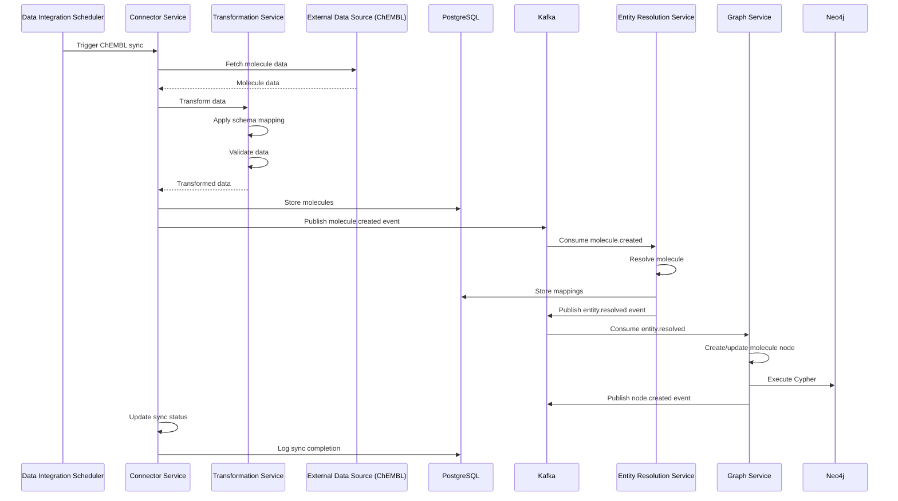
```mermaid
sequenceDiagram
    participant Scheduler as Data Integration Scheduler
    participant ConnectorService as Connector Service
    participant TransformationService as Transformation Service
    participant ExternalSource as External Data Source (ChEMBL)
    participant PostgreSQL as PostgreSQL
    participant Kafka as Kafka
    participant EntityResolution as Entity Resolution Service
    participant GraphService as Graph Service
    
    Scheduler->>ConnectorService: Trigger ChEMBL sync
    ConnectorService->>ExternalSource: Fetch molecule data
    ExternalSource-->>ConnectorService: Molecule data
    
    ConnectorService->>TransformationService: Transform data
    TransformationService->>TransformationService: Apply schema mapping
    TransformationService->>TransformationService: Validate data
    TransformationService-->>ConnectorService: Transformed data
    
    ConnectorService->>PostgreSQL: Store molecules
    ConnectorService->>Kafka: Publish molecule.created event
    
    Kafka->>EntityResolution: Consume molecule.created
    EntityResolution->>EntityResolution: Resolve molecule
    EntityResolution->>PostgreSQL: Store mappings
    EntityResolution->>Kafka: Publish entity.resolved event
    
    Kafka->>GraphService: Consume entity.resolved
    GraphService->>GraphService: Create/update molecule node
    GraphService->>Neo4j: Execute Cypher
    GraphService->>Kafka: Publish node.created event
    
    ConnectorService->>ConnectorService: Update sync status
    ConnectorService->>PostgreSQL: Log sync completion
```

---

## 14. Error Handling Flow

sequenceDiagram
    participant User as Research Scientist
    participant WebApp as Web Application
    participant APIGateway as API Gateway
    participant Service as Microservice
    participant RetryPolicy as Retry Policy
    participant CircuitBreaker as Circuit Breaker
    participant DLQ as Dead Letter Queue
    participant Observability as Observability Service
    participant Alerting as Alerting System
    
    User->>WebApp: Make request
    WebApp->>APIGateway: Forward request
    APIGateway->>Service: gRPC call
    
    alt Success
        Service-->>APIGateway: Success response
        APIGateway-->>WebApp: Response
        WebApp-->>User: Display result
    else Transient Error
        Service-->>APIGateway: Error (timeout)
        APIGateway->>RetryPolicy: Check retry policy
        RetryPolicy->>RetryPolicy: Check retry count
        
        alt Retry allowed
            RetryPolicy-->>APIGateway: Retry
            APIGateway->>Service: Retry request
            Service-->>APIGateway: Success
            APIGateway-->>WebApp: Response
        else Max retries exceeded
            RetryPolicy-->>APIGateway: Give up
            APIGateway->>CircuitBreaker: Report failure
            CircuitBreaker->>CircuitBreaker: Update failure count
            
            alt Circuit open
                CircuitBreaker-->>APIGateway: Circuit open
                APIGateway->>DLQ: Send to DLQ
                APIGateway->>Observability: Log error
                Observability->>Alerting: Trigger alert
                Alerting-->>User: Error notification
                APIGateway-->>WebApp: Error response
            else Circuit closed
                APIGateway->>DLQ: Send to DLQ
                APIGateway->>Observability: Log error
                APIGateway-->>WebApp: Error response
            end
        end
    else Permanent Error
        Service-->>APIGateway: Error (validation)
        APIGateway->>DLQ: Send to DLQ
        APIGateway->>Observability: Log error
        APIGateway-->>WebApp: Error response
        WebApp-->>User: Display error
    end
```

---

## 15. Real-time Notification Flow

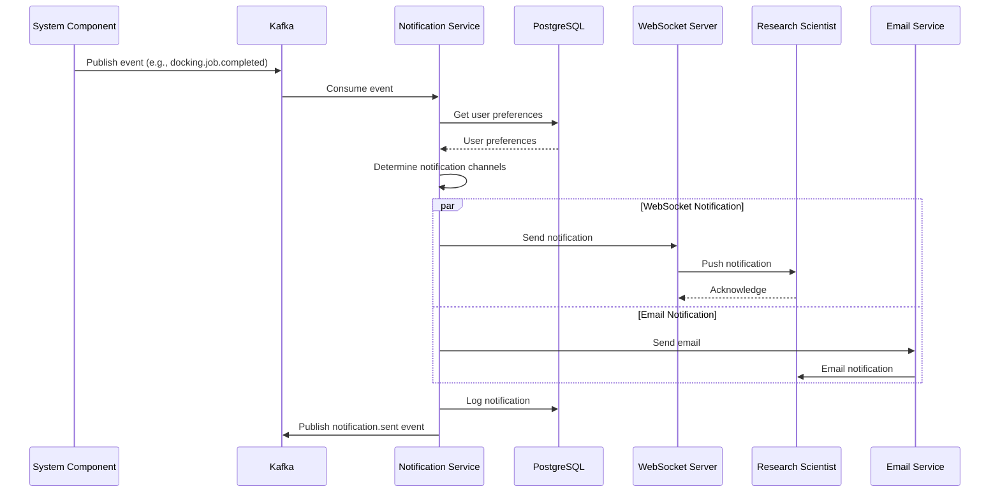
```mermaid
sequenceDiagram
    participant System as System Component
    participant Kafka as Kafka
    participant NotificationService as Notification Service
    participant PostgreSQL as PostgreSQL
    participant WebSocket as WebSocket Server
    participant User as Research Scientist
    participant EmailService as Email Service
    
    System->>Kafka: Publish event (e.g., docking.job.completed)
    Kafka->>NotificationService: Consume event
    NotificationService->>PostgreSQL: Get user preferences
    PostgreSQL-->>NotificationService: User preferences
    
    NotificationService->>NotificationService: Determine notification channels
    
    par WebSocket Notification
        NotificationService->>WebSocket: Send notification
        WebSocket->>User: Push notification
        User-->>WebSocket: Acknowledge
    and Email Notification
        NotificationService->>EmailService: Send email
        EmailService->>User: Email notification
    end
    
    NotificationService->>PostgreSQL: Log notification
    NotificationService->>Kafka: Publish notification.sent event
```

---

## 16. Backup and Restore Flow

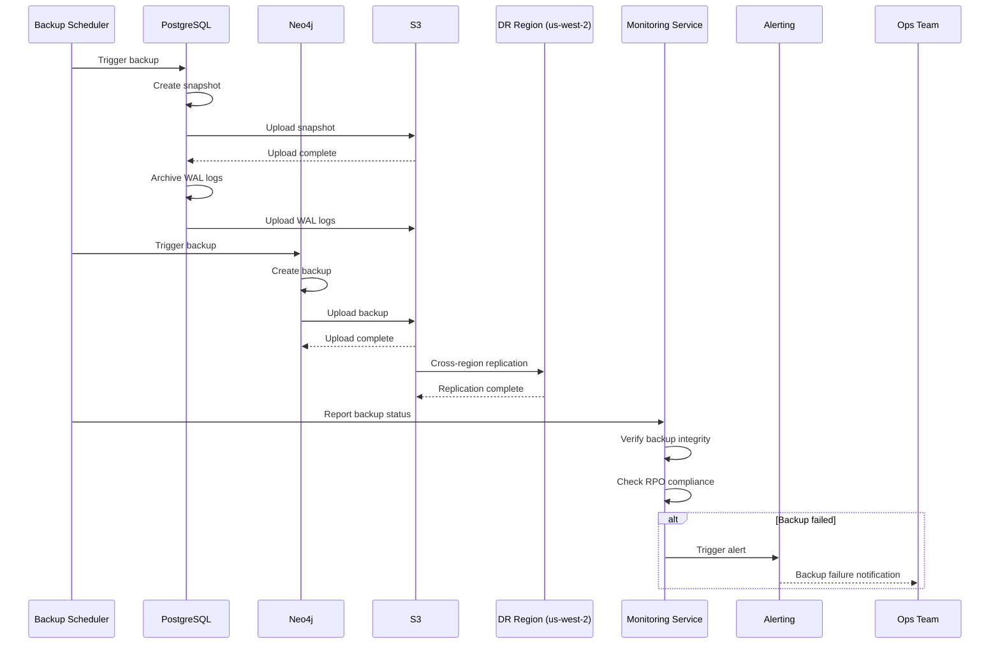
```mermaid
sequenceDiagram
    participant Scheduler as Backup Scheduler
    participant PostgreSQL as PostgreSQL
    participant Neo4j as Neo4j
    participant S3 as S3
    participant DRRegion as DR Region (us-west-2)
    participant Monitoring as Monitoring Service
    
    Scheduler->>PostgreSQL: Trigger backup
    PostgreSQL->>PostgreSQL: Create snapshot
    PostgreSQL->>S3: Upload snapshot
    S3-->>PostgreSQL: Upload complete
    PostgreSQL->>PostgreSQL: Archive WAL logs
    PostgreSQL->>S3: Upload WAL logs
    
    Scheduler->>Neo4j: Trigger backup
    Neo4j->>Neo4j: Create backup
    Neo4j->>S3: Upload backup
    S3-->>Neo4j: Upload complete
    
    S3->>DRRegion: Cross-region replication
    DRRegion-->>S3: Replication complete
    
    Scheduler->>Monitoring: Report backup status
    Monitoring->>Monitoring: Verify backup integrity
    Monitoring->>Monitoring: Check RPO compliance
    
    alt Backup failed
        Monitoring->>Alerting: Trigger alert
        Alerting-->>Ops Team: Backup failure notification
    end
```

---

## 17. Scaling Event Flow

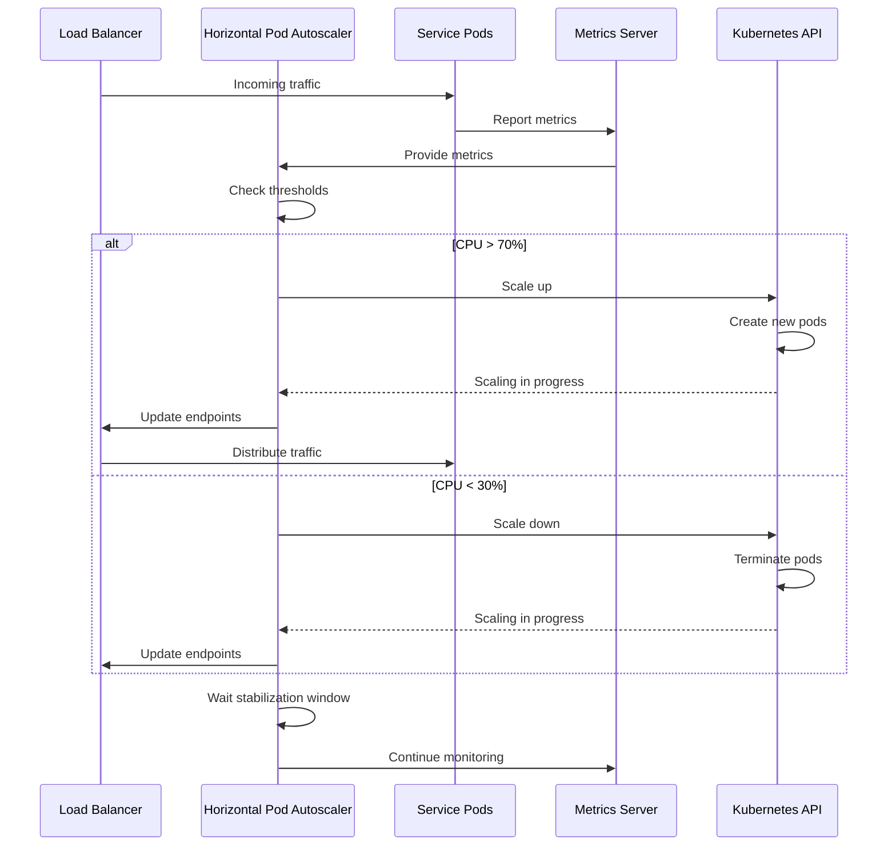
```mermaid
sequenceDiagram
    participant LoadBalancer as Load Balancer
    participant HPA as Horizontal Pod Autoscaler
    participant Pods as Service Pods
    participant MetricsServer as Metrics Server
    participant Kubernetes as Kubernetes API
    
    LoadBalancer->>Pods: Incoming traffic
    Pods->>MetricsServer: Report metrics
    
    MetricsServer->>HPA: Provide metrics
    HPA->>HPA: Check thresholds
    
    alt CPU > 70%
        HPA->>Kubernetes: Scale up
        Kubernetes->>Kubernetes: Create new pods
        Kubernetes-->>HPA: Scaling in progress
        HPA->>LoadBalancer: Update endpoints
        LoadBalancer->>Pods: Distribute traffic
    else CPU < 30%
        HPA->>Kubernetes: Scale down
        Kubernetes->>Kubernetes: Terminate pods
        Kubernetes-->>HPA: Scaling in progress
        HPA->>LoadBalancer: Update endpoints
    end
    
    HPA->>HPA: Wait stabilization window
    HPA->>MetricsServer: Continue monitoring
```

---

## 18. Deployment Flow

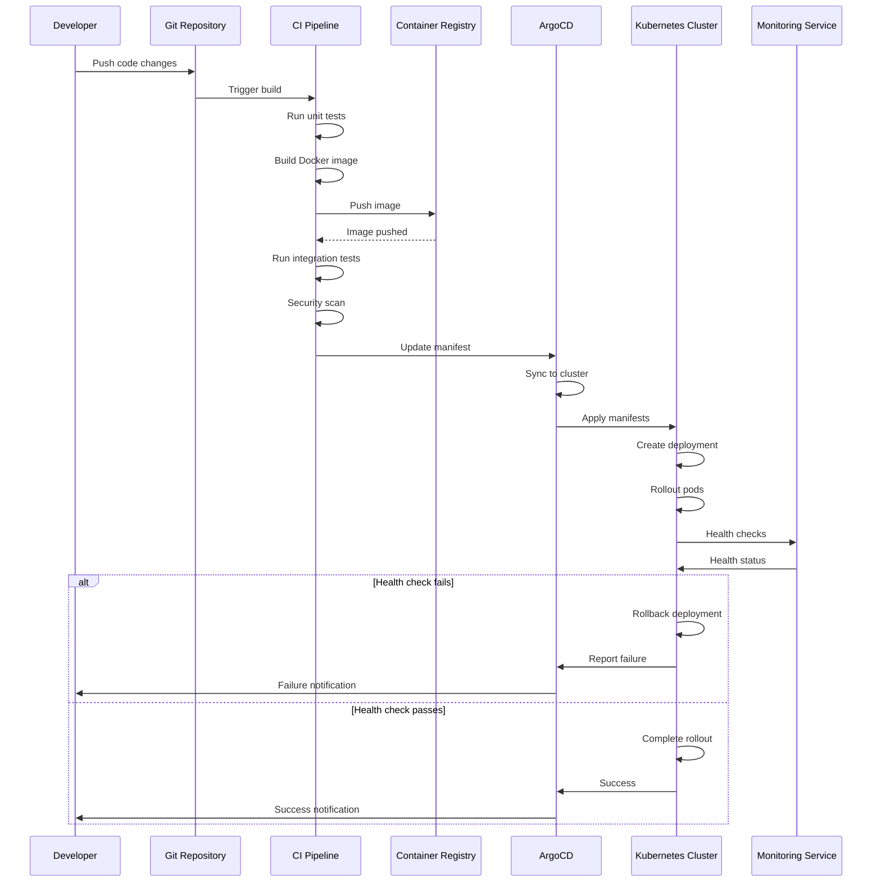
```mermaid
sequenceDiagram
    participant Developer as Developer
    participant Git as Git Repository
    participant CI as CI Pipeline
    participant Registry as Container Registry
    participant ArgoCD as ArgoCD
    participant Kubernetes as Kubernetes Cluster
    participant Monitoring as Monitoring Service
    
    Developer->>Git: Push code changes
    Git->>CI: Trigger build
    CI->>CI: Run unit tests
    CI->>CI: Build Docker image
    CI->>Registry: Push image
    Registry-->>CI: Image pushed
    CI->>CI: Run integration tests
    CI->>CI: Security scan
    
    CI->>ArgoCD: Update manifest
    ArgoCD->>ArgoCD: Sync to cluster
    ArgoCD->>Kubernetes: Apply manifests
    Kubernetes->>Kubernetes: Create deployment
    Kubernetes->>Kubernetes: Rollout pods
    
    Kubernetes->>Monitoring: Health checks
    Monitoring->>Kubernetes: Health status
    
    alt Health check fails
        Kubernetes->>Kubernetes: Rollback deployment
        Kubernetes->>ArgoCD: Report failure
        ArgoCD->>Developer: Failure notification
    else Health check passes
        Kubernetes->>Kubernetes: Complete rollout
        Kubernetes->>ArgoCD: Success
        ArgoCD->>Developer: Success notification
    end
```

---

## Summary

This document provides sequence diagrams for the following key workflows:

1. **User Authentication Flow** - Login, MFA verification, session creation
2. **Literature Ingestion Flow** - Document ingestion, extraction, indexing
3. **AI Agent Conversation Flow** - Agent invocation, tool execution, context management
4. **Molecule Discovery Flow** - Molecule generation, docking, ADMET prediction
5. **Knowledge Graph Query Flow** - Graph querying, caching, entity resolution
6. **Scientific Search Flow** - Hybrid search (keyword, vector, graph)
7. **Clinical Trial Prediction Flow** - Trial data extraction, prediction
8. **Portfolio Scoring Flow** - Multi-dimensional asset scoring
9. **Competitive Intelligence Flow** - Competitor monitoring, analysis
10. **Document Collaboration Flow** - Real-time collaboration, versioning
11. **Report Generation Flow** - Report generation from notebooks
12. **Multi-Agent Workflow Flow** - Coordinated multi-agent workflows
13. **Data Integration Flow** - External data ingestion and transformation
14. **Error Handling Flow** - Retry, circuit breaker, DLQ
15. **Real-time Notification Flow** - WebSocket and email notifications
16. **Backup and Restore Flow** - Database backup and DR
17. **Scaling Event Flow** - HPA-based autoscaling
18. **Deployment Flow** - CI/CD and GitOps deployment

These diagrams illustrate the interactions between components, services, databases, and external systems in AI-RxOS, providing a comprehensive view of the system's behavior across various use cases.
