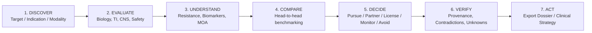

# Architecture Decision Record: AI Drug Opportunity Discovery Engine (NeoZenome)

**Status:** ACCEPTED  
**Date:** 2026-10-05  
**Context:** AI-RxOS Enterprise Decision Intelligence  

---

## 1. Executive Summary & Problem Statement

Drug discovery, translational oncology, and biopharma business development teams routinely evaluate candidate therapeutics to answer critical strategic questions:
- Which assets should we pursue, investigate, partner on, license, monitor, or avoid?
- Which patient subpopulations and genomic biomarkers define the opportunity?
- What resistance mechanisms and synergistic combinations exist?
- What is the clinical development potential and stage transition probability?
- What is the safety, therapeutic index, and CNS/intracranial penetration profile?
- Who owns the asset, what is the patent exclusivity timeline, and is licensing feasible?
- What evidence supports or contradicts the recommendation, and what remains unknown?
- Would the system have correctly identified the opportunity historically before trial outcomes were known?

Traditional search engines and generic RAG chatbots hallucinate scientific facts, fail to maintain evidence lineage, cannot perform temporal backtesting, and conflate speculative hypotheses with verified clinical facts.

**NeoZenome** is an **evidence-grounded decision intelligence platform** that provides deterministic provenance, model lineage, contradictory evidence preservation, explicit unknowns, and anti-leakage historical backtesting.

---

## 2. Core Architectural Principles

1. **Evidence-First Provenance:**
   - Every factual claim links to verified persistent source identifiers (PMID, NCT, FDA Application/Approval, Patent Number).
   - Claims distinguish `source_fact` (directly reported), `normalized_observation` (standardized assay/metric), and `ai_inference` (explicitly marked with model version and reasoning).

2. **Duality of Supporting vs Contradicting Evidence:**
   - Decision intelligence systems that only report confirmatory evidence induce confirmation bias. NeoZenome surfaces both supporting and contradictory findings (e.g. dose-limiting diarrhea in pan-HER inhibitors vs favorable wild-type sparing in mutant-selective inhibitors).

3. **Explicit Unknowns & Confidence Calibration:**
   - Rather than fabricating missing parameters, the engine exposes explicit "Unknowns" (e.g., human CNS overall response rate pending in ongoing Phase II trials, unresolved patent litigation, undisclosed licensing terms).

4. **Strict Temporal Cutoff & Anti-Leakage Backtesting:**
   - To answer whether the platform would have predicted an opportunity historically, queries can specify an `as_of` temporal cutoff date.
   - All knowledge ingested or published after the cutoff date is masked from the scoring pipeline, preventing future information leakage.

5. **No Legal or Regulatory Advice Disclaimer:**
   - IP and freedom-to-operate (FTO) insights are strictly informational and non-legal.
   - Final decisions are the responsibility of human experts.

---

## 3. Workflow Progression

The system guides the user through the primary product lifecycle:

---

## 4. Multi-Dimensional Scoring Lineage

### 4.1 Development Potential Score (\(DPS\))
\[
DPS = w_{sel} \cdot S_{sel} + w_{pot} \cdot S_{pot} + w_{ti} \cdot S_{ti} + w_{cns} \cdot S_{cns} + w_{bm} \cdot S_{bm} + w_{clin} \cdot S_{clin}
\]
Where:
- \(S_{sel}\): Target & mutant selectivity score \([0, 100]\)
- \(S_{pot}\): Target potency & biochemical IC50 score \([0, 100]\)
- \(S_{ti}\): Preclinical & clinical therapeutic index \([0, 100]\)
- \(S_{cns}\): Intracranial / blood-brain barrier penetration \([0, 100]\)
- \(S_{bm}\): Biomarker stratification readiness \([0, 100]\)
- \(S_{clin}\): Clinical maturity & preliminary disease control \([0, 100]\)
- Default calibrated weights: \(w = [0.20, 0.15, 0.20, 0.15, 0.15, 0.15]\).

### 4.2 Stage Transition Probability Engine (Model v0.1)
Calibrated Bayesian transition probabilities conditioned on modality, oncology indication benchmark rates, and asset-specific attributes:
- \(P(\text{Preclinical} \to \text{IND})\)
- \(P(\text{Phase I} \to \text{Phase II})\)
- \(P(\text{Phase II} \to \text{Phase III})\)
- \(P(\text{Phase III} \to \text{Approval})\)

### 4.3 Strategic Action Recommendation Matrix
- **PURSUE:** High development potential (\(\ge 65\%\)), favorable TI, clear biomarker subpopulation, unencumbered or strong IP.
- **INVESTIGATE:** Promising biology, but critical human efficacy or safety data pending.
- **PARTNER:** High clinical value, controlled by external pharma, potential for co-development or regional rights.
- **LICENSE:** High asset viability, available licensing pathway or out-licensing indication expansion.
- **MONITOR:** Narrower therapeutic index, established competitor crowding, or generic cliff nearing.
- **AVOID:** Major safety liability / unacceptable toxicity, lack of differentiation, or negative phase III clinical trial failure.

---

## 5. System Architecture & Component Mapping

- **FastAPI Core (`apps/ai-services/app/opportunity_engine/`):**
  - Pure Python domain models, scoring pipeline, temporal backtesting, and repository.
  - High performance, easily tested with pytest, integrated into existing microservice topology.
- **FastAPI Router:** Mounted at `/api/v1/ai/opportunity` and `/api/v1/decision`.
- **Next.js End-User Application (`apps/web`):**
  - Interactive multi-dimensional radar charts, transition progress bars, head-to-head comparison table, evidence drawer, filter dropdowns, and export engine.
  - Type-safe integration via `@ai-rxos/types`.
