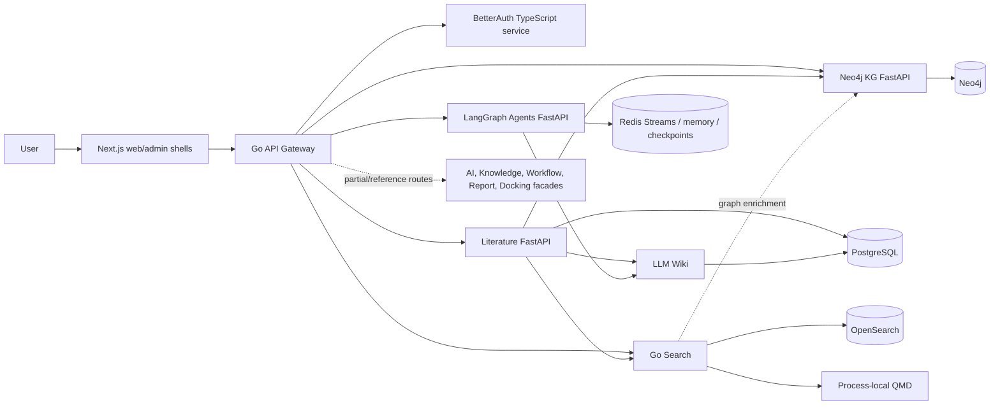
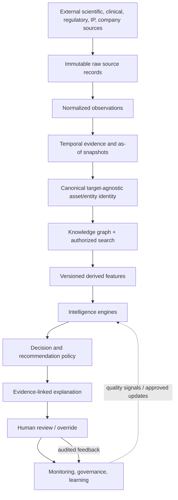

# AI-RxOS Architecture: Current, Transition, Target

## Purpose and Status

This document maps the existing repository toward the AI-RxOS evidence-backed asset decision platform. It separates source-verified **CURRENT** behavior from recommended **TRANSITION** work and the intended **TARGET**. Target components below are not claims of current implementation. The repository-level evidence and detailed discrepancy list are in [CODEBASE_ASSESSMENT.md](CODEBASE_ASSESSMENT.md).

The governing direction is to evolve named owners already in the monorepo. Do not add duplicate authentication, graph, search, wiki, or agent platforms. Implement only the currently authorized phase; Phase 2 canonical data modeling is in progress.

## CURRENT STATE

### Existing Architecture

Current labels in the diagram represent present code paths, not a guarantee that each request is authenticated, tenant-filtered, durable, or deployed together. The static web/admin pages are not yet a connected product. `apps/ai-services` and `apps/knowledge-service` overlap with `services/agents` and `services/kg`; their future role needs consolidation planning.

## TARGET STATE

### Target Conceptual Data and Decision Flow

The target preserves source fact, normalized observation, model prediction, AI inference, and human decision as distinct data types. It retains contradictory evidence and uncertainty and records source time, retrieval time, valid time, model/prompt/tool version, and evaluation cutoff. Human review is part of the system, not a post-hoc interface decoration.

## TRANSITION STATE

### Layer-by-Layer Evolution Map

| Target layer                               | Current implementation and status                                                                                  | Reusable foundation                                                             | Gap before target                                                                                            | Future owner / attachment point                                                                                        | Dependencies                                                                                 |
| ------------------------------------------ | ------------------------------------------------------------------------------------------------------------------ | ------------------------------------------------------------------------------- | ------------------------------------------------------------------------------------------------------------ | ---------------------------------------------------------------------------------------------------------------------- | -------------------------------------------------------------------------------------------- |
| Frontend/workspace                         | `apps/web`, `apps/admin`: PARTIAL starter shells; shared components in `packages/ui`.                              | Next.js apps, UI, SDK/types, Storybook.                                         | Authenticated workflows, evidence views, real API state and browser tests.                                   | Existing web/admin apps.                                                                                               | Stable APIs, verified auth/tenant contract, accessible data schemas.                         |
| API gateway                                | Go/chi proxy and HS256 validation: PARTIAL.                                                                        | `apps/api-gateway`.                                                             | Claim propagation, service identity, per-service authorization, readiness and consistent errors.             | Existing gateway, with local authorization retained in service owners.                                                 | Auth issuer decision, trusted ingress behavior, service authorization tests.                 |
| Authentication/security                    | BetterAuth active image plus legacy/adapter overlap: PARTIAL/CONFLICTING.                                          | `services/auth`, auth tests and existing auth audit.                            | One token/session contract, fail-closed tenant context, internal service credentials.                        | `services/auth` after explicit migration decision.                                                                     | Compatibility tests, secret management, identity propagation.                                |
| External sources/ingestion                 | Literature connectors for PubMed/PMC/trials/preprints plus limited conference/patent/company paths: PARTIAL.       | `services/literature` connectors, parser, crawler and integration clients.      | Rights-aware source coverage, cursors, durable jobs, retries, lineage, replay.                               | Existing literature owner; no new ingestion service assumed.                                                           | Per-source terms/rate limits, canonical source-record/evidence contracts.                    |
| Raw evidence                               | Some raw metadata/payload passes through connector pipeline; no immutable source archive: MISSING as shared layer. | Literature source records and Wiki provenance as migration inputs only.         | Immutable durable source record, hashes, license/retention, retrieval timestamps.                            | Ownership/storage boundary to be selected during Phase 2; source acquisition remains literature.                       | Canonical data ownership, object retention/security, idempotency.                            |
| Normalized observations                    | Literature extraction payloads plus Phase 2 append-only observations in the KG-owned PostgreSQL `canonical` schema: PARTIAL. | Existing literature pipeline, source IDs, canonical source/observation tables. | Full extraction-to-canonical reconciliation, contradiction review, and source replay.                         | Literature owns extraction; KG canonical API owns records and observation identity.                                      | Raw records, tenant-safe scope, source provenance.                                           |
| Temporal evidence                          | Timestamps and KG graph versions exist; no temporal/as-of truth model: MISSING.                                    | Existing source dates, `created_at` metadata and graph version history.         | Valid/recorded time, supersession, contradictory values, evaluation cutoff.                                  | Canonical data owner TBD in Phase 2; existing owners expose their source timestamps.                                   | Observation IDs, migration semantics, time-sliced test fixtures.                             |
| Canonical asset identity/entity resolution | KG-owned canonical PostgreSQL identities, namespaced IDs, sourced aliases, exact resolution, and ambiguous-name results: PARTIAL. | Existing KG owner, literature source IDs, new canonical migration/repository.  | Existing source reconciliation, review workflow, richer merge history, and complete API consumers.           | `services/kg` canonical API/PostgreSQL is the identity authority; Neo4j is a projection.                                  | Stable source IDs, reviewer identity, tenant-safe boundaries.                                 |
| Knowledge graph                            | `services/kg` retains Neo4j CRUD/import/version and projects global canonical UUIDs via an outbox: PARTIAL/CONFLICTING. | Existing KG service plus canonical projection worker/outbox.                    | Live projection retry validation, source-linked evidence edges, tenant-safe graph reads, legacy facade migration. | `services/kg`; PostgreSQL remains canonical authority and Neo4j a graph projection.                                  | Canonical identity, tenant security, source event/replay contracts.                          |
| Search/vector retrieval                    | Existing OpenSearch/QMD/RRF plus canonical ID/type document fields and explicit index failure responses: PARTIAL. | Existing `services/search` index API; canonical outbox payload.                  | Local OpenSearch demo CA is not trusted by Search; verify delivery/retry and tenant-safe canonical search.      | `services/search` remains sole search owner; OpenSearch is a rebuildable projection.                                  | CA trust config, canonical records, authorization filters, index rebuild manifests.           |
| Derived features                           | Heuristic literature scores exist; reproducible persisted features absent: PARTIAL.                                | Existing ranking/extraction utilities as labeled heuristics.                    | Input evidence IDs, algorithm version, uncertainty, temporal cutoff and reproducibility.                     | Future feature/engine owner selected per domain; orchestrated by existing agents where needed.                         | Canonical evidence/time layer and representative tests.                                      |
| Intelligence engines                       | Generic agent runtime only; domain engines missing.                                                                | `services/agents`, MCP/tool/model registry and provider adapters.               | Scientific tools, outputs, citations, evaluation, safety policy and domain fixtures.                         | Existing agent runtime plus separately owned domain modules; no second orchestrator.                                   | Evidence/retrieval contracts, feature lineage, model/prompt evaluation.                      |
| Decision/recommendation                    | No implementation found: MISSING.                                                                                  | Auth/audit, future feature/engine outputs, existing report/workflow API intent. | Versioned policy, snapshot, uncertainty, conflicts, thresholds, comparison and overrides.                    | Decision domain owner TBD; do not infer `services/reports` is the engine.                                              | Validated features/engines, temporal snapshots, human policy.                                |
| Explainability                             | Citation/search enrichment and Wiki provenance partial; no decision explanation contract.                          | Search citations, Wiki versions/provenance, agent output metadata.              | Claim-to-evidence mapping, counterevidence, cutoff, model/policy version.                                    | Decision API and evidence owner; render in existing UI.                                                                | Decision snapshot schema, observation refs, human review.                                    |
| Research copilot                           | Runtime has streaming/tools/memory; integrated product copilot missing.                                            | `services/agents`, `services/search`, KG/literature, LLM Wiki.                  | Tenant-safe evidence tool calls, citations, fact/inference separation, evaluations.                          | `services/agents` runtime; existing web app for UI.                                                                    | Auth, search/evidence APIs, policy, structured outputs.                                      |
| Human review/override                      | Auth audit exists; no asset recommendation review workflow: MISSING.                                               | Auth identities/audit schema, workflow/report route intent.                     | Durable reviewer decisions, rationale, state/version, override audit.                                        | Product workflow owner TBD; do not adopt in-memory workflow API as durable.                                            | Recommendation snapshot, permissions, durable job model.                                     |
| Monitoring/learning                        | Service logs/metrics/tracing partial; no evidence/outcome learning loop: MISSING.                                  | Current service telemetry, agent hooks, auth audit.                             | Central collector/alerts/data quality/outcomes; governance before feedback can change models.                | Platform operations plus domain owners; no monitor service exists today.                                               | Standard telemetry/events, privacy policy, evaluation/outcome labels.                        |
| Governance                                 | Auth audit and Wiki provenance partial; model/data governance missing.                                             | Existing audit fields/provenance/versioned Wiki.                                | Lineage, retention, approvals, model/prompt/tool release, human accountability.                              | Cross-cutting policy owned by platform plus service-specific enforcement.                                              | Canonical evidence, access controls, audit event contracts.                                  |

Owner decisions explicitly deferred: decision-engine service boundary, centralized monitoring backend, durable workflow/event product. Canonical ownership is assigned to `services/kg` and the shared PostgreSQL `canonical` schema in Phase 2; see `PHASE_2_GAP_MATRIX.md` for limitations.

## 4. Cross-Cutting Architecture

### Frontend

**CURRENT:** Next.js web/admin shells and a shared UI/Storybook package. The home screens are not authenticated workspaces and do not consume the typed SDK in their inspected routes.

**TRANSITION:** preserve Next.js and UI exports; connect route groups to stable gateway contracts. Build evidence, asset, comparison, review and copilot workflows only after data and authorization contracts exist.

**TARGET:** role-aware research and portfolio workspace with secure, traceable evidence exploration, asset evaluation, comparison, review and monitoring. UI must show provenance, uncertainty, conflicts, loading/error states, and temporal context.

### API layer

**CURRENT:** Go/chi gateway routes to existing service owners, validates an HS256 bearer token and rate-limits requests. It does not propagate verified identity/tenant claims; some services expose direct ports and do not authenticate locally.

**TRANSITION:** keep gateway and public paths; normalize token validation and service-to-service identity. Define OpenAPI/versioned request, response, pagination, error, tenant, request-ID and idempotency contracts per existing owner.

**TARGET:** gateway for routing/rate policy plus independently authorized domain services. Tenant scope is derived from verified identity, cannot be overridden by client filters, and is enforced at every persistence/query boundary.

### Authentication, authorization, and tenancy

**CURRENT:** BetterAuth functionality, legacy source, auth-adapter scaffold, JWT gateway middleware, and service-specific policy implementations coexist. RLS/session-setting conventions mismatch and some policies permit NULL tenant scope.

**TRANSITION:** preserve users/sessions and APIs while determining the deployed issuer/contract; add compatibility tests, propagate verified claims, unify tenant setting names, deny by default, test RLS and service-level filtering, and gate direct service access.

**TARGET:** a single documented identity authority, service-specific authorization with common policy contracts, least-privilege service credentials, verified tenant/workspace/project scope, fail-closed database controls, and auditable access decisions. This is not a Phase 1 redesign.

### Persistence and ownership

**CURRENT:** PostgreSQL owns Auth/Wiki, partial Literature/agent state, and the Phase 2 `canonical` schema managed by KG. Neo4j belongs to `services/kg`; OpenSearch belongs to `services/search`; Redis backs Auth and agents. Literature schema remains partial/dynamic and several APIs are process-local.

**TRANSITION:** retain each store and named owner. Inventory actual tables/indexes, add owner-managed additive migrations, decide which records belong in relational/graph/search stores, and establish idempotent outbox/replay or rebuildable indexing contracts.

**TARGET:** canonical durable domain/evidence data has explicit authoritative ownership; graph and search are derived/query projections whose provenance and rebuild path are known. No store silently becomes a competing source of truth.

## 5. Service Evolution Boundaries

| Existing owner                                               | Keep and evolve toward                                                                                                                            |
| ------------------------------------------------------------ | ------------------------------------------------------------------------------------------------------------------------------------------------- |
| `services/auth`                                              | Identity, session/token issuance, organizations and access policy; settle adapter/legacy status before any replacement.                           |
| `apps/api-gateway`                                           | External routing and common edge controls; add verified claim propagation only with trust-boundary tests.                                         |
| `services/literature`                                        | Source acquisition, parsing/extraction and ingest orchestration; add durable evidence contracts without rebuilding connectors wholesale.          |
| `services/kg`                                                | Canonical PostgreSQL entity/identity/provenance APIs and migrations; Neo4j schema/API/import/version and global canonical projections.               |
| `services/search`                                            | OpenSearch/search/index ownership; extend rather than build a second search stack.                                                                |
| `services/llm-wiki`                                          | Versioned knowledge summaries/memory and provenance; keep summaries distinct from canonical facts/observations.                                   |
| `services/agents`                                            | Agent execution, tools, prompts, models, memory, MCP and job runtime; host future domain agents rather than add a second orchestrator.            |
| `packages/ui`, `packages/sdk`, `packages/types`              | Shared presentation/client/schema primitives; version stable API contracts and avoid leaking server implementation details into apps.             |
| `apps/ai-services`, `apps/knowledge-service`                 | Compatibility facades only where needed; future consolidation must preserve routes/contracts or provide adapters and tests.                       |
| `services/workflows`, `services/reports`, `services/docking` | Existing reference contracts may inform later requirements; replace in-memory/stub internals only when a later phase defines production behavior. |

## 6. Intelligence, Decision, and Explainability Boundaries

The generic agent runtime is not the scientific intelligence layer. Each future engine should be a separately testable domain capability that reads authorized, time-bounded evidence and emits typed outputs with source observation IDs, uncertainty, feature/model/prompt/tool versions, and explicit unsupported/unknown values.

Predictions must remain distinct from recommendation policy. The decision engine should consume versioned evidence/features and produce a reproducible recommendation snapshot; it must not let an LLM silently promote a hypothesis into fact. Explainability must include supporting and contradictory evidence, date cutoff, uncertainty, and reviewer disposition. Legal/licensing conclusions require verified source material and qualified human review.

No engine, recommendation, copilot redesign, opportunity discovery, or asset evaluation API is implemented by this document.

## 7. Governance, Security, and Observability

**CURRENT:** service-level logs/metrics, some request IDs, agent tracing hooks, auth audit records, encrypted agent execution payloads and Wiki tenant filters. Central observability, complete tenant guarantees and unified audit are not established.

**TRANSITION:** establish event/audit schemas and access policy; preserve service audit records while defining a central sink. Add metrics/traces with tenant-safe redaction, alerts, data-quality checks, source freshness and migration/backup runbooks. Add security gates to CI for cross-tenant access, token claims, direct service routes and secrets configuration.

**TARGET:** governance for data lineage, access, retention, model/prompt/tool approval, evaluation, change control, human override and decision traceability. Operations monitor source health, evidence freshness, retrieval quality, engine calibration, drift, system availability and backup/restore. Observability must avoid logging protected raw evidence or credentials.

## 8. Event and Workflow Direction

**CURRENT:** agent jobs use Redis Streams; literature uses an in-process worker/scheduler plus partial Postgres job state. Kafka, Temporal and a general event bus are not operationally present. Workflow/report/docking state is in memory.

**TRANSITION:** first make owner-local work durable, idempotent, recoverable and observable. Add versioned integration events only when consumers and replay behavior are defined. Do not introduce Kafka/Temporal as a reflexive rewrite; select a platform only against measured workflow requirements and migration cost.

**TARGET:** durable ingestion and long-running orchestration with retries, deduplication, state transitions, dead-letter review, replay, audit, and clear source-of-truth ownership. Events carry tenant, schema version, provenance, event ID and creation time; consumers are idempotent.

## 9. Migration Guardrails

1. Phase 1 repository assessment and architecture mapping are complete. Phase 2 Canonical Data Model is authorized and in progress; additions remain migration-backed and preserve existing consumers.
2. Before adding a target capability, identify its current service owner and classify current behavior using the assessment matrix.
3. Prefer additive schemas, adapters, dual-read/write only when bounded and measured, migration telemetry, and rollback plans. Preserve current APIs until consumers move.
4. Require compatibility tests for auth/token, tenant boundaries, graph/search contracts, and source ingestion before routing traffic to migrated owners.
5. Distinguish implemented from planned in code, docs, UI status, and operational dashboards. A route, container, Helm value, or test double is not proof of production capability.
6. Do not delete a working service or database solely to align terminology. A replacement requires a documented conflict, compatibility plan, and separate authorization.

## 10. Phase Boundary

**PHASE 2 — CANONICAL DATA MODEL is in progress.** Its starting point is the existing Auth, Literature, KG, Search, Wiki, and agent ownership described here and in [CODEBASE_ASSESSMENT.md](CODEBASE_ASSESSMENT.md), not a greenfield schema. Canonical identity/provenance/observation persistence is additive in the KG owner with PostgreSQL authoritative. See [PHASE_2_GAP_MATRIX.md](PHASE_2_GAP_MATRIX.md) and [PHASE_2_IMPLEMENTATION.md](PHASE_2_IMPLEMENTATION.md) for progress and remaining gaps. Phase 3 is not started.
