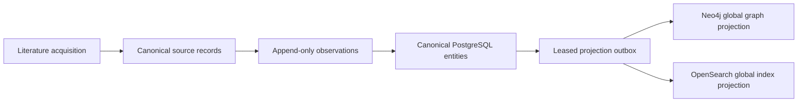

# AI-RxOS Architecture Constitution

## Status

This document is the code-backed Phase 0 architecture baseline for the existing
repository. It describes what is present today and separates it from planned
capabilities. Detailed service-specific designs remain in `architecture/` and
the service directories.

## Product Identity

AI-RxOS is an evidence-backed translational oncology decision-support platform.
Its purpose is to help pharmaceutical, biotech, investment, and drug-development
teams decide whether a therapeutic asset is worth pursuing, licensing,
partnering, monitoring, avoiding, or competing with.

The platform is not merely a drug database and not merely an LLM chatbot. AI
claims must be traceable to source evidence, normalized observations, temporal
context, derived features, model predictions, or explicitly labeled AI
inference. Human experts remain in the decision loop.

Initial examples may include breast cancer and targets such as HER2, ESR1,
CDK4/6, TROP2, B7-H4, ferroptosis, FTL, and NK-cell targets. These are seed
domains only. The data model and service contracts must remain target-,
indication-, disease-, modality-, company-, and asset-agnostic.

## Current System Shape

The repository is a Turborepo/pnpm monorepo containing Next.js web/admin apps,
a Go API gateway, FastAPI facades, shared TypeScript packages, Python and Go
services, Docker Compose, Helm/Kubernetes manifests, tests, and architecture
documents.

The implementation is a scaffold with several substantial vertical slices. It
is not yet a complete translational oncology product.

## Evidence-First Flow

```text
raw scientific/clinical/regulatory/IP data
  -> ingestion and provenance
  -> normalized observations
  -> temporal evidence
  -> canonical asset/entity identity
  -> knowledge graph and search indexes
  -> derived features
  -> intelligence engines
  -> decision and recommendation
  -> human review, explanation, and audit
```

The system must preserve contradictory evidence, uncertainty, historical
validity windows, and source timestamps. Missing facts are explicit unknowns;
they are never filled with plausible-looking LLM text.

## Implemented Reusable Foundations

- BetterAuth/JWT/session/RBAC/MFA/ABAC/audit foundations in `services/auth`.
- Neo4j graph CRUD, import, versioning, constraints, and evidence scoring in
  `services/kg`. Phase 2 extends this owner with canonical PostgreSQL entities,
  identity, provenance, observations, and APIs.
- Neo4j tenant isolation is enforced at the KG query boundary with explicit
  tenant/system scopes. Both endpoints of every relationship operation are
  checked; arbitrary Cypher execution is disabled because Neo4j Community
  does not provide property-based RLS.
- OpenSearch tenant isolation is enforced at the Search application boundary:
  shared-index queries include public, organization, and workspace visibility
  predicates, while the client stores no mutable tenant state. OpenSearch
  native document-level security is not enabled by the current deployment.
- Canonical PostgreSQL is the source of truth for entities, relationships,
  observations, and provenance. Its transactional projection outbox feeds the
  existing Neo4j and OpenSearch projections through a leased retryable worker;
  neither derived store is authoritative.
- The validated B10 integration path follows source record, reconciliation,
  canonical identity, evidence, relationship, outbox, projection, Search, and
  graph retrieval while preserving tenant and public visibility boundaries.
- B11 deployment validation requires a non-superuser runtime PostgreSQL role,
  healthy Auth/Gateway startup, and rendered Helm probes/configuration before
  deployment readiness can be claimed.
- Literature connectors, parsing, extraction, normalization, deduplication,
  summaries, metrics, and local retry/job behavior in `services/literature`.
- The Literature owner now supports durable FDA Drugs@FDA application and
  submission ingestion through the same tenant-scoped job/checkpoint path;
  normalized regulatory events reconcile into canonical source records,
  observations, claims/evidence, and the existing projection outbox.
- OpenSearch/hybrid search, citation enrichment, graph enrichment, and RRF
  code in `services/search`.
- Versioned LLM Wiki persistence and provenance in `services/llm-wiki`.
- A custom bounded agent runtime with checkpoints, Redis Streams, retries,
  prompt/model/tool registries, memory, streaming, and redaction in
  `services/agents`.
- Shared UI primitives and Storybook stories in `packages/ui` and
  `apps/storybook`.
- Container and Helm packaging in `docker-compose.yml`, `infra/helm`, and
  `infra/k8s`.

## Architectural Boundaries

- `services/auth` owns identity until the BetterAuth adapter migration is
  deliberately completed and verified.
- `services/search` owns search and embedding-index contracts.
- `services/kg` owns Neo4j persistence and graph schema behavior.
- `services/kg` also owns canonical biomedical APIs and migrations; the shared
  PostgreSQL `canonical` schema is authoritative for identity, source records,
  relationships, and observations.
- `services/llm-wiki` owns durable wiki pages, chunks, versions, and provenance.
- `services/agents` owns agent execution, tools, prompts, memory, and jobs.
- PostgreSQL remains authoritative for durable service state where a service
  owns relational records.
- Neo4j and OpenSearch hold rebuildable projections of canonical records and
  are not competing identity authorities.
- MLflow supports tracking/artifacts but never replaces PostgreSQL lifecycle
  authority or human promotion policy.
- New domain services must reuse these owners instead of creating duplicate
  auth, search, graph, memory, or orchestration systems.

## Non-Negotiable Principles

1. Evidence before explanation.
2. Provenance for every important claim.
3. Facts, observations, predictions, AI inference, and human decisions remain
   distinguishable.
4. Temporal validity and retrospective leakage controls are mandatory.
5. Contradictions and uncertainty are first-class data.
6. Licensing and legal conclusions require verified evidence and expert review.
7. Tenant isolation is enforced inside services, not assumed from gateway
   routing.
8. Security failures fail closed.
9. Existing working functionality is extended incrementally.
10. No seed example becomes a hard-coded architecture.

## Known Reality Gaps

- The architecture folder claims more bounded contexts and microservices than
  are deployable in this repository.
- Kafka, Temporal, durable workflow execution, centralized audit storage,
  multi-region operations, and production observability are not complete.
- Tenant propagation and enforcement are inconsistent; some RLS policies fail
  open when tenant context is absent.
- Literature still has in-memory/JSON persistence paths despite production
  schema documentation.
- Local QMD search and report/workflow services contain in-memory behavior.
- The generic agent runtime exists, but concrete scientific domain agents and
  many scientific tools are not implemented.
- Docking is a contract/stub path, not verified AutoDock/Vina execution.
- Native and Docker Compose environments are intentionally separate.

## Migration Rule

When existing implementation conflicts with this constitution, document the
conflict in the roadmap, add compatibility tests, and migrate the smallest
boundary possible. Do not replace a working service because a future design
names a different technology.

## Phase 2 Canonical Flow



The KG service owns the canonical API; the existing shared PostgreSQL owns
canonical data. Namespaced identifiers resolve exactly, verified aliases may
resolve, and name collisions remain ambiguous. Canonical APIs independently
verify bearer claims and enforce organization scope. Tenant-owned entities are
not projected to unscoped graph/search stores. The local Compose demo CA is
mounted and trusted by Search with TLS verification enabled; synthetic global
projection has passed live validation. Managed CA/provider configuration and
tenant-private projection remain open. The implementation inventory and remaining gaps are in
`PHASE_2_GAP_MATRIX.md`.

### Patent and Licensing Evidence (Phase 8)

Patent ingestion extends the existing Literature durable job and canonical KG
owners. Google Patents public search results become tenant-scoped normalized
patent rows plus content-hashed source snapshots, then jurisdiction-scoped
canonical identifiers, patent/family entities, source-fact observations,
claims/evidence, and outbox events. Retrieval, source date precision, and
canonical availability remain distinct. The same KG projection worker handles
global records, while private records remain excluded from global projections.

Structured licensing/assignment events may be submitted through the canonical
IP event contract only with source provenance. Parties and covered assets/
patents link only through unique exact identifiers. A name, search result, or
AI extraction is not sufficient to establish ownership or a license, and the
system makes no legal or freedom-to-operate determination. Google Patents is
not a substitute for official assignment registers; automated licensing
discovery and broader authoritative patent-office sources remain limitations.