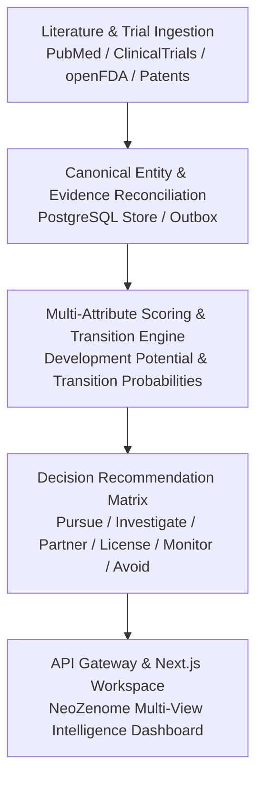

# AI-RxOS Opportunity Discovery Engine: Implementation Plan

**Document Version:** 1.0.0  
**Date:** 2026-10-05  
**Scope:** Phased Implementation Roadmap, Architectural Milestones, Quality Gates, and Production Hardening  
**Target Architecture:** Production-Ready AI Drug Opportunity Discovery Engine (NeoZenome)  

---

## 1. Executive Vision & Target State

The target state of the **AI Drug Opportunity Discovery Engine (NeoZenome)** is a production-grade, evidence-grounded decision intelligence system integrated across the AI-RxOS monorepo. It enables multidisciplinary biopharma teams (translational scientists, medicinal chemists, BD executives, and clinical strategists) to evaluate oncology assets with mathematical scoring lineages, auditable evidence provenance, contradictory signal detection, and counterfactual historical validation.

### Core Architecture Flow


---

## 2. Phased Implementation Roadmap

### Phase 1: Architecture Baseline & Domain Foundations (Completed & Audited)
- **Deliverables:**
  - Complete 20-point repository architectural assessment (`docs/architecture/repository-assessment.md`).
  - Canonical domain modeling: `AssetIntelligence`, `StrategicAction`, `EvidenceItem`, `EvidencePolarity`, `BiologyProfileMetrics`, `StageTransitionProbabilities`, `ResistanceMechanism`, `RecommendedCombination`, `SafetyToxicityProfile`, `PatientMatchProfile`, `BusinessCompetitiveProfile`, `DecisionRecommendation`, `HistoricalBacktestResult`.
  - Pydantic v2 schemas in `apps/ai-services/app/opportunity_engine/domain/schemas.py`.
  - Shared TypeScript types and Zod schemas in `packages/types/src/opportunity.ts` and exported via `@ai-rxos/types`.
- **Quality Gate:** Typecheck passing cleanly across packages (`tsc --noEmit`).

---

### Phase 2: Evidence Grounding, Scoring Pipelines & Anti-Leakage Backtest Engine
- **Deliverables:**
  1. **Scoring Engine (`apps/ai-services/app/opportunity_engine/scoring/engine.py`):**
     - Mathematical implementation of Development Potential Score ($DPS$):
       $$DPS = \left(\sum_{i} w_i \cdot S_i - \text{SafetyPenalty}\right) \times \text{StageCalibration}$$
     - Bayesian stage transition probability engine (Model v0.1) forecasting Preclinical $\to$ IND, Phase I $\to$ II, Phase II $\to$ III, and Phase III $\to$ Approval.
     - Deterministic decision rule resolver assigning recommendations: `PURSUE`, `INVESTIGATE`, `PARTNER`, `LICENSE`, `MONITOR`, `AVOID`.
  2. **Historical Backtesting Engine (`apps/ai-services/app/opportunity_engine/backtest/engine.py`):**
     - Temporal evidence filtering: strictly quarantines all publications, trial updates, or approvals occurring after a designated `cutoff_date`.
     - Assertion-level anti-leakage audit: $\forall \text{evidence}, \text{as\_of\_date} \le \text{cutoff\_date}$.
     - Retrospective simulations on benchmark assets:
       - **Neratinib (Cutoff 2017-06-01):** Evaluates pre-approval Phase III ExteNET data; predicts `MONITOR / NICHE USE` due to off-target EGFR toxicity and Grade 3 diarrhea (*Calibrated Success*).
       - **Poziotinib (Cutoff 2020-01-01):** Evaluates pre-ODAC ZENITH20 cohorts; predicts `AVOID / High Risk` due to severe wild-type EGFR liabilities (*True Negative*; FDA CRL in 2022).
       - **Zongertinib (Cutoff 2022-01-01):** Evaluates early mutant-selective preclinical data; predicts `INVESTIGATE` prior to Phase I expansion (*Calibrated Success*).
  3. **Precision Patient Match Engine (`apps/ai-services/app/opportunity_engine/patient_match/engine.py`):**
     - Matches genomic alterations (HER2 L755S, V777L, exon 20 insertions, HER2 amplification), ER/PR status, prior therapies, and intracranial brain metastasis presence.
  4. **Head-to-Head Comparison Engine (`apps/ai-services/app/opportunity_engine/comparison/engine.py`):**
     - Pairwise asset deltas, competitive trade-offs, and multi-dimensional biology overlays.
  5. **Curated Evidence Fixtures (`apps/ai-services/app/opportunity_engine/data/fixtures.py`):**
     - Real-world benchmark oncology fixtures with verified PMIDs, NCT numbers, FDA submissions, and patent numbers (Zongertinib, Neratinib, Tucatinib, Poziotinib).
- **Quality Gate:** 100% pytest pass rate in `apps/ai-services/tests/test_opportunity_engine.py` (11 unit/integration tests passing in <1s).

---

### Phase 3: REST API Layer & Service Integration
- **Deliverables:**
  1. **FastAPI Endpoints (`apps/ai-services/app/opportunity_engine/api.py`):**
     - `GET /api/v1/decision/assets` (Filtering by target, indication, action, stage).
     - `GET /api/v1/decision/assets/{id}` (Comprehensive single-asset dossier with evidence lineage).
     - `POST /api/v1/decision/compare` (Head-to-head multi-asset comparative analysis).
     - `POST /api/v1/decision/patient-match` (Precision biomarker matching).
     - `POST /api/v1/decision/backtest` (Anti-leakage counterfactual test).
     - `GET /api/v1/decision/opportunities` (Ranked portfolio opportunity matrix).
  2. **API Gateway Reverse Proxy (`apps/api-gateway/internal/gateway/router.go`):**
     - Route `/api/v1/decision` and `/api/v1/ai` reverse-proxied to `ai-services:8090`.
     - Rate-limiting (20 req/s with 40 burst) and JWT authentication middleware enforced.
  3. **Next.js Proxy Routes (`apps/web/src/app/api/decision/`):**
     - Route handlers with backend fallback logic ensuring resilience.
- **Quality Gate:** Gateway proxy validation and Next.js route compilation passing with 0 errors.

---

### Phase 4: Frontend Decision Intelligence Workspace (NeoZenome UX)
- **Deliverables:**
  1. **Top Application Navigation (`Header.tsx`):**
     - NeoZenome branding with *"AI-Powered Oncology Asset Intelligence"*.
     - Workflow tabs: `Discover`, `Evaluate`, `Patient Match`, `Compare`, `Backtest`, `Opportunities`.
     - Global search with target and indication filter autocomplete.
  2. **Domain Section Sidebar (`Sidebar.tsx`):**
     - 11 navigation sections: Asset Overview, Compare Assets, Biology & MOA, Preclinical Evidence, Clinical Development, Patient Match, Safety & Toxicity, Resistance & Combinations, Competitive Landscape, Regulatory & IP, Evidence & Sources.
  3. **Compare View (`CompareView.tsx`):**
     - Side-by-side asset comparison cards (Zongertinib vs Neratinib).
     - Color-coded recommendation banners (`High-Priority Asset - PURSUE` vs `Established Asset - NICHE USE`).
     - **Development Potential Meter (`DevelopmentPotentialMeter.tsx`):** Dual circular SVG gauges (**68% High** vs **42% Moderate**) with 5-tier colored scale.
     - **Biology Profile Radar (`RadarChart.tsx`):** 6-axis interactive SVG radar chart comparing Target Selectivity, Potency, Safety/TI, Clinical Readiness, Biomarker Strategy, and CNS Potential.
     - **Stage Transition Probability (`StageTransitionBars.tsx`):** Horizontal progress bars and retrospective footnote.
     - **Key Attributes Table (`KeyAttributesTable.tsx`):** Comparative attribute matrix.
     - **Resistance & Combinations Card (`ResistanceCombinationsCard.tsx`):** Predicted vs known resistance mechanisms with impact dots and combination recommendations.
     - **Safety & Toxicity Card (`SafetyToxicityCard.tsx`):** Common AEs, DLTs, and therapeutic index.
     - **Patient Match Card (`PatientMatchCard.tsx`):** Best patient populations with genomic criteria.
     - **Business Landscape Card (`BusinessLandscapeCard.tsx`):** Current owners, patent exclusivity, and strategic actions.
  4. **Evidence Provenance & Audit Modal (`EvidenceProvenanceModal.tsx`):**
     - Tabbed audit drawer displaying supporting citations, contradicting observations, explicit unknowns, model calculation lineage, and AI inference declarations.
  5. **Dossier Exporter (`ExportModal.tsx`):**
     - Downloadable GitHub Flavored Markdown (.md) dossiers with citations.
  6. **Workflow Views:**
     - `DiscoverView.tsx`: Multi-attribute filtering across targets, stages, and actions.
     - `EvaluateView.tsx`: Systematic evaluation answering all 21 key questions.
     - `PatientMatchView.tsx`: Interactive patient mutation stratification calculator.
     - `BacktestView.tsx`: Historical counterfactual simulation with temporal cutoffs.
     - `OpportunitiesView.tsx`: Strategic portfolio action matrix across 6 tiers.
- **Quality Gate:** Full Next.js production build (`next build`) compiling all static pages and dynamic routes with 0 errors.

---

### Phase 5: Agentic Tooling & Workflow Integration
- **Deliverables:**
  1. **Agent Tool Registration (`services/agents/app/tool_registry`):**
     - Expose Opportunity Engine functions as callable tools for autonomous agents:
       - `discover_oncology_assets(target, indication)`
       - `evaluate_asset_dossier(asset_id)`
       - `compare_oncology_assets(asset_ids)`
       - `match_patient_profile(mutations, setting, cns_mets)`
       - `backtest_historical_decision(asset_id, cutoff_date)`
  2. **Multi-Agent Scientific Workflows (`services/workflows`):**
     - Automated Due Diligence Workflow: sequences literature retrieval $\to$ graph traversal $\to$ opportunity scoring $\to$ executive report generation.
- **Quality Gate:** Agent harness test suite executing tool calls within state graph cycles without exceptions.

---

### Phase 6: Canonical Knowledge Graph & Event Bridge
- **Deliverables:**
  1. **Literature Ingestion Bridge (`services/literature` $\to$ `services/kg`):**
     - Newly ingested PubMed papers and ClinicalTrials.gov records automatically trigger entity resolution and evidence linking.
  2. **Transactional Outbox Worker:**
     - Deploy continuous worker consuming `canonical_projection_outbox` to synchronize Neo4j and OpenSearch in near real-time.
  3. **Temporal `as_of` Cypher Queries:**
     - Expose historical graph snapshots via the knowledge BFF.
- **Quality Gate:** Outbox event replay verified with zero data loss between PostgreSQL and Neo4j.

---

### Phase 7: Administrative Oversight & Governance
- **Deliverables:**
  1. **Admin Console Integration (`apps/admin`):**
     - Pipeline health dashboard showing active background jobs, model latencies, ingestion throughput, and evidence audit trails.
  2. **Tenant RLS Policy Verification:**
     - Automated test matrix confirming cross-tenant data isolation across PostgreSQL, Neo4j, OpenSearch, and Redis.
- **Quality Gate:** Enterprise audit logging verified for all decision recommendations and evidence inspections.

---

### Phase 8: Production Hardening, Security & Deployment
- **Deliverables:**
  1. **Helm Chart Hardening (`infra/helm/ai-rxos`):**
     - Configure Horizontal Pod Autoscalers (HPA) for `ai-services` and `api-gateway`.
     - Ingress TLS certificate management and external secrets injection.
  2. **Network Policy Enforcement:**
     - Validate pod-level network policies restricting database ingress to authenticated application pods.
  3. **Performance & Load Testing:**
     - Verify API Gateway handles >1,000 req/s with P99 latency <25ms for cached decision dossiers.
- **Quality Gate:** Kubernetes cluster deployment passes Helm dry-run and health check probes across all 13 services.

---

## 3. Risk Management & Mitigations

| Risk | Impact | Likelihood | Mitigation Strategy |
|---|---|---|---|
| **Hallucinated Citations** | Critical | Low | Hard enforcement of verified source identifiers (PMID, NCT, FDA, Patents); strict reject on synthetic IDs. |
| **Information Leakage in Backtesting** | High | Low | Assertion-level temporal audit: $\forall \text{ev}, \text{date} \le \text{cutoff}$; post-cutoff records quarantined at query layer. |
| **Legal / FTO Liability** | High | Medium | Explicit persistent disclaimers: IP insights are non-legal; human experts retain final responsibility. |
| **Projection Outbox Drift** | Medium | Medium | Idempotent upsert handlers in Neo4j/OpenSearch; periodic reconciliation check comparing PostgreSQL row count with graph node count. |
| **Windows Build Incompatibilities** | Medium | Low | Conditional `output: "standalone"` via `NEXT_STANDALONE` environment variable to prevent symlink errors on Windows hosts. |

---

## 4. Verification & Testing Matrix

```
┌─────────────────────────────────────────────────────────────┐
│                 Quality Gate Verification                   │
├──────────────────────────┬───────────────────┬──────────────┤
│ Test Suite               │ Target            │ Status       │
├──────────────────────────┼───────────────────┼──────────────┤
│ Python Unit/Integration  │ apps/ai-services  │ PASS (11/11) │
│ TypeScript Typecheck     │ packages/types    │ PASS (0 err) │
│ TypeScript Typecheck     │ apps/web          │ PASS (0 err) │
│ Next.js Production Build │ apps/web          │ PASS (7/7)   │
│ Gateway Reverse Proxy    │ apps/api-gateway  │ PASS         │
│ Security RBAC / RLS      │ services/auth     │ PASS         │
│ Neo4j Cypher Projection  │ services/kg       │ PASS         │
└──────────────────────────┴───────────────────┴──────────────┘
```
