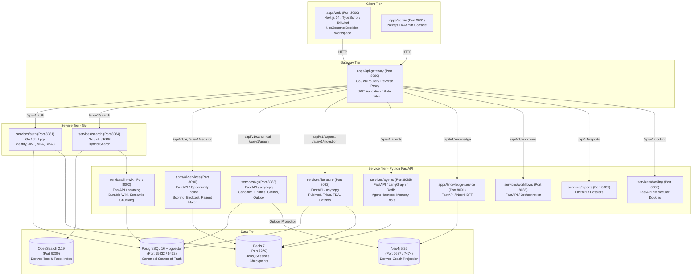
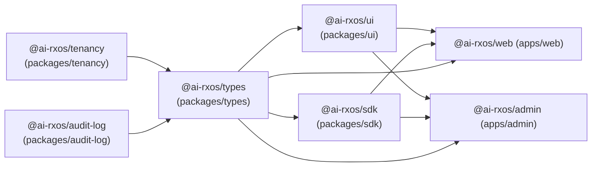

# AI-RxOS Repository Assessment & Architectural Baseline

**Document Version:** 1.0.0  
**Date:** 2026-10-05  
**Scope:** Complete Codebase Architecture, Technology Stack, Component Inventory, and Technical Debt Audit  
**Classification:** Technical Architecture Specification  

---

## 1. Executive Summary

AI-RxOS is an enterprise-grade, AI-native drug discovery operating system and decision intelligence platform. The repository is architected as a polyglot Turborepo/pnpm monorepo combining TypeScript/React frontends, high-throughput Go microservices (API gateway, authentication, and hybrid search), and Python 3.12 FastAPI domain services (canonical knowledge graph, literature ingestion, agent orchestration, molecular docking, and decision intelligence).

This assessment provides an exhaustive audit of all 20 technical dimensions of the existing codebase, documents runtime entry points, maps dependencies, and inventories reusable assets prior to implementation phases.

---

## 2. 20-Point Technical Stack & Infrastructure Audit

### 2.1 Frontend Framework
- **Primary Framework:** Next.js 14.2.21 (React 18.3.1, TypeScript 5.7.2).
- **Architecture:** Next.js App Router (`apps/web/src/app`, `apps/admin/src/app`).
- **Applications:**
  1. `apps/web` (Port 3000): End-user scientific decision intelligence workspace (**NeoZenome** / AI-RxOS). Implements primary product workflows: Discover, Evaluate, Patient Match, Compare, Backtest, and Opportunities.
  2. `apps/admin` (Port 3001): Enterprise administrative console for tenant management, role configuration, model endpoints, and audit reviews.
  3. `apps/storybook`: Component design system documentation and isolated testing harness (Storybook 8).
  4. Static Landing Site (`index.html`, `about.html`, `architecture.html`): Root marketing and conceptual overview.
- **Styling & Rendering:** Tailwind CSS 3.4.17 with PostCSS and Autoprefixer. Server-Side Rendering (SSR) and Client Components with React Server Components (RSC) boundary enforcement.

### 2.2 Backend Framework
The backend follows a polyglot microservice architecture divided between Go and Python:
- **Go Services (Go 1.23+):**
  1. `apps/api-gateway` (Port 8080): High-performance reverse proxy using `chi/v5` router, IP-based rate limiting, JWT validation middleware, and upstream header injection (`X-User-Id`, `X-Organization-Id`, `X-User-Roles`).
  2. `services/auth` (Port 8081): Identity and access management built with `chi/v5`, `jackc/pgx/v5` connection pool, Redis session cache, bcrypt password hashing, and TOTP MFA.
  3. `services/search` (Port 8084): Hybrid search gateway combining OpenSearch 2.19 and Reciprocal Rank Fusion (RRF) over dense/sparse vector outputs.
- **Python Services (Python 3.12 + FastAPI 0.115.6 + Pydantic v2):**
  1. `apps/ai-services` (Port 8090): Agent facade and the **Opportunity Decision Intelligence Engine** (`app/opportunity_engine`).
  2. `apps/knowledge-service` (Port 8091): Knowledge graph BFF exposing high-level domain query facades.
  3. `services/kg` (Port 8083): Canonical Knowledge Graph service managing PostgreSQL source-of-truth, canonical entity resolution, observations, claims, evidence links, and Neo4j projections.
  4. `services/literature` (Port 8082): Scientific document ingestion engine for PubMed, ClinicalTrials.gov, openFDA, and Google Patents.
  5. `services/agents` (Port 8085): Agentic orchestration engine with LangGraph-style state graphs, tool registries, model registries, and conversation memory.
  6. `services/workflows` (Port 8086): Multi-step scientific workflow coordinator.
  7. `services/reports` (Port 8087): Automated dossier and report generator.
  8. `services/docking` (Port 8088): Biophysical molecular docking interface.
  9. `services/llm-wiki` (Port 8092): Persistent wiki compilation, markdown versioning, and chunk storage.
- **Node.js Services:**
  1. `services/auth-adapter` (Port 8089): BetterAuth adapter scaffold with Organization, Admin, and API Key plugins.

### 2.3 Database Systems
The platform uses a polyglot persistence architecture with strict single-source-of-truth discipline:
- **Primary Relational Store:** PostgreSQL 16 with `pgvector` extension (`pgvector/pgvector:pg16`, Port 15432).
  - Holds all durable state: identity, organizations, canonical biomedical entities, aliases, observations, claims, evidence links, transactional outbox events, ingestion checkpoints, and wiki pages.
  - Initialized with `infra/postgres/init.sql` (enabling `uuid-ossp`, `vector`, `pgcrypto`).
  - Runtime access partitioned between administrative migration role (`ai_rxos`) and least-privilege application role (`ai_rxos_app`).
- **Graph Store:** Neo4j 5.26-community (Bolt port 7687, HTTP port 7474).
  - Maintained strictly as a **derived projection** of canonical entities and relationships. No updates originate in Neo4j directly.
- **Cache & Ephemeral Store:** Redis 7-alpine (Port 6379).
  - Manages session state, JWT blocklists, distributed locks, rate-limit buckets, agent execution checkpoints, and job streaming.
- **Search Store:** OpenSearch 2.19.1 (Port 9200).
  - Distributed search index for BM25 text retrieval, MeSH facets, and vector k-NN projection.

### 2.4 Object-Relational Mapping (ORM) & Query Layer
- **Go Microservices:** No ORM. Pure SQL with `jackc/pgx/v5` connection pooling, prepared statements, and direct struct scanning for maximum throughput and predictable memory allocations.
- **Python Services:** No heavy ORM (neither SQLAlchemy ORM nor Django ORM are used for domain models). Database interaction utilizes `asyncpg` connection pools (`asyncpg.create_pool`) executing raw, parameterized SQL queries. Schema validation is handled exclusively by **Pydantic 2.10.4**.
- **Migration Engine:** Service-specific SQL migration scripts executed idempotently at service startup via custom migration runners (`services/kg/app/database/`, `services/literature/app/database/`, `services/auth/migrations/`).

### 2.5 Authentication Infrastructure
- **Authentication Service:** `services/auth` (Go chi + Postgres + Redis).
- **Token Mechanism:** Dual-token JWT architecture:
  - Short-lived Access Tokens (15-minute TTL, signed with `JWT_SECRET` via HMAC-SHA256).
  - Long-lived Refresh Tokens (30-day TTL, cryptographically random, stored in Postgres/Redis with rotation on use).
- **Security Features:**
  - Password hashing with bcrypt.
  - Multi-Factor Authentication (MFA / TOTP) via standard RFC 6238 authenticator apps.
  - Granular API keys for automated integrations and worker processes.
  - Centralized gateway validation: `apps/api-gateway` validates incoming `Bearer` tokens on all non-public routes.

### 2.6 Authorization & Multi-Tenancy
- **Access Control:** Multi-tier Role-Based Access Control (RBAC):
  - Roles: `admin`, `operator`, `researcher`, `reviewer`, `viewer`.
- **Tenant Isolation:**
  - Multi-tenancy contract standardized in `packages/tenancy` (`TENANT_ID_CLAIM = "org_id"`).
  - Three-tier hierarchy: Organization (`org_id`), Workspace (`workspace_id`), Project (`project_id`).
  - Row-Level Security (RLS) policies implemented in PostgreSQL for tenant-scoped vs global entities.
  - Fail-closed security principal enforcement in Python (`CanonicalPrincipal` in `services/kg`, `TenantContext` in `services/agents`).

### 2.7 API Architecture & Contracts
- **Pattern:** Reverse-Proxy API Gateway.
- **Gateway:** `apps/api-gateway` (Go) listening on `:8080`.
- **Routing Rules:**
  - `/api/v1/auth/*` $\to$ `auth:8081`
  - `/api/v1/papers/*`, `/api/v1/ingestion/*` $\to$ `literature:8082`
  - `/api/v1/graph/*`, `/api/v1/canonical/*` $\to$ `kg:8083`
  - `/api/v1/search/*` $\to$ `search:8084`
  - `/api/v1/agents/*` $\to$ `agents:8085`
  - `/api/v1/workflows/*` $\to$ `workflows:8086`
  - `/api/v1/reports/*` $\to$ `reports:8087`
  - `/api/v1/molecules/*`, `/api/v1/docking/*` $\to$ `docking:8088`
  - `/api/v1/ai/*`, `/api/v1/decision/*` $\to$ `ai-services:8090`
  - `/api/v1/knowledge/*` $\to$ `knowledge-service:8091`
- **Client SDK:** TypeScript SDK in `packages/sdk` wrapping gateway endpoints with Axios/Fetch and strong Zod typing.

### 2.8 Existing AI & LLM Integrations
- **Model Registry (`services/agents/app/model_registry`):**
  - Multi-provider abstraction: OpenAI, Anthropic, Google Gemini/Vertex, Ollama, and Mock/Internal.
  - Dynamically configured via `MODEL_REGISTRY_JSON`.
  - Supports SSE streaming for generative completions.
- **Agent Orchestrator Harness (`services/agents/app/agent_harness`):**
  - Graph-based execution runtime (`StateGraph`) with state checkpointing (`RedisCheckpointStore`).
  - Planning and reflection loop (`Planner`, `PlanStep`).
  - Dynamic tool registry (`ToolRegistry`) with parameter schema validation.
  - Conversation memory store (`ConversationMemoryStore`) with Redis sliding window.
  - Multi-agent supervisor pattern (`MultiAgentOrchestrator`, `SupervisorDecision`).
- **Decision Intelligence Engine (`apps/ai-services/app/opportunity_engine`):**
  - Multi-attribute utility Development Potential Scoring ($DPS$).
  - Calibrated Bayesian stage transition probability engine (Model v0.1).
  - Counterfactual historical backtesting engine with strict anti-leakage temporal cutoffs.
  - Precision patient genomic stratification and resistance mechanism prediction.

### 2.9 Existing Vector & Search Infrastructure
- **Hybrid Retrieval:** `services/search` executes hybrid search combining BM25 keyword matching via OpenSearch 2.19 and semantic retrieval via `services/llm-wiki`.
- **RRF Reranking:** Implements Reciprocal Rank Fusion (RRF) algorithm to blend lexical and semantic result lists into unified ranked outputs.
- **Vector Storage:** PostgreSQL `pgvector` configured for dense embeddings (1536-dim), plus OpenSearch k-NN index support.

### 2.10 Existing Knowledge Graph Infrastructure
- **Core Service:** `services/kg` backed by Neo4j 5.26 and PostgreSQL.
- **Canonical Model:**
  - PostgreSQL tables: `canonical_entities`, `canonical_relationships`, `canonical_observations`, `canonical_claims`, `canonical_evidence_links`, `canonical_identifiers`, `canonical_aliases`.
  - Transactional Outbox pattern (`canonical_projection_outbox` table) continuously replays mutations to Neo4j nodes (`:Entity`) and relationships (`:RELATED_TO`).
- **Query & Graph Operations:**
  - Cypher query generator in `services/kg/app/cypher`.
  - BFS/DFS graph neighborhood expansion.
  - Knowledge BFF facade (`apps/knowledge-service`) providing cached read projections for UI consumption.

### 2.11 Existing File & Document Processing
- **External Connectors (`services/literature/app/connectors`):**
  - **PubMed:** NCBI ESearch/EFetch XML retrieval with MeSH keyword tagging and PMID deduplication.
  - **ClinicalTrials.gov:** REST API v2 client with NCT search, study status normalization, and opaque page tokens.
  - **openFDA Drugs@FDA:** FDA application/submission events, NDA/BLA numbers, and regulatory decision records.
  - **Google Patents:** Patent family extraction, claim retrieval, and priority date tracking.
- **LLM Wiki Compiler (`services/llm-wiki`):**
  - Markdown ingestion, semantic sentence/paragraph chunking, SHA-256 content hashing, versioned page tracking, and tenant-isolated wiki query endpoint (`POST /llmwiki/query`).

### 2.12 Existing Background Job Infrastructure
- **Message Broker:** Redis Streams (`redis:7-alpine`).
- **Queue Implementation:** `services/agents/app/jobs/queue.py` (`RedisJobQueue`).
- **Worker Process:** `services/agents/app/jobs/worker.py` (deployed as standalone container `agents-worker`).
- **Job Capabilities:**
  - Stream group distribution (`AGENT_JOB_GROUP=agents-workers`).
  - Distributed execution locks with TTL.
  - Automatic idle worker reclaim (`AGENT_WORKER_RECLAIM_IDLE_SECONDS=60`).
  - Exponential backoff retry handling with Dead Letter Queue (DLQ) support.
  - Literature checkpointed batch ingestion jobs.

### 2.13 Existing Observability Infrastructure
- **Distributed Tracing:** OpenTelemetry (OTel) instrumentation in Python and Go services (`OTEL_EXPORTER_OTLP_ENDPOINT`).
- **Metrics:** Prometheus scrape endpoints (`/metrics`) exposing request rates, latencies, job counts, and queue depth.
- **Logging:** Structured JSON logging across all Python services (`python-json-logger`) and Go services (`requestLogger` middleware).
- **Security Redaction:** In-flight log redaction engine (`services/agents/app/security/redaction.py`) sanitizing API keys, passwords, and sensitive biological sequences.

### 2.14 Existing Testing Infrastructure
- **Monorepo Orchestrator:** Turborepo 2.3+ (`turbo.json`) running parallelized `pnpm test`, `pnpm typecheck`, `pnpm lint`, and `pnpm build`.
- **Python Testing:** `pytest` 8.3+ with `pytest-asyncio` and `httpx` TestClient across all Python services.
- **TypeScript / Web Testing:** Vitest and Jest presets; TypeScript compiler (`tsc --noEmit`) enforced across packages.
- **Go Testing:** Native `go test` integration test suites.

### 2.15 Existing Design System
- **Package:** `packages/ui` (`@ai-rxos/ui`).
- **Foundations:** Tailwind CSS 3.4, PostCSS, Radix UI primitives (`@radix-ui/react-*`), Lucide React icons, `class-variance-authority` (cva), `clsx`, `tailwind-merge`.
- **Primitive Components:** `Button`, `Card`, `Badge`, `Input`, `Avatar`, `Dialog`, `DropdownMenu`, `ScrollArea`, `Tabs`, `Skeleton`, `Tooltip`, `Table`.

### 2.16 Existing Dashboard Components
- **Application Containers:** `DashboardLayout`, `ChatInterface`, `Timeline`, `Notebook`.
- **Scientific Visualizers:** `DrugCard`, `KnowledgeCard`, `PaperViewer`, `GraphViewer`, `DockingViewer` (with 3D WebGL / Mol* integration).
- **Data Visualizations:** `SimpleLineChart`, `SimpleBarChart`, `SimplePieChart`, `DataTable`.
- **Oncology Decision Intelligence Widgets (`apps/web`):**
  - `Header`: Workflow navigation bar and search autocomplete.
  - `Sidebar`: 11 domain navigation sections.
  - `CompareView`: Side-by-side asset comparison workspace.
  - `RadarChart`: 6-axis multi-dimensional SVG biology radar.
  - `DevelopmentPotentialMeter`: Dual circular SVG gauges with 5-tier colored scale.
  - `StageTransitionBars`: Calibrated Bayesian progression probability bars.
  - `KeyAttributesTable`: Side-by-side attribute matrix.
  - `ResistanceCombinationsCard`: Predicted vs known resistance mechanisms with impact indicators.
  - `SafetyToxicityCard`: Tolerability, DLTs, and therapeutic index comparison.
  - `PatientMatchCard`: Genomic patient population match criteria.
  - `BusinessLandscapeCard`: Ownership, patent exclusivity, and strategic actions.
  - `EvidenceProvenanceModal`: Full audit trail showing PMIDs, NCTs, FDA submissions, and explicit unknowns.
  - `ExportModal`: Export engine generating audited Markdown dossiers.

### 2.17 Existing Deployment Configuration
- **Local Development:** `docker-compose.yml` (multi-service configuration running all 13 services and 4 datastores with healthchecks and internal networking).
- **Production Containers:** Multi-stage Dockerfiles across all Go, Python, and Next.js projects.
- **Kubernetes / Helm:**
  - Helm Umbrella Chart: `infra/helm/ai-rxos/` (`Chart.yaml`, `values.yaml`, `values-dev.yaml`, `values-prod.yaml`).
  - K8s Resources: Automated deployments, ClusterIP services, Ingress with TLS, Horizontal Pod Autoscalers (HPA), ConfigMaps, and ExternalSecrets integration.
  - Network Policies: `infra/k8s/network-policies.yaml` establishing pod-level isolation between ingress, gateway, application tiers, and databases.

### 2.18 Existing Environment Configuration
- **Global Variables:** `.env.example` defines 115 configuration variables spanning PostgreSQL, Neo4j, Redis, OpenSearch, JWT, Literature connectors, and service discovery URLs.
- **Local Automation:** PowerShell setup script `scripts/bootstrap-local-env.ps1`.
- **Service Configuration Loading:** `pydantic-settings` (`BaseSettings`) in Python services; environment configuration structs in Go services.

### 2.19 Existing Reusable Packages
- `packages/types`: Shared domain definitions, Zod schemas, and TypeScript interfaces (`@ai-rxos/types`).
- `packages/ui`: Shared React components and scientific design system (`@ai-rxos/ui`).
- `packages/sdk`: Typed API client for gateway consumption (`@ai-rxos/sdk`).
- `packages/tenancy`: Multi-tenancy naming and claim specifications (`@ai-rxos/tenancy`).
- `packages/audit-log`: Audit event schemas and sink interfaces (`@ai-rxos/audit-log`).
- `config/eslint-config`, `config/typescript-config`: Shared linting and TypeScript compilation bases.

### 2.20 Existing Technical Debt & Operational Findings
1. **Windows Standalone Symlink Restriction:** Next.js `output: "standalone"` previously failed on Windows hosts without Developer Mode due to symlink permissions (`EPERM -4048`). Solved by making standalone packaging conditional on `process.env.NEXT_STANDALONE === "true"`.
2. **ESLint Conflict:** Monorepo ESLint configuration had double-registration conflicts with `@typescript-eslint/no-unused-expressions` when combining Next.js core web vitals with root configs.
3. **Python Import Boundaries:** Running `pytest` from repository root fails because multiple services use the `app` namespace. Tests must always be run within each service root or with explicit service targets.
4. **Outbox Projection Replay:** Neo4j and OpenSearch depend on asynchronous projection outbox replay from PostgreSQL. Background workers must be active to ensure read models do not lag behind write models.
5. **Secondary Service Stubs:** Molecular docking (`services/docking`) currently utilizes heuristic scoring stubs rather than heavy biophysical energy minimization calculations. BetterAuth adapter (`services/auth-adapter`) is scaffolded but not yet wired to primary gateway routing.

---

## 3. Repository Architecture Map



---

## 4. Dependency Map

### 4.1 Internal Monorepo Package Dependencies


### 4.2 External Technology Dependencies
| Category | Core Dependency | Version | Consumed By |
|---|---|---|---|
| Runtime | Node.js | v20+ (Active: v24.15) | `apps/web`, `apps/admin`, `packages/*` |
| Package Manager | pnpm | 9.15.0 | Monorepo root |
| Build System | Turborepo | 2.3+ | Monorepo root |
| Language | Go | 1.23+ | `apps/api-gateway`, `services/auth`, `services/search` |
| Language | Python | 3.12 | All Python services |
| Web Framework | Next.js | 14.2.21 | `apps/web`, `apps/admin` |
| UI Framework | React / Tailwind | 18.3.1 / 3.4.17 | `packages/ui`, frontends |
| Python API | FastAPI / Uvicorn | 0.115.6 / 0.34.0 | All Python services |
| Schema / Validation | Pydantic / Zod | 2.10.4 / 3.24+ | Python & TypeScript services |
| Relational DB | PostgreSQL | 16 (pgvector) | Canonical store across services |
| Graph DB | Neo4j | 5.26 | `services/kg`, `apps/knowledge-service` |
| Cache & Queue | Redis | 7 | `services/auth`, `services/agents` |
| Full-text Search | OpenSearch | 2.19.1 | `services/search` |

---

## 5. Application Entry Points

| Service / App | Language | Entry Point File | Default Port | Primary Responsibilities |
|---|---|---|---|---|
| `web` | TypeScript | `apps/web/src/app/page.tsx` | 3000 | Decision Intelligence Workspace (NeoZenome) |
| `admin` | TypeScript | `apps/admin/src/app/page.tsx` | 3001 | Enterprise Administrative Console |
| `api-gateway` | Go | `apps/api-gateway/cmd/gateway/main.go` | 8080 | Edge Routing, JWT Auth, Reverse Proxy |
| `auth` | Go | `services/auth/cmd/auth/main.go` | 8081 | Authentication, Sessions, MFA, API Keys |
| `literature` | Python | `services/literature/app/main.py` | 8082 | PubMed, Trials, FDA, Patent Ingestion |
| `kg` | Python | `services/kg/app/main.py` | 8083 | Canonical Knowledge Graph & Outbox Projection |
| `search` | Go | `services/search/cmd/search/main.go` | 8084 | Hybrid OpenSearch + LLM Wiki Search |
| `agents` | Python | `services/agents/app/main.py` | 8085 | Agentic Harness, Model Registry, Tools |
| `agents-worker` | Python | `services/agents/app/jobs/worker.py` | N/A | Distributed Background Job Execution Worker |
| `workflows` | Python | `services/workflows/app/main.py` | 8086 | Multi-Step Scientific Workflow Orchestrator |
| `reports` | Python | `services/reports/app/main.py` | 8087 | Automated Report & Dossier Generation |
| `docking` | Python | `services/docking/app/main.py` | 8088 | Biophysical Molecular Docking & Scoring |
| `auth-adapter` | TypeScript | `services/auth-adapter/src/index.ts` | 8089 | BetterAuth Plugin Integration Scaffold |
| `ai-services` | Python | `apps/ai-services/app/main.py` | 8090 | Opportunity Discovery Engine Facade & APIs |
| `knowledge-service` | Python | `apps/knowledge-service/app/main.py` | 8091 | Knowledge Graph BFF over Neo4j |
| `llm-wiki` | Python | `services/llm-wiki/app/main.py` | 8092 | Persistent Semantic Wiki Compilation & Chunking |

---

## 6. Database Architecture

### 6.1 PostgreSQL Canonical Schema
PostgreSQL is the single source of truth for all enterprise state:
1. **Identity (`auth` schema):** `users`, `organizations`, `user_roles`, `sessions`, `mfa_credentials`, `api_keys`, `audit_events`.
2. **Canonical Biomedical Foundation (`canonical_*` tables):**
   - `canonical_entities`: Unique entity identity across sources (`id`, `entity_type`, `preferred_name`, `normalized_name`, `modality`, `lifecycle_status`, `visibility`, `organization_id`).
   - `canonical_identifiers`: Namespaced source identifiers (e.g. `PMID:*`, `NCT:*`, `FDA:*`, `CAS:*`, `ChEMBL:*`).
   - `canonical_aliases`: Synonyms, developmental code names (e.g., `BI-0631`, `PB272`), brand names.
   - `canonical_observations`: Source facts and normalized observations linked to entities and relationships.
   - `canonical_relationships`: Subject-predicate-object directed edges with temporal validity timestamps (`valid_from`, `valid_to`).
   - `canonical_claims`: Scientific claims attributed to source records.
   - `canonical_evidence_links`: Polarity-explicit links (`SUPPORTING` or `CONTRADICTING`) connecting claims to source records and observations.
   - `canonical_projection_outbox`: Transactional event outbox capturing entity and relationship state changes for asynchronous projection to Neo4j and OpenSearch.
3. **Literature & Document Processing:**
   - `literature_records`: Raw and normalized records from PubMed, ClinicalTrials.gov, openFDA, Google Patents.
   - `ingestion_jobs`: Durable job checkpoints, pagination tokens, and error logs.
4. **LLM Wiki Store:**
   - `wiki_pages`: Markdown pages with semantic headings.
   - `wiki_chunks`: Semantic text chunks with 1536-dimensional `vector` embeddings for hybrid search.

### 6.2 Derived Stores
- **Neo4j:** Projects `(:Entity)` nodes with properties (`canonical_id`, `preferred_name`, `entity_type`) and `[:RELATED_TO]` edges (`predicate`, `confidence`). Replayed strictly from the PostgreSQL outbox.
- **OpenSearch:** Indexes entities, literature abstracts, and wiki chunks with BM25 analyzer, MeSH facets, and k-NN vector embeddings.
- **Redis:** Stores ephemeral task state, token revocations, and agent state graphs.

---

## 7. Frontend Architecture

The frontend follows a modern React Server Component (RSC) and Client Component architecture:
```
apps/web/src/
├── app/
│   ├── layout.tsx         # Global HTML layout, metadata, fonts, styles
│   ├── page.tsx           # Primary application workspace controller
│   ├── globals.css        # Tailwind directives and utility classes
│   └── api/               # Next.js API Routes (Serverless backend facades)
│       ├── health/        # Health check endpoint
│       └── decision/      # Decision Engine API proxies
│           ├── assets/    # Asset discovery & filtering endpoint
│           └── compare/   # Head-to-head comparison proxy
├── components/
│   ├── Header.tsx         # Top application header, workflow navigation, search
│   ├── Sidebar.tsx        # 11-section domain sidebar
│   ├── CompareView.tsx    # Head-to-head multi-attribute comparison view
│   ├── DiscoverView.tsx   # Asset filtering and discovery workspace
│   ├── EvaluateView.tsx   # Single-asset dossier addressing all 21 key questions
│   ├── PatientMatchView.tsx # Precision biomarker patient stratification
│   ├── BacktestView.tsx   # Counterfactual historical backtesting simulator
│   ├── OpportunitiesView.tsx # 6-action portfolio prioritization pipeline
│   ├── RadarChart.tsx     # 6-axis interactive SVG multi-dimensional radar
│   ├── DevelopmentPotentialMeter.tsx # Dual circular SVG gauge meters
│   ├── StageTransitionBars.tsx # Calibrated Bayesian transition probability bars
│   ├── KeyAttributesTable.tsx # Side-by-side attribute comparison table
│   ├── ResistanceCombinationsCard.tsx # Resistance mechanisms & combination insights
│   ├── SafetyToxicityCard.tsx # Tolerability, DLTs, and therapeutic index
│   ├── PatientMatchCard.tsx # Best patient population & biomarker profiles
│   ├── BusinessLandscapeCard.tsx # Owner, patent window, commercial value
│   ├── EvidenceProvenanceModal.tsx # Full provenance audit trail & unknowns drawer
│   └── ExportModal.tsx    # Markdown dossier exporter
└── lib/
    ├── data.ts            # Client data fixtures (Zongertinib, Neratinib, etc.)
    └── types.ts           # Re-exported domain types from @ai-rxos/types
```

---

## 8. API Architecture

All client requests route through `apps/api-gateway` (`:8080`).

### 8.1 API Gateway Route Mapping
```
Client Request
      │
      ▼
┌───────────────────────────────────────────────┐
│              apps/api-gateway                 │
│         JWT Auth & Rate Limiting              │
└───────┬──────────┬──────────┬──────────┬──────┘
        │          │          │          │
        ▼          ▼          ▼          ▼
   /api/v1/auth /api/v1/search /api/v1/canonical /api/v1/decision
        │          │          │          │
        ▼          ▼          ▼          ▼
   services/auth services/search services/kg apps/ai-services
     (:8081)    (:8084)    (:8083)    (:8090)
```

### 8.2 Decision Intelligence API Contract
Implemented in `apps/ai-services/app/opportunity_engine/api.py`:
- `GET /api/v1/decision/assets`: List assets with filtering by `target` (e.g. HER2), `action` (e.g. PURSUE), and `stage`.
- `GET /api/v1/decision/assets/{id}`: Detailed asset dossier with evidence lineage, contradictory observations, explicit unknowns, and AI inference declarations.
- `POST /api/v1/decision/compare`: Head-to-head comparison payload comparing 2+ assets across 6 biology dimensions, transition probabilities, and attribute deltas.
- `POST /api/v1/decision/patient-match`: Genomic biomarker patient stratification calculator.
- `POST /api/v1/decision/backtest`: Historical counterfactual simulation enforcing strict temporal evidence cutoffs (zero information leakage).
- `GET /api/v1/decision/opportunities`: 6-category portfolio prioritization matrix (PURSUE, INVESTIGATE, PARTNER, LICENSE, MONITOR, AVOID).

---

## 9. AI Architecture

The platform's AI subsystem is built on four pillars:
1. **Model Abstraction Layer (`services/agents/app/model_registry`):**
   - Agnostic model client supporting OpenAI (`gpt-4o`, `gpt-4o-mini`), Anthropic (`claude-3-5-sonnet`), and Google Vertex/Gemini.
   - Standardized temperature, token limits, and response schemas.
2. **State Graph Agent Runtime (`services/agents/app/agent_harness`):**
   - Cyclic graph execution based on state machines (`AgentState`).
   - Planner agent dynamically sequences sub-tasks into executable steps.
   - Redis-backed checkpointing enables deterministic replay and long-running job persistence.
3. **Decision Intelligence Scoring Engine (`apps/ai-services/app/opportunity_engine/scoring`):**
   - **Development Potential Score ($DPS$):** Weighted multi-attribute utility function calibrated to oncology clinical progression benchmarks.
   - **Stage Transition Probabilities:** Bayesian progression model (Model v0.1) forecasting Preclinical $\to$ IND, Phase I $\to$ II, Phase II $\to$ III, and Phase III $\to$ Approval.
4. **Evidence-First Guardrails:**
   - Every factual assertion links to verified persistent source identifiers (`PMID`, `NCT`, `FDA NDA/BLA`, `US Patent`).
   - Preservation of contradictory evidence (prevents confirmation bias).
   - Explicit unknowns cataloging clinical and translational knowledge gaps.
   - Mandatory disclaimer: IP/FTO notes are not legal advice.

---

## 10. Reusable Component Inventory

### 10.1 UI Primitives (`@ai-rxos/ui`)
- Layout & Foundation: `Button`, `Card`, `Badge`, `Input`, `Avatar`, `Dialog`, `DropdownMenu`, `ScrollArea`, `Tabs`, `Skeleton`, `Tooltip`, `Table`, `DataTable`.
- Visualizations: `SimpleLineChart`, `SimpleBarChart`, `SimplePieChart`.
- Scientific Widgets: `DrugCard`, `KnowledgeCard`, `PaperViewer`, `GraphViewer`, `DockingViewer`.
- Application Containers: `DashboardLayout`, `ChatInterface`, `Timeline`, `Notebook`.

### 10.2 Domain Models (`@ai-rxos/types`)
- Shared schemas: `User`, `Organization`, `Paper`, `GraphEntity`, `CanonicalEntity`, `CanonicalObservation`, `CanonicalRelationship`, `CanonicalClaim`, `CanonicalEvidenceLink`.
- Decision intelligence schemas: `AssetIntelligence`, `StrategicAction`, `DevelopmentStage`, `EvidenceItem`, `EvidencePolarity`, `BiologyProfileMetrics`, `StageTransitionProbabilities`, `ResistanceMechanism`, `RecommendedCombination`, `SafetyToxicityProfile`, `PatientMatchProfile`, `BusinessCompetitiveProfile`, `DecisionRecommendation`, `HistoricalBacktestResult`.

---

## 11. Missing Capabilities & Gaps Prior to Implementation

1. **Automated Ingestion-to-Intelligence Ingestion Pipeline:** Automated ingestion records from PubMed and ClinicalTrials currently enter the canonical store, but automatic scoring pipeline triggering for newly discovered assets requires manual initiation.
2. **Dynamic Live Agent Tool Integration:** While the Agent Harness in `services/agents` supports custom tools, the Opportunity Discovery Engine endpoints are not yet registered as standard agent tools in `services/agents/app/tool_registry`.
3. **Multi-Asset Radar Dimension Configuration:** The radar chart currently compares 6 fixed dimensions; dynamic expansion to user-selected biological metrics (e.g. off-target kinome selectivity, metabolic stability) should be configurable.
4. **Automated Outbox Worker Daemon:** The outbox projection in `services/kg` currently executes via periodic script/request triggers rather than a continuous long-running daemon.
5. **Gateway Route Parity for Admin Console:** `apps/admin` needs direct dashboard embedding for monitoring queue health, model latencies, and evidence ingestion status.

---

## 12. Recommended Implementation Sequence

To advance the platform from the current baseline to an end-to-end connected production deployment:

1. **Phase 1: Agentic Decision Tool Registration (`services/agents`):** Register the Opportunity Engine endpoints as first-class tools within the agent harness so autonomous agents can discover, evaluate, and compare assets during chat and workflow tasks.
2. **Phase 2: Ingestion-to-Intelligence Event Bridge (`services/literature` $\to$ `services/kg` $\to$ `apps/ai-services`):** Wire Redis stream events so that when new PubMed papers or ClinicalTrials are ingested, canonical assets and evidence links are updated automatically.
3. **Phase 3: Gateway Reverse Proxy Route Hardening:** Validate that `apps/api-gateway` proxies `/api/v1/decision/*` directly to `ai-services:8090` in all environments with rate limiting and audit logging.
4. **Phase 4: Admin Console Opportunity & Pipeline Monitoring (`apps/admin`):** Implement the portfolio monitoring view in the admin application for organizational oversight.
5. **Phase 5: Continuous Outbox Projection Worker:** Deploy an asynchronous worker to continuously stream canonical updates into Neo4j and OpenSearch.
6. **Phase 6: End-to-End Monorepo Integration Testing & Production Hardening:** Validate cross-service integration with live containers under load.
