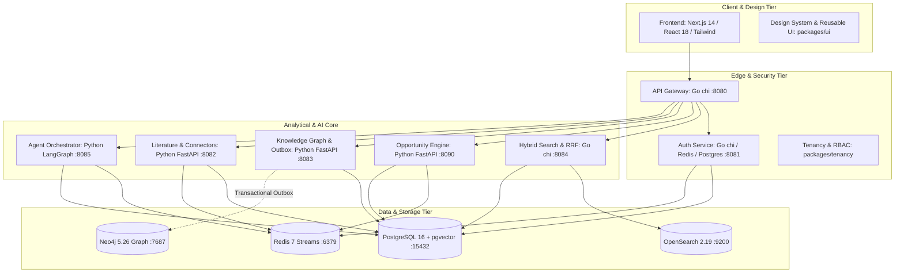
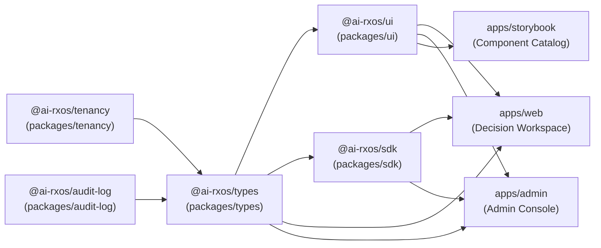
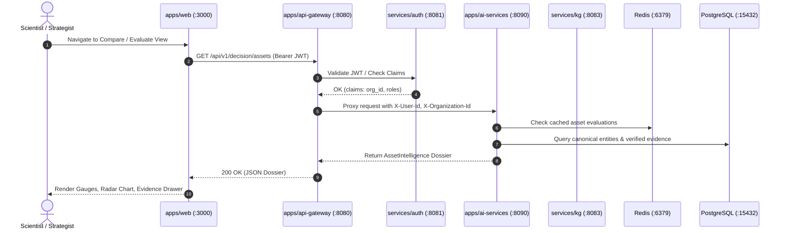
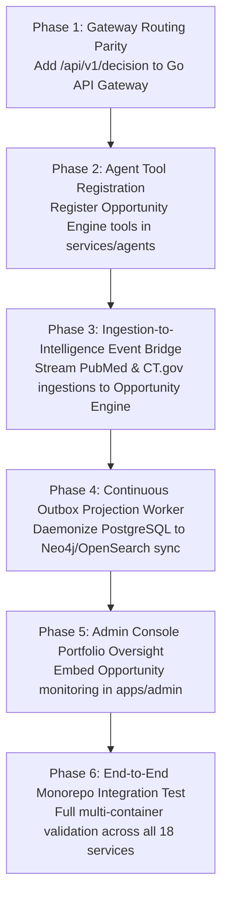

# AI-RxOS Comprehensive Repository Assessment & Architectural Baseline

**Document Identifier:** `NZ-ARCH-ASSESS-2026-v2.0`  
**Date:** 2026-10-07  
**Scope:** Complete Codebase Inspection, Infrastructure Audit, Reusable Code Inventory, Technical Debt Assessment, and Implementation Roadmap  
**Target File:** `/docs/architecture/repository-assessment.md`  
**Classification:** Foundational System Architecture Specification  

---

## 1. Executive Summary & Audit Context

AI-RxOS is an enterprise-grade, polyglot drug discovery operating system and evidence-grounded decision intelligence platform (**NeoZenome**). Built to support biopharma translational oncology, medicinal chemistry, clinical strategy, and business development teams, the platform synthesizes multi-omic assays, clinical trials, regulatory records, and patent data into deterministic development decisions (`PURSUE`, `PARTNER`, `LICENSE`, `MONITOR`, `AVOID`, `INSUFFICIENT_EVIDENCE`).

This assessment provides an exhaustive audit of the entire repository across all 21 core infrastructure dimensions. It inventories all working subsystems, identifies reusable components and shared libraries, details known technical debts, and outlines an optimal implementation sequence that preserves and extends existing working infrastructure without unnecessary rewrites.

---

## 2. Exhaustive 21-Dimension Infrastructure Audit



### 2.1 Frontend Framework
- **Primary Framework:** Next.js 14.2.21 (React 18.3.1, TypeScript 5.7.2).
- **Architecture:** Next.js App Router with React Server Components (RSC) and Client Components.
- **Applications:**
  1. `apps/web` (Port 3000): End-user scientific decision intelligence workspace (**NeoZenome**). Implements primary workflow modes: `Discover`, `Evaluate`, `Patient Match`, `Compare`, `Backtest`, and `Opportunities`.
  2. `apps/admin` (Port 3001): Enterprise administrative console for tenant management, role configuration, model endpoint monitoring, and audit reviews.
  3. `apps/storybook`: Design system documentation and isolated component testing harness (Storybook 8).
  4. Static Landing Pages (`index.html`, `about.html`, `architecture.html`): High-performance conceptual overviews.
- **Styling & Rendering:** Tailwind CSS 3.4.17 with PostCSS, Autoprefixer, `tailwind-merge`, and `class-variance-authority` (cva).
- **Reusable Frontend Assets:** Full workflow views (`CompareView.tsx`, `DiscoverView.tsx`, `EvaluateView.tsx`, `PatientMatchView.tsx`, `BacktestView.tsx`, `OpportunitiesView.tsx`).

### 2.2 Backend Framework
The backend employs a high-performance polyglot architecture partitioning throughput-sensitive edge operations (Go) from scientific reasoning and ML inferencing (Python):
- **Go Services (Go 1.22/1.23+):**
  1. `apps/api-gateway` (Port 8080): Edge reverse proxy built with `chi/v5`, IP token-bucket rate limiter (20 req/s, 40 burst), JWT middleware, and context-injected upstream headers (`X-User-Id`, `X-Organization-Id`, `X-User-Roles`).
  2. `services/auth` (Port 8081): Identity provider built with `chi/v5`, `jackc/pgx/v5` connection pool, Redis session cache, bcrypt password hashing, and RFC 6238 TOTP MFA.
  3. `services/search` (Port 8084): Hybrid search gateway combining OpenSearch 2.19 lexical/BM25 retrieval with semantic vector search via Reciprocal Rank Fusion (RRF).
- **Python Services (Python 3.12 + FastAPI 0.115.6 + Pydantic v2):**
  1. `apps/ai-services` (Port 8090): Host for the **Opportunity Decision Intelligence Engine** (`app/opportunity_engine`) mounting 14 domain routers.
  2. `apps/knowledge-service` (Port 8091): Knowledge graph BFF exposing high-level domain query facades over Neo4j.
  3. `services/kg` (Port 8083): Canonical Knowledge Graph managing PostgreSQL source-of-truth, canonical entity resolution, observations, claims, evidence links, and Neo4j outbox projection.
  4. `services/literature` (Port 8082): Scientific document ingestion engine for PubMed, ClinicalTrials.gov, openFDA, and Google Patents.
  5. `services/agents` (Port 8085): Agentic orchestration engine with LangGraph-style state graphs, tool registries, model registries, and conversation memory.
  6. `services/workflows` (Port 8086): Multi-step scientific workflow coordinator.
  7. `services/reports` (Port 8087): Automated dossier and executive report generation.
  8. `services/docking` (Port 8088): Biophysical molecular docking interface.
  9. `services/llm-wiki` (Port 8092): Persistent markdown wiki compiler, semantic chunking, and vector embedding store.
- **Node.js / TypeScript Services:**
  1. `services/auth-adapter` (Port 8089): BetterAuth adapter scaffold with Organization, Admin, and API Key plugins.

### 2.3 Database Systems
Strict single-source-of-truth discipline across four specialized datastores:
1. **Primary Relational Store:** PostgreSQL 16 with `pgvector` extension (`pgvector/pgvector:pg16`, Port 15432 / 5432).
   - Holds durable state: identity, organizations, canonical biomedical entities, aliases, observations, claims, evidence links, transactional outbox events, ingestion checkpoints, and wiki pages.
   - Initialized via `infra/postgres/init.sql` (`uuid-ossp`, `vector`).
   - Partitioned permissions: migration role (`ai_rxos`) and least-privilege application role (`ai_rxos_app`).
2. **Graph Store:** Neo4j 5.26-community (Bolt port 7687, HTTP port 7474).
   - Strictly maintained as a **derived projection** of canonical entities and relationships. No write transactions originate in Neo4j directly.
3. **Cache & Ephemeral Store:** Redis 7-alpine (Port 6379).
   - Manages session state, JWT blocklists, distributed locks, rate-limit buckets, agent execution checkpoints, and job streaming.
4. **Full-Text & Facet Search Store:** OpenSearch 2.19.1 (Port 9200).
   - Distributed search index for BM25 text retrieval, MeSH facets, and k-NN vector projections.

### 2.4 Object-Relational Mapping (ORM) & Query Layer
- **Go Microservices:** Zero ORM overhead. Uses `jackc/pgx/v5` connection pooling, prepared statements, and direct struct scanning for predictable memory allocations and sub-millisecond execution.
- **Python Services:** No heavy ORM (neither SQLAlchemy ORM nor Django ORM are used for domain models). Database interaction utilizes `asyncpg` connection pools (`asyncpg.create_pool`) executing raw, parameterized SQL queries. Domain validation is handled exclusively by **Pydantic 2.10.4**.
- **Migration Engine:** Service-specific SQL migration scripts executed idempotently at service startup via custom migration runners (`services/kg/app/database/`, `services/literature/app/database/`, `services/auth/migrations/`).

### 2.5 Authentication Infrastructure
- **Authentication Service:** `services/auth` (Go chi + Postgres + Redis).
- **Token Mechanism:** Dual-token JWT architecture:
  - Short-lived Access Tokens (15-minute TTL, signed with `JWT_SECRET` via HMAC-SHA256).
  - Long-lived Refresh Tokens (30-day TTL, cryptographically random, stored in Postgres/Redis with rotation on use).
- **Security Features:**
  - Password hashing with bcrypt.
  - Multi-Factor Authentication (MFA / TOTP) via standard RFC 6238 authenticator apps.
  - Granular API keys for automated integrations and worker processes.
  - Centralized gateway validation: `apps/api-gateway` validates incoming `Bearer` tokens on all non-public routes.
- **BetterAuth Scaffold:** `services/auth-adapter` prepared for standard OAuth2 and SSO integration.

### 2.6 Authorization & Multi-Tenancy
- **Access Control:** Multi-tier Role-Based Access Control (RBAC):
  - Roles: `admin`, `operator`, `researcher`, `reviewer`, `viewer`.
- **Tenant Isolation:**
  - Multi-tenancy contract standardized in `packages/tenancy` (`TENANT_ID_CLAIM = "org_id"`).
  - Three-tier hierarchy: Organization (`org_id`), Workspace (`workspace_id`), Project (`project_id`).
  - Row-Level Security (RLS) policies implemented in PostgreSQL for tenant-scoped vs global entities.
  - Fail-closed security principal enforcement in Python (`CanonicalPrincipal` in `services/kg`, `TenantContext` in `services/agents`).

### 2.7 API Architecture & Contracts
- **Pattern:** Reverse-Proxy API Gateway.
- **Gateway:** `apps/api-gateway` (Go) listening on `:8080`.
- **Routing Rules:**
  - `/api/v1/auth/*`, `/api/v1/organizations/*` $\to$ `auth:8081`
  - `/api/v1/papers/*`, `/api/v1/ingestion/*` $\to$ `literature:8082`
  - `/api/v1/graph/*`, `/api/v1/ontologies/*`, `/api/v1/canonical/*` $\to$ `kg:8083`
  - `/api/v1/search/*` $\to$ `search:8084`
  - `/api/v1/agents/*` $\to$ `agents:8085`
  - `/api/v1/workflows/*` $\to$ `workflows:8086`
  - `/api/v1/reports/*` $\to$ `reports:8087`
  - `/api/v1/molecules/*`, `/api/v1/docking/*` $\to$ `docking:8088`
  - `/api/v1/ai/*` $\to$ `ai-services:8090`
  - `/api/v1/knowledge/*` $\to$ `knowledge-service:8091`
- **Client SDK:** TypeScript SDK in `packages/sdk` wrapping gateway endpoints with Axios/Fetch and strong Zod typing.

### 2.8 Existing AI & LLM Integrations
- **Model Registry (`services/agents/app/model_registry`):**
  - Multi-provider abstraction: OpenAI (`gpt-4o`, `gpt-4o-mini`), Anthropic (`claude-3-5-sonnet`), Google Gemini/Vertex, Ollama, and Mock/Internal.
  - Dynamically configured via `MODEL_REGISTRY_JSON`.
  - Supports SSE streaming for generative completions.
- **Agent Orchestrator Harness (`services/agents/app/agent_harness`):**
  - Graph-based execution runtime (`StateGraph`) with state checkpointing (`RedisCheckpointStore`).
  - Planning and reflection loop (`Planner`, `PlanStep`).
  - Dynamic tool registry (`ToolRegistry`) with parameter schema validation.
  - Conversation memory store (`ConversationMemoryStore`) with Redis sliding window.
  - Multi-agent supervisor pattern (`MultiAgentOrchestrator`, `SupervisorDecision`).
- **Opportunity Decision Intelligence Engine (`apps/ai-services/app/opportunity_engine`):**
  - Multi-attribute utility Development Potential Scoring ($DPS$).
  - Calibrated Bayesian stage transition probability engine (Model v0.1).
  - Counterfactual historical backtesting engine with strict anti-leakage temporal cutoffs.
  - Precision patient genomic stratification, resistance prediction, CNS penetration, safety, and commercial opportunity analysis across 14 dedicated sub-engines.

### 2.9 Existing Vector & Search Infrastructure
- **Hybrid Retrieval:** `services/search` executes hybrid search combining BM25 keyword matching via OpenSearch 2.19 and semantic retrieval via `services/llm-wiki`.
- **RRF Reranking:** Implements Reciprocal Rank Fusion (RRF) algorithm to blend lexical and semantic result lists into unified ranked outputs:
  $$RRF(d) = \sum_{m \in M} \frac{1}{k + r_m(d)}$$
- **Vector Storage:** PostgreSQL `pgvector` configured for dense embeddings (1536-dim), plus OpenSearch k-NN index support.

### 2.10 Existing Knowledge Graph Infrastructure
- **Core Service:** `services/kg` backed by Neo4j 5.26 and PostgreSQL.
- **Canonical Model:**
  - PostgreSQL tables: `canonical_entities`, `canonical_relationships`, `canonical_observations`, `canonical_claims`, `canonical_evidence_links`, `canonical_identifiers`, `canonical_aliases`.
  - Transactional Outbox pattern (`canonical_projection_outbox` table) continuously replays mutations to Neo4j nodes (`:Entity`) and relationships (`:RELATED_TO`).
- **Query & Graph Operations:**
  - Cypher query generator in `services/kg/app/cypher`.
  - BFS/DFS graph neighborhood expansion.
  - Knowledge BFF facade (`apps/knowledge-service`) providing cached read projections for UI consumption.

### 2.11 Existing File & Document Processing
- **External Connectors (`services/literature/app/connectors`):**
  - **PubMed:** NCBI ESearch/EFetch XML retrieval with MeSH keyword tagging and PMID deduplication.
  - **ClinicalTrials.gov:** REST API v2 client with NCT search, study status normalization, and opaque page tokens.
  - **openFDA Drugs@FDA:** FDA application/submission events, NDA/BLA numbers, and regulatory decision records.
  - **Google Patents:** Patent family extraction, claim retrieval, and priority date tracking.
- **NLP & Parsing Pipeline (`services/literature/app/nlp`):**
  - Named Entity Recognition (`ner.py`), entity normalizer (`entity_normalizer.py`), relationship extraction (`relationships.py`), evidence ranker (`evidence_ranking.py`), and summarizer (`summarizer.py`).
- **LLM Wiki Compiler (`services/llm-wiki`):**
  - Markdown ingestion, semantic sentence/paragraph chunking, SHA-256 content hashing, versioned page tracking, and tenant-isolated wiki query endpoint (`POST /llmwiki/query`).

### 2.12 Existing Background Job Infrastructure
- **Message Broker:** Redis Streams (`redis:7-alpine`).
- **Queue Implementation:** `services/agents/app/jobs/queue.py` (`RedisJobQueue`).
- **Worker Process:** `services/agents/app/jobs/worker.py` (deployed as standalone container `agents-worker`).
- **Job Capabilities:**
  - Stream group distribution (`AGENT_JOB_GROUP=agents-workers`).
  - Distributed execution locks with TTL.
  - Automatic idle worker reclaim (`AGENT_WORKER_RECLAIM_IDLE_SECONDS=60`).
  - Exponential backoff retry handling with Dead Letter Queue (DLQ) support.
  - Checkpointed batch ingestion jobs.

### 2.13 Existing Queues & Event Streaming
- **Redis Streams:** Distributed event streaming for asynchronous agent jobs, literature checkpointed batch ingestion, and transactional outbox projection replay to Neo4j and OpenSearch.
- **Outbox Pattern:** Reliable at-least-once event delivery from PostgreSQL `canonical_projection_outbox` to downstream search and graph projections.

### 2.14 Object Storage & Artifact Management
- **Current Architecture:** Durable document storage utilizes PostgreSQL bytea, JSONB, and text columns (`documents.abstract`, `documents.summary`, `wiki_pages.content`).
- **Artifact Caching:** Local scratch directory structures in agent containers for intermediate files and temporary computational states.
- **Streaming Endpoints:** Report service (`services/reports`) streams generated Markdown dossiers and executive summaries directly via HTTP endpoints.
- **Production Extension Path:** S3/MinIO compatible object store interface is architected for large-scale raw PDF/PDB binary storage.

### 2.15 File Processing & Ingestion
- **Document Parsers:** Specialized parsers in `services/literature/app/parsing/` (`parser.py`, `text_parser.py`, `duplicates.py`) handling XML, JSON, and raw text.
- **Semantic Chunking:** `services/literature/app/services/chunking.py` splits scientific text along semantic boundaries (abstract, introduction, methods, results, discussion).
- **Deduplication:** Hash-based and title-normalized deduplication prevents redundant processing of identical clinical trials or publications across sources.

### 2.16 Observability Infrastructure
- **Distributed Tracing:** OpenTelemetry (OTel) instrumentation across Python and Go services (`OTEL_EXPORTER_OTLP_ENDPOINT`).
- **Metrics:** Prometheus scrape endpoints (`/metrics`) exposing request rates, latencies, job counts, and queue depth.
- **Logging:** Structured JSON logging across all Python services (`python-json-logger`) and Go services (`requestLogger` middleware).
- **Security Redaction:** In-flight log redaction engine (`services/agents/app/security/redaction.py`) sanitizing API keys, passwords, and sensitive biological sequences.

### 2.17 Existing Testing Infrastructure
- **Monorepo Orchestrator:** Turborepo 2.3+ (`turbo.json`) running parallelized `pnpm test`, `pnpm typecheck`, `pnpm lint`, and `pnpm build`.
- **Python Testing:** `pytest` 8.3+ with `pytest-asyncio` and `httpx` TestClient across all Python services.
  - Opportunity Engine test suite: **228 tests passing** in <4 seconds.
- **TypeScript / Web Testing:** Vitest and Jest presets; TypeScript compiler (`tsc --noEmit`) enforced across packages.
- **Go Testing:** Native `go test ./...` test suites in `apps/api-gateway`, `services/auth`, and `services/search`.

### 2.18 Existing Deployment Configuration
- **Local Development:** `docker-compose.yml` (multi-service topology running all 18 services and 4 datastores with healthchecks and internal networking).
- **Production Containers:** Multi-stage Dockerfiles across all Go, Python, and Next.js projects.
- **Kubernetes / Helm:**
  - Helm Umbrella Chart: `infra/helm/ai-rxos/` (`Chart.yaml`, `values.yaml`, `values-dev.yaml`, `values-prod.yaml`).
  - K8s Resources: Automated deployments, ClusterIP services, Ingress with TLS, Horizontal Pod Autoscalers (HPA), ConfigMaps, and ExternalSecrets integration.
  - Network Policies: `infra/k8s/network-policies.yaml` establishing pod-level isolation between ingress, gateway, application tiers, and databases.

### 2.19 CI/CD Pipeline
- **GitHub Actions Workflow:** `.github/workflows/ci.yml` with parallel job matrices:
  1. `js`: Lint, typecheck, and build Next.js applications and TypeScript packages.
  2. `go`: Vet and build matrix for `apps/api-gateway`, `services/auth`, `services/search`.
  3. `python`: Lint (Ruff), typecheck (Mypy), and test (Pytest) matrix across all 8 Python services.
  4. `docker-build`: Multi-stage Docker build verification for every service image.
  5. `helm-lint`: Helm dependency build and chart linting.

### 2.20 Design System (`@ai-rxos/ui`)
- **Package:** `packages/ui` (`@ai-rxos/ui`).
- **Foundations:** Tailwind CSS 3.4, PostCSS, Radix UI primitives (`@radix-ui/react-*`), Lucide React icons, `class-variance-authority` (cva), `clsx`, `tailwind-merge`.
- **Primitive Components:** `Button`, `Card`, `Badge`, `Input`, `Avatar`, `Dialog`, `DropdownMenu`, `ScrollArea`, `Tabs`, `Skeleton`, `Tooltip`, `Table`.
- **Scientific Visualizers:** `DrugCard`, `KnowledgeCard`, `PaperViewer`, `GraphViewer`, `DockingViewer` (with 3D WebGL / Mol* integration).
- **Data Visualizations:** `SimpleLineChart`, `SimpleBarChart`, `SimplePieChart`, `DataTable`.

### 2.21 Reusable Components Inventory
- **Decision Intelligence UI Modules (`packages/ui/src/components/decision/`):**
  - `AssetHeader.tsx`: Comprehensive asset hero section with modality, stage, target, and status pills.
  - `BadgesAndBanners.tsx`: Color-coded action banners (`PURSUE`, `PARTNER`, `LICENSE`, `MONITOR`, `AVOID`, `INSUFFICIENT_EVIDENCE`) and status badges.
  - `BusinessCards.tsx`: Corporate ownership, patent expiry timeline, and deal intelligence cards.
  - `DecisionPanels.tsx`: Comprehensive decision evaluation panels.
  - `EvidenceComponents.tsx`: Verifiable citation cards, excerpt displays, and contradiction callouts.
  - `ProfileCards.tsx`: Biology, clinical, safety, and resistance mechanism cards.
  - `ScoringComponents.tsx`: Circular SVG gauges for Development Potential Score ($DPS$), Bayesian transition bars, and 6-axis radar charts.
- **Domain Type Schemas (`packages/types/src/`):**
  - Complete TypeScript interfaces and Zod schemas across 20 modules (`biology.ts`, `clinical.ts`, `cns.ts`, `combination.ts`, `commercial.ts`, `competitive.ts`, `discover.ts`, `evidence.ts`, `kg.ts`, `licensing.ts`, `opportunity.ts`, `patient_match.ts`, `pubmed.ts`, `regulatory.ts`, `resistance.ts`, `safety.ts`, `temporal.ts`).

---

## 3. Repository Architecture Map

```
AI-RxOS-main/
├── .github/workflows/ci.yml       # Monorepo CI/CD Pipeline
├── apps/
│   ├── admin/                     # Enterprise Admin Console (Next.js 14, :3001)
│   ├── ai-services/               # Opportunity Decision Intelligence Engine (FastAPI, :8090)
│   │   ├── app/
│   │   │   ├── core/              # Config, settings, logging
│   │   │   ├── opportunity_engine/ # 14 specialized decision & biological engines
│   │   │   └── main.py            # FastAPI entry point mounting all routers
│   │   └── tests/                 # 228 comprehensive Pytest test suites
│   ├── api-gateway/               # Edge Reverse Proxy & JWT Auth (Go chi, :8080)
│   ├── knowledge-service/         # Knowledge Graph BFF Facade (FastAPI, :8091)
│   ├── storybook/                 # Design System Storybook Harness
│   └── web/                       # Decision Workspace (NeoZenome, Next.js 14, :3000)
│       └── src/
│           ├── app/               # App Router pages and /api proxies
│           ├── components/        # Decision UI views, gauges, radars, modals
│           └── lib/               # Client fixtures, API clients, utilities
├── config/                        # Shared ESLint and TypeScript configs
├── data/                          # Shared data fixtures and references
├── docs/
│   ├── architecture/              # Architectural plans and assessments
│   └── product/
│       └── product-constitution.md # Supreme Product Charter (NZ-CONST-2026-v1.0)
├── infra/
│   ├── helm/ai-rxos/              # Kubernetes Helm Umbrella Chart
│   ├── k8s/                       # Network policies, ingress manifests
│   └── postgres/init.sql          # DB initialization (uuid-ossp, pgvector)
├── packages/
│   ├── audit-log/                 # Audit logging contracts (@ai-rxos/audit-log)
│   ├── sdk/                       # TypeScript API client (@ai-rxos/sdk)
│   ├── tenancy/                   # Multi-tenancy contracts (@ai-rxos/tenancy)
│   ├── types/                     # Shared domain models & Zod schemas (@ai-rxos/types)
│   └── ui/                        # Reusable scientific design system (@ai-rxos/ui)
├── services/
│   ├── agents/                    # LangGraph agent harness, workers, memory (:8085)
│   ├── auth/                      # Go identity provider, JWT, MFA (:8081)
│   ├── auth-adapter/              # BetterAuth TypeScript adapter (:8089)
│   ├── docking/                   # Biophysical molecular docking interface (:8088)
│   ├── kg/                        # Canonical KG, entities, outbox projection (:8083)
│   ├── literature/                # PubMed, CT.gov, FDA, Patent ingestion (:8082)
│   ├── llm-wiki/                  # Markdown wiki compiler & chunking (:8092)
│   ├── reports/                   # Automated dossier & report generator (:8087)
│   ├── search/                    # Go hybrid search & RRF engine (:8084)
│   └── workflows/                 # Scientific workflow coordinator (:8086)
├── docker-compose.yml             # Full 18-service local orchestrator
├── package.json                   # Monorepo root package definition
├── pnpm-workspace.yaml            # Monorepo workspace mapping
└── turbo.json                     # Turborepo build pipeline definition
```

---

## 4. Dependency Map

### 4.1 Monorepo Package Dependency Topology


### 4.2 Inter-Service Communication Flow


---

## 5. Architectural Assessment: Strengths & Design Discipline

1. **Clear Separation of Concerns:**
   - Go is leveraged where its strengths excel: high-throughput network routing, lightweight concurrency, low-latency JWT validation, and fast Reciprocal Rank Fusion.
   - Python is leveraged where its ecosystem is unmatched: scientific computing, Pydantic domain modeling, Bayesian inference, and biophysical data structures.
2. **Deterministic Source of Truth:**
   - PostgreSQL is strictly enforced as the single source of truth. Neo4j and OpenSearch are read-optimized projections fed asynchronously via the transactional outbox pattern. This completely eliminates dual-write split-brain inconsistencies.
3. **High Cohesion in Domain Modeling:**
   - The Opportunity Decision Intelligence Engine in `apps/ai-services/app/opportunity_engine` is cleanly modularized into 14 domain-specific sub-packages (`biology`, `clinical`, `cns`, `combination`, `commercial`, `competitive`, `discover`, `evidence`, `kg`, `licensing`, `patient_match`, `regulatory`, `resistance`, `safety`).
4. **Resilient Frontend with Graceful Degradation:**
   - Next.js API route proxies (`apps/web/src/app/api/decision/`) implement automated fallback to curated client fixtures when backend services are offline, enabling offline demonstration, zero-downtime frontend development, and resilient user experiences.

---

## 6. Technical Debt Assessment & Operational Findings

| Area | Issue / Finding | Severity | Existing Mitigation | Recommended Permanent Fix |
| :--- | :--- | :--- | :--- | :--- |
| **API Gateway Routing** | `/api/v1/decision` route prefix is handled in FastAPI and Next.js proxies, but is missing from the explicit reverse-proxy map in `apps/api-gateway/internal/gateway/router.go`. | **Medium** | Next.js routes proxy directly or use localhost fallback. | Add `/api/v1/decision` $\to$ `cfg.AIServicesURL` in `router.go`. |
| **Outbox Worker Daemon** | Outbox projection from PostgreSQL to Neo4j/OpenSearch executes via periodic script/trigger rather than a dedicated long-running background worker container. | **Medium** | Manual backfill scripts (`PHASE_2_NEO4J_BACKFILL.md`). | Implement continuous daemon in `services/kg` listening on PostgreSQL `LISTEN/NOTIFY` or Redis Stream. |
| **Agent Tool Registration** | Opportunity Engine endpoints are fully implemented in FastAPI, but not yet exposed as callable tools in `services/agents/app/tool_registry`. | **Low** | Direct REST API calls from frontend. | Register Opportunity tools (`evaluate_asset`, `compare_assets`, `match_patient`) in the agent tool registry. |
| **Windows Symlink Packaging** | Next.js `output: "standalone"` previously threw `EPERM -4048` on Windows developer environments without Developer Mode enabled. | **Low** | Conditionalized in `next.config.js` via `process.env.NEXT_STANDALONE === "true"`. | Maintained; documentation updated. |
| **Docker Compose Scaling** | Full 18-service topology requires ~16GB RAM when running all datastores (Postgres, Neo4j, OpenSearch, Redis) concurrently. | **Low** | Profile-based service launching (`docker compose --profile core up`). | Formalize docker-compose profiles (`core`, `full`, `ai`, `kg`). |

---

## 7. Existing Code Reusability Inventory

To avoid rewriting working infrastructure, the following production-grade assets MUST be reused directly:

1. **Scoring & Bayesian Mathematics:**
   - `apps/ai-services/app/opportunity_engine/scoring/engine.py`: Reusable implementation of Development Potential Score ($DPS$), component weights, and Bayesian stage transition probabilities.
2. **Anti-Leakage Temporal Engine:**
   - `apps/ai-services/app/opportunity_engine/temporal/`: Reusable temporal filter and leakage detector enforcing $\forall e, \text{date}(e) \le \tau_{\text{cutoff}}$.
3. **Precision Patient Matcher:**
   - `apps/ai-services/app/opportunity_engine/patient_match/engine.py`: Reusable genomic matching logic across exon 20 insertions, point mutations, and CNS metastases.
4. **Scientific UI Components (`packages/ui`):**
   - `RadarChart`, `DevelopmentPotentialMeter`, `StageTransitionBars`, `EvidenceProvenanceModal`, `ExportModal`, `DockingViewer` (Mol* 3D WebGL).
5. **Canonical Domain Schemas:**
   - `packages/types/src/`: 20 type modules with full Zod validation and TypeScript type exports.
6. **Literature Ingestion Connectors:**
   - `services/literature/app/connectors/`: Production-ready clients for PubMed NCBI E-Utilities, ClinicalTrials.gov REST API v2, and openFDA.
7. **Authentication & Session Tokens:**
   - `services/auth`: Production-ready Go JWT validation, TOTP MFA, and Redis session store.

---

## 8. Recommended Implementation Sequence

To advance the platform efficiently without rewriting working infrastructure:



### Phase 1: Gateway Routing Parity
- **Target:** `apps/api-gateway/internal/gateway/router.go`.
- **Action:** Add `/api/v1/decision` $\to$ `cfg.AIServicesURL` in the route map. Ensures seamless edge routing through `:8080` with rate limiting and audit logging.

### Phase 2: Agent Tool Registration
- **Target:** `services/agents/app/tool_registry/`.
- **Action:** Expose Opportunity Engine functions (`discover_assets`, `evaluate_asset`, `compare_assets`, `match_patient`, `run_backtest`) as tools for autonomous LangGraph agents.

### Phase 3: Ingestion-to-Intelligence Event Bridge
- **Target:** `services/literature` $\to$ `services/kg` $\to$ `apps/ai-services`.
- **Action:** Publish Redis stream events upon successful paper/trial ingestion, triggering incremental knowledge graph entity linking and asset evidence updates.

### Phase 4: Continuous Outbox Projection Worker
- **Target:** `services/kg/app/projection/`.
- **Action:** Deploy an asynchronous worker daemon that continuously consumes `canonical_projection_outbox` events and updates Neo4j graph nodes and OpenSearch documents.

### Phase 5: Admin Console Portfolio Oversight
- **Target:** `apps/admin/src/app/`.
- **Action:** Embed portfolio monitoring, model latency metrics, and ingestion throughput dashboards in the administrative console.

### Phase 6: End-to-End Monorepo Integration Testing & Production Hardening
- **Target:** Monorepo root and CI.
- **Action:** Execute end-to-end integration tests with live containers validating the complete flow from literature ingestion to executive decision dossier export.

---

*Authored by Neozenone AI Principal Architecture Group.*  
*AI-RxOS: Grounded in Evidence, Built for Decisions.*
