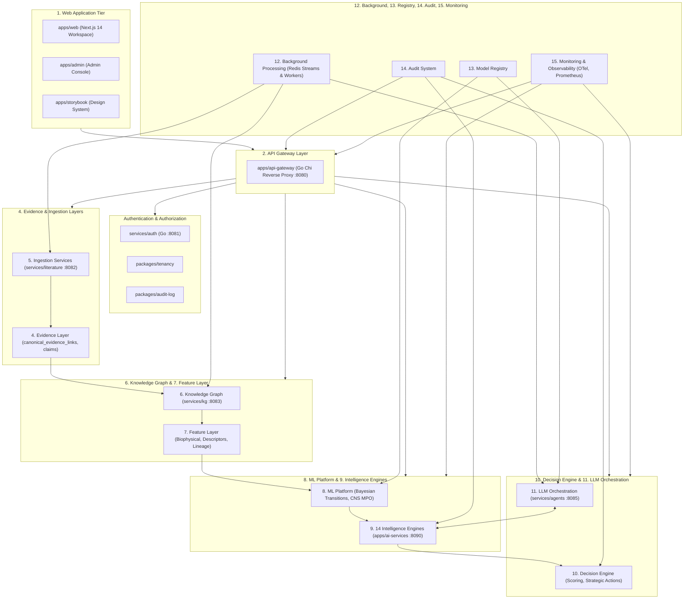
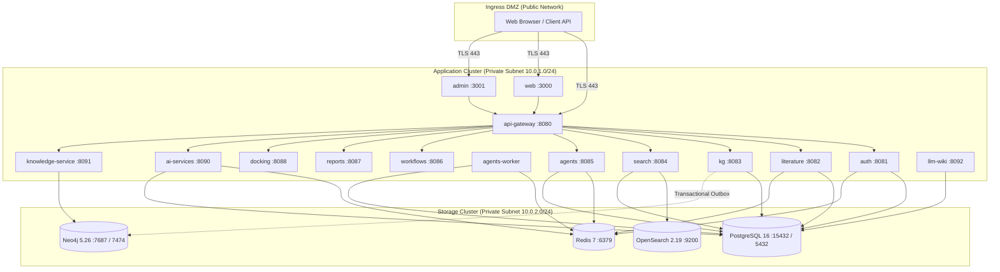
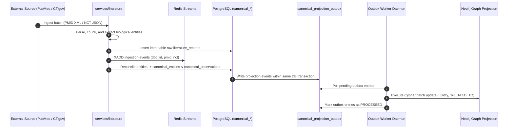
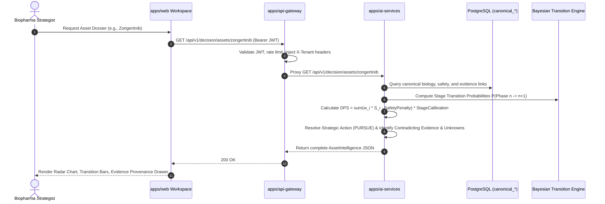
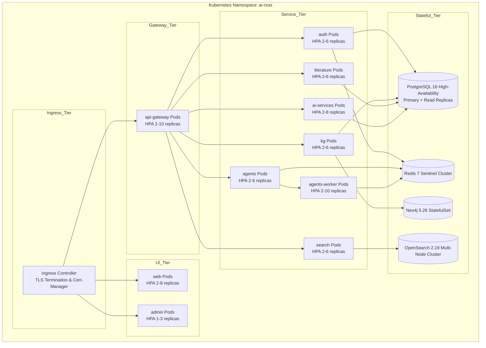

# System Architecture Specification: AI Drug Opportunity Discovery Engine (NeoZenome / AI-RxOS)

**Document Identifier:** `NZ-ARCH-SYS-2026-v1.0`  
**Classification:** Master Technical Architecture & System Specification  
**Authority:** Neozenone AI Principal Architecture Group & Biopharma Decision Systems Board  
**Target Path:** `/docs/architecture/system-architecture.md`  
**Effective Date:** 2026-10-07 | **Status:** RATIFIED & ENFORCED  

---

## 1. Executive Architectural Charter & Core Mandates

### 1.1 Architectural Vision
The **AI Drug Opportunity Discovery Engine (NeoZenome / AI-RxOS)** is an enterprise-grade, evidence-grounded decision intelligence platform designed to systematically de-risk biopharmaceutical drug development. It transforms petabytes of unstructured biomedical literature, multi-omic preclinical assays, clinical trial protocols, regulatory dockets, and global patent registries into deterministic, auditable, and actionable drug development decisions (`PURSUE`, `PARTNER`, `LICENSE`, `MONITOR`, `AVOID`, `INSUFFICIENT_EVIDENCE`).

```
+---------------------------------------------------------------------------------------------------+
|                                 NEOZENONE SYSTEM ARCHITECTURE MAP                                 |
+---------------------------------------------------------------------------------------------------+
|  [Presentation Tier]        apps/web (Next.js 14)  |  apps/admin (Next.js 14)  |  apps/storybook      |
+---------------------------------------------------------------------------------------------------+
|  [Edge & Gateway Tier]      apps/api-gateway (Go chi :8080) -> JWT, Rate Limiting, Audit Context   |
+---------------------------------------------------------------------------------------------------+
|  [Security & Identity]      services/auth (Go :8081)  |  packages/tenancy  |  packages/audit-log  |
+---------------------------------------------------------------------------------------------------+
|  [Analytical Core]          apps/ai-services (:8090)  -  14 Specialized Opportunity Engines       |
|                             services/agents (:8085)   -  StateGraph LLM Orchestrator & Workers    |
|                             services/workflows (:8086)-  Multi-Step Scientific Pipelines         |
+---------------------------------------------------------------------------------------------------+
|  [Knowledge & Ingestion]    services/kg (:8083)       -  PostgreSQL Canonical Authority           |
|                             services/literature (:8082)- PubMed, CT.gov, FDA, Patent Connectors    |
|                             services/search (:8084)   -  Hybrid BM25 + Vector Search (RRF)        |
+---------------------------------------------------------------------------------------------------+
|  [Polyglot Data Fabric]     PostgreSQL 16 (pgvector)  |  Neo4j 5.26  |  Redis 7  |  OpenSearch 2.19|
+---------------------------------------------------------------------------------------------------+
```

### 1.2 Non-Negotiable Architectural Invariants

1. **API-First Development:** Every business capability, scoring model, and data ingestion pipeline is exposed via strictly typed, versioned HTTP/REST and streaming APIs before any UI consumption.
2. **Asynchronous Ingestion & Event-Driven Decoupling:** Ingestion of external data sources (PubMed, ClinicalTrials.gov, openFDA, USPTO) is fully asynchronous, checkpointed, and mediated by Redis Streams and PostgreSQL transactional outbox events.
3. **Reproducible Predictions & Cryptographic Lineage:** Given identical knowledge graph states and model configurations, every score, classification, and transition probability is deterministic and bit-for-bit reproducible.
4. **Temporal Datasets & Anti-Leakage Protocol:** The platform enforces strict temporal filtering via `as_of` cutoff dates:
   $$\forall e \in \text{EvidenceCorpus}, \quad \text{Date}(e) \le \tau_{\text{cutoff}}$$
   Future clinical trial outcomes or regulatory approvals are quarantined during retrospective backtesting.
5. **Strict Model & Feature Versioning:** Machine learning models and feature extraction pipelines MUST register their exact `model_id`, `model_version`, `feature_schema_version`, and weights in prediction payloads.
6. **Multi-Tenancy & Fail-Closed Isolation:** Tenant context (`org_id`, `workspace_id`, `project_id`) is validated at the gateway and enforced via PostgreSQL Row-Level Security (RLS) and fail-closed application principals (`CanonicalPrincipal`).
7. **Human-in-the-Loop Review & Explicit Overrides:** Human expert assessments are first-class domain entities (`ReviewAssessment`), retaining immutable audit logs without silently overwriting algorithmic scores.
8. **Enterprise Zero-Trust Security:** Strict boundary defense, dual-token JWTs with rotation, TLS 1.3 in-flight encryption, envelope encryption for sensitive data, and real-time security log redaction.

---

## 2. Logical Architecture: The 15 Subsystem Layers



---

### 2.1 Layer 1: Web Application Tier
- **Applications:**
  - `apps/web` (Port 3000): End-user scientific decision intelligence workspace (**NeoZenome**). Supports 6 primary workflow views:
    1. `Discover`: Dynamic multi-attribute filtering across targets, stages, and actions.
    2. `Evaluate`: Comprehensive single-asset dossiers answering all 22 constitutional inquiries.
    3. `Patient Match`: Interactive genomic biomarker stratification calculator.
    4. `Compare`: Side-by-side head-to-head benchmarking with multi-axis radar charts.
    5. `Backtest`: Counterfactual historical simulation with temporal cutoff controls.
    6. `Opportunities`: 6-category portfolio prioritization matrix.
  - `apps/admin` (Port 3001): Enterprise console for tenant administration, role configuration, model endpoint monitoring, and audit reviews.
  - `apps/storybook`: Isolated design system documentation and component testing harness.
- **Technology:** Next.js 14.2.21 App Router, React 18.3.1, TypeScript 5.7.2, Tailwind CSS 3.4.17.
- **Design System:** Built upon `@ai-rxos/ui`, providing reusable scientific widgets (Mol* 3D WebGL docking, SVG circular gauges, interactive radar charts).

### 2.2 Layer 2: API Gateway Layer
- **Component:** `apps/api-gateway` (Port 8080).
- **Core Engine:** High-performance Go 1.23 reverse proxy utilizing `go-chi/chi/v5`.
- **Responsibilities:**
  - Ingress request logging and distributed tracing propagation (`traceparent`, `X-Request-Id`).
  - IP-based token bucket rate limiting (20 req/s, 40 burst).
  - Centralized JWT verification and signature validation.
  - Upstream context header injection (`X-User-Id`, `X-Organization-Id`, `X-Workspace-Id`, `X-User-Roles`).
  - Reverse proxy routing across all 10 backend service endpoints with automatic header stripping and CORS handling.

### 2.3 Layer 3: Domain Services Layer
- **Components:**
  - `apps/ai-services` (Port 8090): Primary host of the Opportunity Decision Intelligence Engine.
  - `services/workflows` (Port 8086): Multi-step scientific workflow coordinator.
  - `services/reports` (Port 8087): Automated dossier and executive Markdown report generation.
  - `services/docking` (Port 8088): Biophysical molecular docking interface.
  - `services/llm-wiki` (Port 8092): Persistent semantic markdown wiki compilation and chunk storage.

### 2.4 Layer 4: Evidence Layer
- **Architecture:** Canonical Evidence Store hosted in PostgreSQL.
- **Data Entities:**
  - `canonical_evidence_links`: Bidirectional links connecting claims to empirical source items.
  - `canonical_claims`: Extracted scientific propositions attributed to specific papers or trials.
  - `canonical_observations`: Standardized preclinical and clinical observations.
- **Polarity Tracking:** Every evidence item is tagged with `EvidencePolarity`:
  - `SUPPORTING`: Validates the developmental thesis (e.g., mutant-sparing selectivity, intracranial response).
  - `CONTRADICTING`: Challenges or refutes the developmental thesis (e.g., dose-limiting diarrhea, trial failure, cardiac liability).

### 2.5 Layer 5: Ingestion Services
- **Component:** `services/literature` (Port 8082).
- **External Connectors:**
  1. `PubMed Connector`: NCBI ESearch/EFetch XML harvesting, MeSH heading indexing, and deduplication.
  2. `ClinicalTrials.gov Connector`: REST API v2 client harvesting study designs, cohort definitions, primary completion dates, and outcomes.
  3. `openFDA Connector`: Ingestion of FDA approved drug labels, NDA/BLA submission history, and Boxed Warnings.
  4. `Google Patents Connector`: Patent claims, priority dates, assignee registries, and expiration tracking.
- **Parsing & NLP Pipeline:**
  - Text chunking along scientific section headers.
  - Named Entity Recognition (NER) for genes, mutations, chemical compounds, and diseases.
  - Relationship extraction (`INHIBITS`, `MUTATED_IN`, `TREATS`, `CAUSES_AE`).

### 2.6 Layer 6: Knowledge Graph
- **Component:** `services/kg` (Port 8083) and `apps/knowledge-service` (Port 8091).
- **Dual-Store Architecture:**
  - **Single Source of Truth:** PostgreSQL `canonical_*` tables. All entity resolution, alias mapping, and relationship writes occur in PostgreSQL.
  - **Graph Read Projection:** Neo4j 5.26-community (Bolt port 7687, HTTP port 7474). Maintained via the PostgreSQL Transactional Outbox pattern (`canonical_projection_outbox`).
- **Graph Schema:**
  - Nodes: `(:Target)`, `(:Variant)`, `(:Asset)`, `(:Indication)`, `(:Biomarker)`, `(:TrialCohort)`, `(:AdverseEvent)`, `(:Organization)`.
  - Edges: `[:INHIBITS]`, `[:SELECTIVE_AGAINST]`, `[:DRIVES_RESISTANCE]`, `[:SYNERGIZES_WITH]`, `[:STUDIED_IN]`, `[:SPONSORED_BY]`.

### 2.7 Layer 7: Feature Layer
- **Responsibilities:**
  - Normalization of raw assay measurements into standardized quantitative features:
    - Fold-selectivity: $\text{FoldSel} = \text{IC}_{50}^{\text{WT}} / \text{IC}_{50}^{\text{MUT}}$
    - Physicochemical features: Molecular Weight, $\text{LogP}$, $\text{LogD}_{7.4}$, $\text{TPSA}$, $\text{HBD}$, $\text{p}K_a$.
    - Clinical metrics: Confirmed Objective Response Rate (cORR), Disease Control Rate (DCR), Median PFS (mPFS), Hazard Ratio (HR).
- **Lineage:** Every derived feature references its input `FACT` items and exact transformation code version.

### 2.8 Layer 8: ML Platform
- **Core Predictive Models:**
  1. **Bayesian Stage Transition Probability Engine (Model v0.1):**
     - Computes calibrated transition probabilities conditioned on modality, indication benchmark rates, and asset profile:
       - $P(\text{Preclinical} \to \text{IND})$
       - $P(\text{Phase I} \to \text{Phase II})$
       - $P(\text{Phase II} \to \text{Phase III})$
       - $P(\text{Phase III} \to \text{Approval})$
  2. **CNS Multiparameter Optimization (CNS MPO v2):**
     - Calculates blood-brain barrier permeability score $[1.0 - 6.0]$ and intracranial response probability.
  3. **Off-Target Safety Classifier:**
     - Predicts hERG cardiac liabilities and mucosal GI toxicity risk.
- **Model Metadata Envelope:** Every ML output embeds:
  ```json
  {
    "model_id": "cns-mpo-v2",
    "model_version": "2.1.0",
    "feature_version": "feat-2026-v1",
    "training_cutoff": "2026-01-01"
  }
  ```

### 2.9 Layer 9: The 14 Specialized Intelligence Engines
Hosted within `apps/ai-services/app/opportunity_engine/`:

| Engine Subsystem | Path | Primary Responsibilities |
| :--- | :--- | :--- |
| **Discover Engine** | `discover/` | Multi-parametric asset search and target-based filtering |
| **Biology Engine** | `biology/` | Target selectivity, binding affinity ($K_d$), biochemical potency ($\text{IC}_{50}$) |
| **Clinical Engine** | `clinical/` | Trial cohort analysis, progression velocity, survival endpoints |
| **CNS Engine** | `cns/` | CNS MPO scoring, intracranial response, BBB penetration |
| **Combination Engine** | `combination/` | Dual-pathway synthetic lethality and synergy rationale |
| **Commercial Engine** | `commercial/` | Epidemiology, eligible patient pool sizing, peak sales tier |
| **Comparison Engine** | `comparison/` | Head-to-head benchmarking and pairwise advantage matrices |
| **Competitive Engine** | `competitive/` | Pipeline crowding, line-of-therapy positioning, competitor tracking |
| **Licensing Engine** | `licensing/` | Asset ownership, corporate restructuring signals, deal comps |
| **Patient Match Engine** | `patient_match/` | Precision genomic stratification and inclusion/exclusion logic |
| **Regulatory Engine** | `regulatory/` | Expedited designations (BTD, Fast Track), approvals, CRL autopsies |
| **Resistance Engine** | `resistance/` | On-target secondary mutations, bypass pathway forecasting |
| **Safety Engine** | `safety/` | Dose-limiting toxicities, CTCAE Grade $\ge 3$ AEs, therapeutic index |
| **Temporal Engine** | `temporal/` | Anti-leakage filtering, historical snapshot generation |

### 2.10 Layer 10: Decision Engine
- **Component:** `scoring/engine.py` & `domain/schemas.py`.
- **Core Function:** Resolves multi-dimensional features and intelligence engine outputs into one of six constitutional decisions:
  `PURSUE`, `PARTNER`, `LICENSE`, `MONITOR`, `AVOID`, `INSUFFICIENT_EVIDENCE`.
- **Scoring Equation (Development Potential Score - $DPS$):**
  $$DPS = \left( \sum_{i=1}^{6} w_i \cdot S_i - \text{SafetyPenalty} \right) \times \text{StageCalibration}$$

### 2.11 Layer 11: LLM Orchestration
- **Component:** `services/agents` (Port 8085).
- **Execution Harness:** LangGraph-style cyclic execution runtime (`StateGraph`).
- **Core Elements:**
  - `Planner`: Deconstructs complex user inquiries into structured, executable steps.
  - `RedisCheckpointStore`: Persists agent state checkpoints for pause, replay, and recovery.
  - `ToolRegistry`: Dynamic tool registry exposing opportunity discovery, patient matching, and comparison tools to autonomous agents.
  - `ConversationMemoryStore`: Redis sliding window memory preserving scientific context.

### 2.12 Layer 12: Background Processing
- **Queue Engine:** `RedisJobQueue` backed by Redis Streams (`redis:7-alpine`).
- **Worker Execution:** Dedicated `agents-worker` container (`services/agents/app/jobs/worker.py`).
- **Key Features:**
  - Distributed execution locks with configurable TTL.
  - Stream group distribution (`AGENT_JOB_GROUP=agents-workers`).
  - Automatic idle worker reclaim (`AGENT_WORKER_RECLAIM_IDLE_SECONDS=60`).
  - Exponential backoff retry handling with Dead Letter Queue (DLQ).

### 2.13 Layer 13: Model Registry
- **Component:** `services/agents/app/model_registry`.
- **Abstraction:** Unified client interface supporting OpenAI (`gpt-4o`), Anthropic (`claude-3-5-sonnet`), Google Vertex/Gemini, Ollama, and local mock drivers.
- **Governance:** Dynamic configuration via `MODEL_REGISTRY_JSON` with rate limit tiers, token tracking, and temperature bounds.

### 2.14 Layer 14: Audit System
- **Contract:** `@ai-rxos/audit-log` (`packages/audit-log`).
- **Storage:** PostgreSQL `audit_events` table and structured log sinks.
- **Capabilities:**
  - Captures every user decision, override, API request, and export event.
  - In-flight sensitive data redaction engine (`services/agents/app/security/redaction.py`).
  - Cryptographic hash chaining for tamper-evident audit trails.

### 2.15 Layer 15: Monitoring & Observability
- **Distributed Tracing:** OpenTelemetry (OTel) instrumentation across all Go and Python services exporting to OpenTelemetry Collector / Jaeger.
- **Metrics:** Prometheus scrape endpoints (`/metrics`) exposing latency histograms, throughput, error rates, and queue depths.
- **Structured Logging:** Standardized JSON logging across all microservices with correlation IDs (`trace_id`, `span_id`, `request_id`).

---

## 3. Physical Architecture & Runtime Topology



### 3.1 Network Port & Protocol Demarcation

| Service / Datastore | Container Port | Host Port | Protocol | Security & Auth |
| :--- | :--- | :--- | :--- | :--- |
| `apps/web` | 3000 | 3000 | HTTP/HTML | Public Ingress / NextAuth Session |
| `apps/admin` | 3000 | 3001 | HTTP/HTML | Admin Ingress / NextAuth Session |
| `apps/api-gateway` | 8080 | 8080 | HTTP/REST | Edge Ingress / Rate Limited / JWT Verification |
| `services/auth` | 8081 | 8081 | HTTP/REST | Internal Mesh / mTLS / Master Secret |
| `services/literature` | 8082 | 8082 | HTTP/REST | Internal Mesh / JWT Claims Forwarded |
| `services/kg` | 8083 | 8083 | HTTP/REST | Internal Mesh / Fail-Closed Principal |
| `services/search` | 8084 | 8084 | HTTP/REST | Internal Mesh / Tenant Header Required |
| `services/agents` | 8085 | 8085 | HTTP/REST + SSE | Internal Mesh / Tenant Context |
| `services/workflows` | 8086 | 8086 | HTTP/REST | Internal Mesh / JWT Forwarded |
| `services/reports` | 8087 | 8087 | HTTP/REST | Internal Mesh / JWT Forwarded |
| `services/docking` | 8088 | 8088 | HTTP/REST | Internal Mesh / Worker Bound |
| `services/auth-adapter`| 8089 | 8089 | HTTP/REST | Internal Mesh / BetterAuth Secret |
| `apps/ai-services` | 8090 | 8090 | HTTP/REST | Internal Mesh / Tenant Context |
| `apps/knowledge-service`| 8091 | 8091 | HTTP/REST | Internal Mesh / Neo4j Read Token |
| `services/llm-wiki` | 8092 | 8092 | HTTP/REST | Internal Mesh / Tenant Context |
| `PostgreSQL 16` | 5432 | 15432 | PostgreSQL TCP | TLS / Application Role / RLS |
| `Neo4j 5.26` | 7687, 7474 | 7687, 7474 | Bolt / HTTP | Basic Auth / Read-Optimized Projection |
| `Redis 7` | 6379 | 6379 | Redis RESP | Redis Auth / Memory Eviction Policy |
| `OpenSearch 2.19` | 9200 | 9200 | HTTPS/REST | Basic Auth / Node TLS Certificates |

---

## 4. End-to-End Data Flows & Transaction Sequences

### 4.1 Flow 1: Asynchronous Ingestion to Canonical Knowledge Graph


### 4.2 Flow 2: Multi-Attribute Scoring & Decision Generation


### 4.3 Flow 3: Counterfactual Historical Backtesting (Anti-Leakage Flow)
```mermaid
sequenceDiagram
    autonumber
    actor User as Diligence Committee
    participant Web as apps/web (Backtest View)
    participant GW as apps/api-gateway
    participant Engine as HistoricalBacktestEngine
    participant Filter as TemporalFilter
    participant Audit as AntiLeakageAudit

    User->>Web: Run Backtest (asset: "neratinib", cutoff: "2017-06-01")
    Web->>GW: POST /api/v1/decision/backtest {asset_id, cutoff_date}
    GW->>Engine: Proxy backtest request
    Engine->>Filter: Filter evidence items where as_of_date <= cutoff_date
    Filter->>Audit: Assert: max(as_of_date) <= cutoff_date
    Audit-->>Engine: Audit Passed (0 future records leaked)
    Engine->>Engine: Re-score DPS & Stage Transitions using historical evidence only
    Engine->>Engine: Determine predicted action at cutoff ("MONITOR / NICHE USE")
    Engine->>Engine: Compare with ground-truth outcome ("Approved; Niche use due to diarrhea")
    Engine-->>GW: Return HistoricalBacktestResult (Calibrated Success)
    GW-->>Web: 200 OK
    Web-->>User: Render Historical Timeline & Prediction Accuracy Card
```

---

## 5. Service Boundaries & Interface Contracts

### 5.1 Bounded Contexts & Microservice Ownership

```
+-----------------------------------------------------------------------------------------+
|                                    BOUNDED CONTEXTS                                     |
+------------------------------+------------------------------+---------------------------+
| Identity & Access            | Literature Intelligence      | Canonical Knowledge Graph |
| Owner: services/auth         | Owner: services/literature   | Owner: services/kg        |
| - Users, Orgs, Sessions      | - External Connectors        | - Canonical Entity Map    |
| - Roles, MFA, API Keys       | - Raw literature_records     | - Single-Writer Authority |
| - PostgreSQL schema: auth    | - NLP Extraction Pipelines   | - Neo4j Outbox Projection |
+------------------------------+------------------------------+---------------------------+
| Decision Intelligence        | Agentic Orchestration        | Search & Retrieval        |
| Owner: apps/ai-services      | Owner: services/agents       | Owner: services/search    |
| - Opportunity Engine         | - StateGraph Runtime         | - OpenSearch BM25 Index   |
| - 14 Analytical Sub-Engines  | - Model Registry             | - Semantic Wiki Vectors   |
| - DPS & Transition Models    | - Redis Job Queue & Workers  | - RRF Reranking Gateway   |
+------------------------------+------------------------------+---------------------------+
```

### 5.2 Single-Writer Database Ownership Principle
To eliminate split-brain write conflicts and data corruption:
- `services/auth` is the **ONLY** service with write privileges to `auth.*` tables.
- `services/kg` is the **ONLY** service with write privileges to `canonical_*` tables.
- `services/literature` is the **ONLY** service with write privileges to `literature_*` and `documents` tables.
- `apps/ai-services` reads canonical entities, observations, and evidence, executing pure functional calculations and returning ephemeral or cached scoring dossiers.

---

## 6. Enterprise Security & Multi-Tenancy Architecture

### 6.1 Authentication & Token Lifecycle
1. **Access Tokens:** Signed with HMAC-SHA256 (`JWT_SECRET`). 15-minute time-to-live (TTL). Carries user identity, role, and organization claim (`org_id`).
2. **Refresh Tokens:** Cryptographically random 256-bit entropy. 30-day TTL. Stored hashed in PostgreSQL with instantaneous rotation on use.
3. **Revocation & Blocklisting:** Immediate token revocation written to Redis blocklist (`jwt:blocklist:<token_hash>`) with TTL matching remaining token lifespan.

### 6.2 Multi-Tenant Data Isolation
- Standardized multi-tenancy claim: `org_id` (defined in `@ai-rxos/tenancy`).
- Every tenant request is scoped by a 3-tier hierarchy:
  $$\text{Organization} \longrightarrow \text{Workspace} \longrightarrow \text{Project}$$
- **PostgreSQL Row-Level Security (RLS):**
  ```sql
  ALTER TABLE canonical_entities ENABLE ROW LEVEL SECURITY;
  CREATE POLICY tenant_isolation_policy ON canonical_entities
    FOR ALL
    USING (organization_id = current_setting('app.current_org_id')::uuid OR visibility = 'global');
  ```
- **Fail-Closed Security Principals:** Python services construct a `CanonicalPrincipal` from inbound gateway headers. If `X-Organization-Id` is missing on a tenant-scoped endpoint, the request fails closed with HTTP 401 Unauthorized.

### 6.3 Sensitive Data Protection & Redaction
- In-flight log redaction engine (`services/agents/app/security/redaction.py`) scrubs:
  - API keys (`sk-...`, `Bearer ...`)
  - Passwords and auth tokens
  - Proprietary chemical SMILES strings and biological sequences designated as trade secrets.

---

## 7. Deployment Topology & Infrastructure Orchestration

### 7.1 Container Deployment Topology



### 7.2 Helm Umbrella Chart Structure
Located in `infra/helm/ai-rxos/`:
- `Chart.yaml`: Master chart bundling sub-charts for each microservice.
- `values.yaml`: Base configuration, resource limits, and probe definitions.
- `values-dev.yaml`: Scaled-down replica counts and local storage overrides.
- `values-prod.yaml`: Multi-zone anti-affinity, Horizontal Pod Autoscalers (HPA), TLS ingress annotations, and ExternalSecrets bindings.

### 7.3 Disaster Recovery & High Availability
- **PostgreSQL RPO / RTO:** Continuous WAL archiving with automated 15-minute point-in-time recovery (PITR); RTO $< 30$ minutes.
- **Neo4j Projection Recovery:** Because Neo4j is a derived projection, if the graph database encounters corruption, it can be re-projected from scratch using the `canonical_projection_outbox` in PostgreSQL.
- **Stateless Resilience:** All Python and Go application containers are completely stateless; restart or autoscaling actions incur zero data loss.

---

*Authored by Neozenone AI Principal Architecture Group.*  
*AI-RxOS: Grounded in Evidence, Built for Decisions.*
