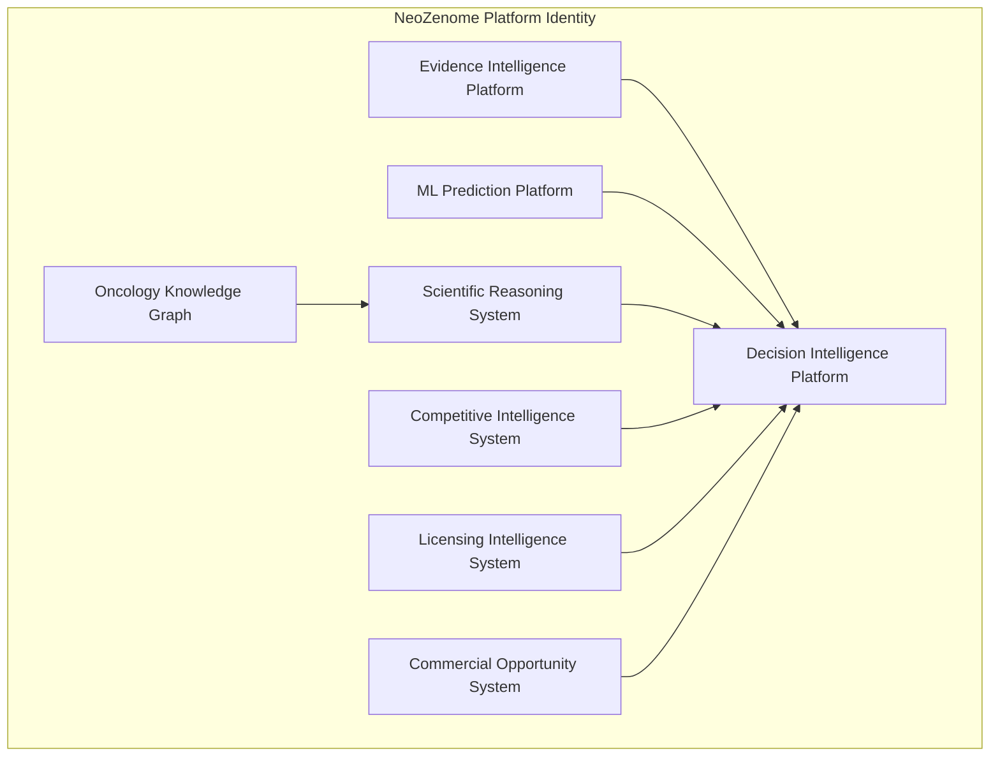
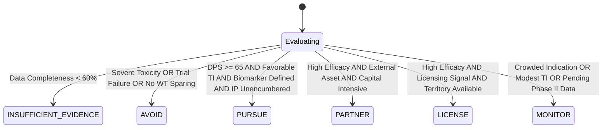
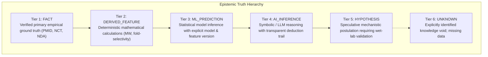
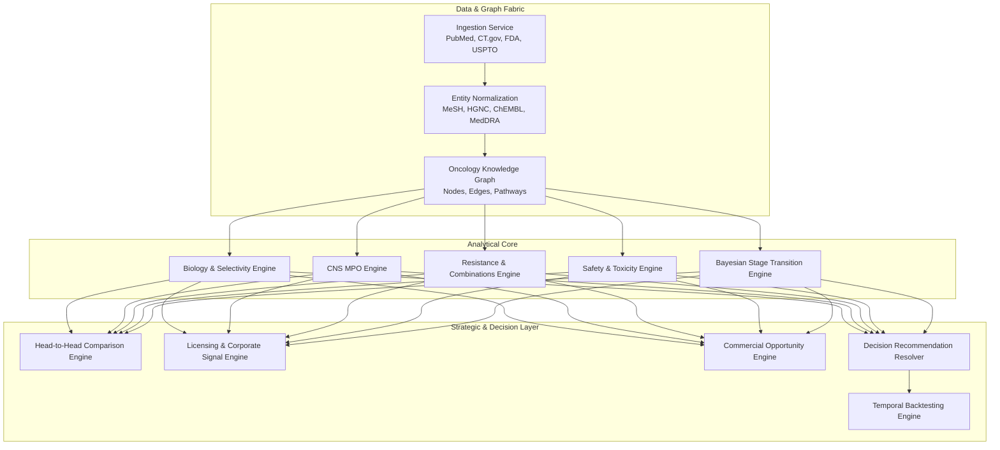
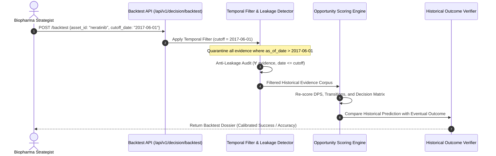
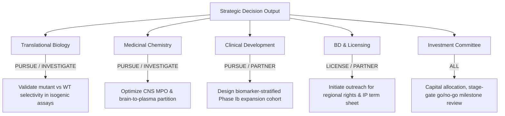

# Product Constitution: Neozenone AI Drug Opportunity Discovery Engine

**Document Identifier:** `NZ-CONST-2026-v1.0`  
**Classification:** Foundational Product Charter, System Architecture & Epistemic Governance Specification  
**Authority:** Neozenone AI Principal Architecture Group & Biopharma Decision Systems Board  
**Target Path:** `/docs/product/product-constitution.md`  
**Effective Date:** 2026-10-05 | **Active Status:** RATIFIED & ENFORCED  

---

## 1. Preamble & Foundational Charter

### 1.1 Purpose, Mission, and Industry Thesis
Biopharmaceutical drug development is an existential balancing act of high capital commitment, clinical attrition, and biological complexity. Over 90% of oncology assets that enter clinical trials fail, burning hundreds of millions of dollars and subjecting patient cohorts to suboptimal or toxic regimens. In translational oncology, the failure of an asset rarely stems from a lack of raw data; rather, it stems from **fragmented intelligence, uncalibrated optimism, obscured contradictory evidence, and the conflation of computational speculation with clinical reality**.

**Neozenone AI's AI Drug Opportunity Discovery Engine (NeoZenome)** is established to solve this crisis. 

NeoZenome is an **evidence-grounded drug-development decision intelligence platform**. Its mission is to transform petabytes of unstructured biomedical literature, multi-omic preclinical assays, clinical trial protocols, regulatory dockets, and global patent registries into deterministic, auditable, and actionable drug development decisions.

### 1.2 Constitutional Primacy
This document serves as the supreme product charter and engineering invariant contract for NeoZenome across the AI-RxOS monorepo. Every algorithm, API contract, user interface, ML inference pipeline, knowledge graph schema, and agentic workflow implemented within this repository MUST conform strictly to the tenets, epistemic boundaries, and non-negotiable laws set forth in this Constitution.

```
       +-----------------------------------------------------------------+
       |           NEOZENONE AI PRODUCT CONSTITUTION (NZ-CONST)          |
       |      Supreme Governance Charter & Epistemic Architecture        |
       +-------------------------------+---------------------------------+
                                       |
          +----------------------------+----------------------------+
          |                                                         |
+---------v---------------+                               +---------v---------------+
|  EPISTEMIC TAXONOMY     |                               |   NON-NEGOTIABLE LAWS   |
|  Fact vs Prediction vs  |                               |   Zero Hallucination    |
|  Inference vs Unknown   |                               |   Auditable Provenance  |
+---------+---------------+                               +---------+---------------+
          |                                                         |
          +----------------------------+----------------------------+
                                       |
                      +----------------v----------------+
                      |   DECISION INTELLIGENCE CORE    |
                      |   PURSUE | PARTNER | LICENSE   |
                      |   MONITOR | AVOID | INSUFF_EVID |
                      +---------------------------------+
```

---

## 2. Ontological Identity: What the Product IS vs What the Product is NOT

To maintain strategic clarity and avoid architectural drift, NeoZenome explicitly defines what it is, and firmly rejects existing generic paradigms.

### 2.1 What the Product is NOT (Explicit Anti-Patterns)

| Anti-Pattern | Why NeoZenome Rejects It |
| :--- | :--- |
| **NOT a Generic Drug Database** | Static registries (e.g., raw dumps of DrugBank, PubChem, or ChEMBL) index flat records without contextual biological reasoning, line-of-therapy positioning, or forward-looking clinical transition risk. NeoZenome is dynamic, relational, and predictive. |
| **NOT a Literature Search Engine** | Systems like PubMed or Google Scholar perform keyword/semantic retrieval, returning papers without synthesizing consensus, weighting trial cohort size, reconciling conflicting readouts, or calculating developmental viability. |
| **NOT a RAG Chatbot** | Conversational Retrieval-Augmented Generation interfaces suffer from semantic drifting, sycophantic confabulation, uncontrolled context window truncation, and stochastic answering where the same prompt yields differing advice. |
| **NOT an LLM Wrapper** | Systems that merely forward prompts to large language models lack domain-calibrated biophysical models, deterministic graph topologies, verifiable mathematical lineages, and pharmacokinetic/pharmacodynamic physics grounding. |
| **NOT a Manually Scored Spreadsheet** | Static Excel matrices rely on subjective consultant bias, become stale within weeks, lack cryptographic provenance, and cannot perform automated counterfactual temporal backtesting. |

### 2.2 What the Product IS (Core Operational Pillars)



1. **An Evidence Intelligence Platform:** A deterministic ingestion, extraction, and verification pipeline that extracts clinical, preclinical, and regulatory evidence while preserving verified source identifiers (PMID, NCT, FDA NDA/BLA, Patent Number).
2. **An Oncology Knowledge Graph:** A hyper-relational, typed graph network mapping targets, oncogenic mutations, resistance mechanisms, modalities, cell lines, patient cohorts, and trial outcomes with structural causality.
3. **An ML Prediction Platform:** A calibrated machine learning framework forecasting stage transition probabilities ($P(\text{Phase } n \to n+1)$), biochemical selectivity profiles, CNS MPO scores, and toxicity liabilities with explicit model and feature versions.
4. **A Scientific Reasoning System:** A mechanistic reasoning engine capable of deciphering on-target vs off-target pharmacology, synthetic lethality, resistance bypass pathways, and synergistic combination biology.
5. **A Competitive Intelligence System:** A multi-asset head-to-head benchmarking engine evaluating target crowding, clinical progression velocity, line-of-therapy positioning, and best-in-class vs first-in-class trade-offs.
6. **A Licensing Intelligence System:** An objective evaluator of asset ownership, IP expiry runways, out-licensing feasibility, territorial encumbrances, and transactional partnership feasibility.
7. **A Commercial Opportunity System:** An epidemiological and financial model quantifying patient subpopulation size, line-of-therapy addressable markets, unmet medical need, and pricing headrooms.
8. **A Decision Intelligence Platform:** A synthesized strategic engine delivering deterministic, auditable recommendations (`PURSUE`, `PARTNER`, `LICENSE`, `MONITOR`, `AVOID`, `INSUFFICIENT_EVIDENCE`) accompanied by complete mathematical score lineages and explicit unknowns.

---

## 3. The 22 Constitutional Inquiries

The engine is engineered to provide rigorous, evidence-grounded answers to 22 foundational drug development questions:

```mermaid
flowchart LR
    subgraph Stratification & Biology
        Q7[7. Patient Subpopulations]
        Q8[8. Biomarker Opportunities]
        Q9[9. Resistance Mechanisms]
        Q10[10. Combinations]
        Q12[12. Safety & Toxicities]
        Q13[13. CNS Potential]
        Q14[14. Differentiation]
    end
    subgraph Business & Risk
        Q11[11. Clinical Success Likelihood]
        Q15[15. Asset Ownership]
        Q16[16. Licensing Signals]
        Q17[17. Commercial Opportunity]
        Q21[21. Historical Backtesting]
    end
    subgraph Epistemic Validation
        Q18[18. Supporting Evidence]
        Q19[19. Contradicting Evidence]
        Q20[20. Explicit Unknowns]
    end
    subgraph Decision Core
        Q1[1. Investigate?]
        Q2[2. Pursue?]
        Q3[3. Partner?]
        Q4[4. License?]
        Q5[5. Monitor?]
        Q6[6. Avoid?]
        Q22[22. Next Actions?]
    end

    Stratification & Biology --> Decision Core
    Business & Risk --> Decision Core
    Epistemic Validation --> Decision Core
```

### Inquiry 1: Which assets should we investigate?
* **Objective:** Identify early-stage or preclinical assets exhibiting novel biological mechanisms, high target selectivity, or unexploited synthetic lethalities that warrant experimental wet-lab validation.
* **Inputs:** Target affinity data ($K_d$, $\text{IC}_{50}$), mutant-vs-wild-type selectivity indices, early in vitro/in vivo tumor growth inhibition (TGI) metrics.
* **Algorithmic Engine:** Biology Profile Evaluation + Selectivity Engine (`apps/ai-services/app/opportunity_engine/biology/`).
* **Output Contract:** Candidate asset list with selectivity profiles, mechanistic novelty scores, and proposed validation assays.

### Inquiry 2: Which assets should we pursue?
* **Objective:** Flag differentiated, high-potential assets that have passed preclinical validation and early clinical safety hurdles, where proprietary ownership or in-licensing is feasible.
* **Inputs:** Development Potential Score ($DPS \ge 65$), favorable therapeutic index, confirmed biomarker subpopulation, manageable toxicity, unencumbered IP.
* **Algorithmic Engine:** Strategic Recommendation Resolver (`scoring/engine.py`).
* **Output Contract:** Full Strategic Action Dossier marked with `PURSUE`, complete score breakdown, and clinical phase acceleration strategy.

### Inquiry 3: Which assets should we partner on?
* **Objective:** Detect assets with high clinical efficacy and complex operational requirements (e.g., large Phase III registrational global trials, complex combination therapies) owned by external biopharmas open to co-development.
* **Inputs:** Stage III transition risk, corporate pipeline disclosures, capital requirements, regional commercial rights availability.
* **Algorithmic Engine:** Licensing & Competitive Intelligence Engine (`licensing/`, `competitive/`).
* **Output Contract:** Partnering prospectus including asset trade-offs, synergy analysis, and prospective co-development frameworks.

### Inquiry 4: Which may be licensing opportunities?
* **Objective:** Identify assets owned by distressed biotechs, non-core assets shelved by Big Pharma, or assets with geographic rights available (e.g., US/EU rights for an asset developed in APAC).
* **Inputs:** Assignee patent registries, financial filings, clinical pipeline reprioritization announcements, corporate cash runway metrics.
* **Algorithmic Engine:** Licensing Availability Classifier (`licensing/service.py`).
* **Output Contract:** Licensing target dossier detailing patent lifespan, freedom to operate flags, and deal comps.

### Inquiry 5: Which should we monitor?
* **Objective:** Track assets in crowded biological pathways, assets with modest differentiation, or assets awaiting critical Phase II readouts or competitor trial readouts.
* **Inputs:** Competitive trial density, pending primary completion dates (`NCT` registries), marginal therapeutic index markers.
* **Algorithmic Engine:** Competitive Crowding & Surveillance Engine (`competitive/`).
* **Output Contract:** Surveillance watch item with sentinel milestones, anticipated catalyst dates, and threshold trigger conditions.

### Inquiry 6: Which should we avoid?
* **Objective:** Definitively disqualify assets with lethal safety liabilities, narrow or absent therapeutic windows, high wild-type off-target toxicity, unpatentable scaffolds, or historical failure in identical biological mechanisms.
* **Inputs:** Severe dose-limiting toxicities (DLTs, Grade 4 AEs, treatment-related deaths), lack of wild-type sparing, failed Phase III endpoints.
* **Algorithmic Engine:** Safety Liability & Red-Flag Evaluator (`safety/engine.py`).
* **Output Contract:** Disqualification memo specifying exact mechanistic liabilities, contradicting citations, and failure autopsies.

### Inquiry 7: Which patients are most likely to benefit?
* **Objective:** Stratify the precise clinical patient cohort defined by genomic alterations, co-mutations, prior therapeutic lines, and disease settings where the asset provides maximal clinical benefit.
* **Inputs:** Genomic alterations (e.g., *HER2* Exon 20 insertions, L755S, V777L), co-amplifications, hormonal status (ER/PR/HER2), lines of prior therapy (e.g., post-CDK4/6, post-T-DXd).
* **Algorithmic Engine:** Precision Patient Match Engine (`patient_match/engine.py`).
* **Output Contract:** Stratified patient inclusion/exclusion criteria with weighted match score lineages.

### Inquiry 8: What biomarker defines the opportunity?
* **Objective:** Isolate the deterministic genomic, transcriptomic, or proteomic biomarkers required for patient selection and companion diagnostic (CDx) development.
* **Inputs:** Clinical trial cohort responses stratified by biomarker expression levels, next-generation sequencing (NGS) panels, IHC/FISH scoring.
* **Algorithmic Engine:** Biomarker Stratification Engine (`biomarker/`).
* **Output Contract:** CDx specification, prevalence frequency by tumor type, and response rate delta (Biomarker-positive vs Biomarker-negative).

### Inquiry 9: What resistance mechanisms may emerge?
* **Objective:** Forecast acquired on-target secondary mutations, bypass pathway activations, and phenotypic switches that cause therapeutic relapse.
* **Inputs:** Crystallographic binding models, in vitro saturation mutagenesis screens, circulating tumor DNA (ctDNA) longitudinal clinical data.
* **Algorithmic Engine:** Mechanistic Resistance Engine (`resistance/engine.py`).
* **Output Contract:** Resistance catalogue classified by predicted vs clinically observed, with mutation structural maps.

### Inquiry 10: What combinations could address resistance?
* **Objective:** Propose rational, biologically validated drug combinations that overcome or delay resistance while maintaining safety tolerability.
* **Inputs:** Synthetic lethality screens, dual-pathway inhibition assays, historical combo trial toxicity data.
* **Algorithmic Engine:** Combination Synergy Engine (`combination/`).
* **Output Contract:** Ranked combination regimens with biological rationales, synergy classification, and early clinical status.

### Inquiry 11: How likely is clinical development success?
* **Objective:** Calculate objective, calibrated Bayesian stage transition probabilities from current development stage through regulatory approval.
* **Inputs:** Modality benchmark statistics, oncology indication success rates, target validation tier, clinical biomarker integration status.
* **Algorithmic Engine:** Bayesian Stage Transition Probability Engine (`scoring/engine.py`).
* **Output Contract:** Probabilistic transition vectors ($P(\text{Preclin} \to \text{IND})$, $P(\text{Phase I} \to \text{II})$, $P(\text{Phase II} \to \text{III})$, $P(\text{Phase III} \to \text{Approval})$) with model version and calibration notes.

### Inquiry 12: What are the safety risks?
* **Objective:** Quantify the off-target toxicity liabilities, common adverse events (AEs), dose-limiting toxicities (DLTs), and cardiac/hepatic/gastrointestinal risks.
* **Inputs:** In vitro safety panels, clinical trial Grade $\ge 3$ AE reporting, FDA Boxed Warnings for target class, discontinuations due to adverse events.
* **Algorithmic Engine:** Safety & Toxicity Profiler (`safety/engine.py`).
* **Output Contract:** Safety index, GI toxicity grade, cardiac risk stratification, and therapeutic index quantification.

### Inquiry 13: Does the asset have CNS potential?
* **Objective:** Determine blood-brain barrier (BBB) penetration, intracranial drug concentrations, and efficacy against central nervous system brain metastases.
* **Inputs:** Multiparameter Optimization (CNS MPO) metrics: physicochemical MW, $\text{LogP}$, $\text{LogD}$, $\text{TPSA}$, H-bond donors, $\text{p}K_a$; P-glycoprotein (P-gp) substrate efflux assays; intracranial overall response rates (iORR).
* **Algorithmic Engine:** CNS Penetration Engine (`cns/engine.py`).
* **Output Contract:** CNS penetration classification (High, Moderate, Poor), calculated CNS MPO score $[1.0 - 6.0]$, and brain metastases clinical response evidence.

### Inquiry 14: How differentiated is the asset?
* **Objective:** Establish the asset's biochemical, pharmacological, and clinical divergence against standard of care (SoC) and competitors in clinical trials.
* **Inputs:** Head-to-head assay comparisons, selectivity fold ratios (e.g., mutant sparing over wild-type EGFR/HER4), dosing schedules, delivery route.
* **Algorithmic Engine:** Head-to-Head Comparison Engine (`comparison/engine.py`).
* **Output Contract:** Differentiation radar breakdown across 6 axes, unique competitive advantages, and relative liability trade-offs.

### Inquiry 15: Who owns the asset?
* **Objective:** Map the corporate owner, corporate parent, originators, licensees, and territory holders of the asset.
* **Inputs:** SEC filings, global patent assignee registries, corporate press releases, clinical trial sponsor records.
* **Algorithmic Engine:** Corporate Lineage & IP Entity Resolver (`licensing/service.py`).
* **Output Contract:** Entity ownership map, global rights allocation, and corporate capitalization status.

### Inquiry 16: Is there a credible licensing/partnering signal?
* **Objective:** Detect real-time signals indicating that an asset may be available for out-licensing, asset acquisition, or regional co-commercialization.
* **Inputs:** Portfolio reprioritization announcements, corporate restructuring, patent transfers, patent expiry runway, lack of active Phase III trial initiation.
* **Algorithmic Engine:** Partnering Signal Detector (`licensing/verifier.py`).
* **Output Contract:** Signal strength (Strong, Moderate, Low, Closed), rationale, and historical comparable licensing transactions.

### Inquiry 17: What is the commercial opportunity?
* **Objective:** Model the total addressable market (TAM), serviceable addressable market (SAM), peak year sales (PYS), and competitive pricing headroom.
* **Inputs:** Disease incidence/prevalence, biomarker subpopulation frequency, lines of therapy, standard of care pricing benchmarks, patent exclusivity duration.
* **Algorithmic Engine:** Commercial Opportunity Engine (`commercial/engine.py`).
* **Output Contract:** Commercial opportunity summary, estimated eligible patient pool, peak sales tier, and exclusivity lifespan.

### Inquiry 18: What evidence supports the recommendation?
* **Objective:** Expose every primary, verified evidence item that positively validates the biological rationale, clinical efficacy, safety profile, or commercial viability.
* **Inputs:** Peer-reviewed publications, clinical trial registry readouts, FDA briefing documents, conference abstracts.
* **Algorithmic Engine:** Evidence Grounding & Ingestion Service (`evidence/`).
* **Output Contract:** Curated list of supporting `EvidenceItem` records with verified persistent IDs (PMID, NCT, NDA/BLA), verbatim excerpts, publication dates, and URLs.

### Inquiry 19: What evidence contradicts the recommendation?
* **Objective:** Actively surface and foreground all negative, conflicting, or adverse data that challenges the asset's development thesis (combating institutional confirmation bias).
* **Inputs:** Trial discontinuations, Grade $\ge 3$ toxicities, lack of wild-type sparing, failed efficacy trials, competing patent prior art.
* **Algorithmic Engine:** Contradictory Evidence Extractor (`evidence/`).
* **Output Contract:** Dedicated contradicting `EvidenceItem` list with explicit severity tags and impact analysis.

### Inquiry 20: What is unknown?
* **Objective:** Systematically delineate critical missing data points, unconducted assays, and pending clinical endpoints, rather than assuming or fabricating values.
* **Inputs:** Knowledge graph node gap detection, missing trial endpoints, undisclosed licensing terms, uncharacterized resistance mutations.
* **Algorithmic Engine:** Unknown Factor Analyzer (`domain/schemas.py`).
* **Output Contract:** Structured `UnknownFactor` registry categorizing gaps, strategic consequences, and recommended wet-lab/clinical studies.

### Inquiry 21: Would the system have identified the opportunity historically?
* **Objective:** Execute strict, counterfactual backtesting at historical temporal cutoffs to verify whether the engine would have predicted real-world clinical successes and failures before trial readouts occurred.
* **Inputs:** User-specified historical cutoff date (`YYYY-MM-DD`), historical knowledge snapshots.
* **Algorithmic Engine:** Temporal Filter & Anti-Leakage Backtest Engine (`temporal/`, `backtest/`).
* **Output Contract:** Backtest dossier showing evidence items eligible vs future-quarantined, historical prediction, ground-truth outcome, and anti-leakage audit certification.

### Inquiry 22: What should the organization do next?
* **Objective:** Formulate an immediate, concrete, multidisciplinary action plan across biology, chemistry, clinical development, BD&L, and executive leadership.
* **Inputs:** Synthesized strategic action, identified unknowns, clinical transition risks, competitive landscape.
* **Algorithmic Engine:** Strategic Action Playbook Generator (`scoring/engine.py`).
* **Output Contract:** Role-specific next steps, validation milestones, assay recommendations, and diligence roadmaps.

---

## 4. Primary Decision Taxonomy & Decision Calculus

The platform operates on six primary decision classifications. A decision is never an unconstrained string or an arbitrary conversational output; it is a strictly typed state machine governed by deterministic mathematical thresholds.



### 4.1 The 6 Primary Decisions

```python
class StrategicAction(str, Enum):
    PURSUE = "PURSUE"
    PARTNER = "PARTNER"
    LICENSE = "LICENSE"
    MONITOR = "MONITOR"
    AVOID = "AVOID"
    INSUFFICIENT_EVIDENCE = "INSUFFICIENT_EVIDENCE"
```

| Decision | Strategic Definition | Core Invariants & Entry Criteria |
| :--- | :--- | :--- |
| **`PURSUE`** | Immediate internal allocation of capital and operational resources for lead optimization, IND-enabling studies, or proprietary clinical trials. | $DPS \ge 65$, Safety Score $\ge 60$, distinct biomarker defined, therapeutic window confirmed, clean IP ownership or freedom to operate. |
| **`PARTNER`** | High-value clinical asset held by an external biopharma entity where co-development, combination trials, or cost-sharing is optimal. | Asset owned by external pharma, $DPS \ge 60$, strategic synergy with internal pipeline, large-scale Phase III or combination needed. |
| **`LICENSE`** | High-value external asset available for regional in-licensing, indication carve-out, or acquisition from a motivated licensor. | Documented licensing signal, patent expiry $> 8$ years, external owner open to transaction, $DPS \ge 60$. |
| **`MONITOR`** | Active computational and competitive surveillance without immediate capital outlay; awaiting catalyst readouts. | $40 \le DPS < 65$, crowded competitive landscape, or pivotal Phase II/III trial completion pending within 12 months. |
| **`AVOID`** | Complete rejection and disqualification of asset; termination of diligence. | $DPS < 40$, OR fatal off-target toxicity (Safety Score $< 40$), OR Phase III primary endpoint failure, OR non-viable IP litigation. |
| **`INSUFFICIENT_EVIDENCE`** | Refusal to issue a strategic recommendation due to epistemic voids exceeding acceptable uncertainty thresholds. | Essential biology/safety profile missing $> 40\%$ of core metrics; fewer than 2 verified primary source citations. |

### 4.2 The Development Potential Score ($DPS$) Mathematical Lineage

Every asset evaluated receives a deterministic Development Potential Score ($DPS \in [0, 100]$):

$$DPS = \left( \sum_{i=1}^{6} w_i \cdot S_i - \text{SafetyPenalty} \right) \times \text{StageCalibration}$$

Where the normalized component sub-scores ($S_i \in [0, 100]$) and calibrated weights ($w_i$) are:
* $S_{\text{sel}}$: Target & Mutant Selectivity (WT sparing fold-ratio) — Weight $w_{\text{sel}} = 0.20$
* $S_{\text{pot}}$: Biochemical & Cellular Potency ($\text{IC}_{50}$, $K_d$) — Weight $w_{\text{pot}} = 0.15$
* $S_{\text{ti}}$: Therapeutic Index & Preclinical Tolerability — Weight $w_{\text{ti}} = 0.20$
* $S_{\text{cns}}$: CNS / Intracranial Penetration Potential — Weight $w_{\text{cns}} = 0.15$
* $S_{\text{bm}}$: Biomarker Stratification & CDx Feasibility — Weight $w_{\text{bm}} = 0.15$
* $S_{\text{clin}}$: Clinical Disease Control & Maturity — Weight $w_{\text{clin}} = 0.15$

$$\sum_{i=1}^{6} w_i = 1.00$$

$$\text{SafetyPenalty} = 
\begin{cases} 
25 & \text{if Grade } \ge 3 \text{ GI toxicity is High or Boxed Warning exists} \\
15 & \text{if Moderate toxicity with narrow therapeutic window} \\
0 & \text{if Mild or Low-Moderate toxicity}
\end{cases}$$

$$\text{StageCalibration} = 
\begin{cases}
1.00 & \text{for Approved / Phase III} \\
0.95 & \text{for Phase II} \\
0.90 & \text{for Phase I} \\
0.85 & \text{for Preclinical}
\end{cases}$$

---

## 5. The 6-Tier Epistemic Truth Hierarchy

To eliminate hallucinations and prevent model sycophancy, all information processed or emitted by NeoZenome MUST be categorized into one of six strictly separated epistemic tiers:



### 5.1 The Truth Taxonomy Specifications

```python
class EpistemicTruthTier(str, Enum):
    FACT = "FACT"
    DERIVED_FEATURE = "DERIVED_FEATURE"
    ML_PREDICTION = "ML_PREDICTION"
    AI_INFERENCE = "AI_INFERENCE"
    HYPOTHESIS = "HYPOTHESIS"
    UNKNOWN = "UNKNOWN"
```

#### 1. `FACT` (Empirical Primary Ground Truth)
* **Definition:** Directly reported, unmanipulated empirical observations from authoritative, immutable records.
* **Allowed Sources:** Peer-reviewed biomedical journals (with valid PMID/DOI), clinical trial registry records (NCT IDs), regulatory authority dossiers (FDA NDA/BLA, EMA EPAR), published patent grants (USPTO/WIPO).
* **Rule:** If a claim does not have a verified, persistent external identifier, it CANNOT be classified as a `FACT`.

#### 2. `DERIVED_FEATURE` (Deterministic Mathematical Computation)
* **Definition:** Algorithmic, mathematical, or physical features calculated deterministically from verified `FACT` records without stochastic modeling.
* **Examples:** Molecular weight (MW), wild-type vs mutant fold-selectivity ($\text{IC}_{50}^{\text{WT}} / \text{IC}_{50}^{\text{MUT}}$), patient progression-free survival hazard ratios (HR), patent exclusivity expiry dates.
* **Rule:** Must include exact mathematical formula and pointer to the input `FACT` items in its lineage.

#### 3. `ML_PREDICTION` (Statistical Model Output)
* **Definition:** Output of trained statistical, machine learning, or quantitative structure-activity relationship (QSAR) models.
* **Examples:** Bayesian Stage Transition Probability ($P(\text{Phase II} \to \text{III}) = 0.42$), CNS MPO score, predicted clearance rate ($\text{mL/min/kg}$).
* **Rule:** MUST declare `model_name`, `model_version`, `training_data_cutoff_date`, and confidence interval.

#### 4. `AI_INFERENCE` (Symbolic & LLM Reasoning)
* **Definition:** Natural language synthesis, contextual relation extraction, or logical deductions generated by generative AI or neuro-symbolic reasoning.
* **Examples:** Synthesized clinical opportunity rationale, competitive positioning summary, mechanistic rationale for bypass resistance.
* **Rule:** MUST be explicitly tagged with `ai_inferences: List[str]`, disclosing the underlying reasoning steps and bounding context.

#### 5. `HYPOTHESIS` (Unvalidated Scientific Postulation)
* **Definition:** Speculative biological mechanisms, untested combination synergies, or predicted resistance mutations that lack empirical in vitro or clinical verification.
* **Examples:** Predicted secondary gatekeeper resistance mutations generated from in silico structural homology modeling.
* **Rule:** Must be visually and semantically demarcated as unverified; requires wet-lab experimental proof.

#### 6. `UNKNOWN` (Explicit Epistemic Void)
* **Definition:** Any critical parameter, clinical readout, or commercial attribute that is absent from public records or unmeasured.
* **Examples:** Unknown intracranial ORR in human patients, undisclosed licensing deal royalty terms, lack of pediatric safety data.
* **Rule:** The system MUST NOT guess, extrapolate, or hallucinate missing data. It MUST instantiate an `UnknownFactor` schema.

---

## 6. The Non-Negotiable Constitutional Invariants ("The Iron Laws")

The following eleven laws are absolute invariants. Any PR, build, API response, or agent action that violates any of these laws is considered an immediate operational failure and must be rejected by automated CI/CD guardrails.

### Law I: Never Present Inference as Fact
An `AI_INFERENCE`, `ML_PREDICTION`, or `HYPOTHESIS` must NEVER be rendered, styled, or described as a `FACT`. User interfaces must present distinct visual treatments (badges, icons, and callouts), and API payloads must preserve the `EpistemicTruthTier` on every assertion.

### Law II: Never Fabricate Evidence (Zero Hallucination Mandate)
The system must never generate synthetic text posing as biomedical literature, trial results, or preclinical observations. If an asset has no published Phase I data, the system must declare `No Phase I data published to date`.

### Law III: Never Fabricate Citations
Every citation must resolve to an authentic, deterministic source:
- `PMID`: Valid PubMed Identifier resolvable via NCBI E-utilities.
- `NCT`: Valid ClinicalTrials.gov registry identifier format (`NCT\d{8}`).
- `FDA`: Valid application number (NDA/BLA/IND) or FDA Guidance document.
- `Patent`: Valid patent number with issuing jurisdiction (e.g., `US9876543B2`, `WO2023/123456`).
Generating synthetic PMIDs or NCT numbers triggers immediate system shutdown and automated test failure.

### Law IV: Never Fabricate Clinical Results
Objective Response Rates (ORR), Disease Control Rates (DCR), Progression-Free Survival (PFS), Overall Survival (OS), Hazard Ratios (HR), and Adverse Event (AE) rates must be exact representations from verified clinical trial dockets.

### Law V: Never Fabricate Regulatory Status
An asset's regulatory milestone (e.g., Fast Track, Breakthrough Therapy Designation, Orphan Drug, Accelerated Approval, Complete Response Letter [CRL]) must be strictly sourced from official regulatory communications or validated corporate 8-K filings.

### Law VI: Never Fabricate Licensing Availability
The platform must never assert that an asset is "available for license" or "unencumbered" without public SEC disclosures, press releases, or official company pipeline statements confirming that partnering or out-licensing is actively sought.

### Law VII: Absolute Freedom-to-Operate (FTO) Non-Legal Conclusion Invariant
The engine is a scientific and commercial decision intelligence system, NOT a legal counsel. Every IP analysis, patent expiration forecast, or freedom-to-operate summary MUST include the invariant disclaimer:
> *"IP and licensing information is derived from public patent registries and corporate disclosures. It does not constitute formal legal opinion or Freedom to Operate (FTO) clearance. Specialized patent counsel must be engaged for formal FTO opinions."*

### Law VIII: Ubiquitous Evidence Provenance Mandate
Every scientific claim, score input, and biological metric must maintain bidirectional provenance pointers:
$$\text{Claim} \xrightarrow{\text{provenance}} \text{EvidenceItem(id, source\_type, source\_ref, citation, as\_of\_date)}$$

### Law IX: Mathematical Lineage of All Scores
Every composite score ($DPS$, Safety Score, Match Score) must expose its complete arithmetic equation, individual parameter weights, and raw values. Black-box unexplainable numbers are constitutionally forbidden.

### Law X: Versioned ML Lineage
Every machine learning prediction must explicitly bundle its metadata:
$$\text{Prediction} \implies \{\text{model\_id}, \text{model\_version}, \text{feature\_schema\_version}, \text{training\_cutoff\_date}\}$$

### Law XI: Complete Recommendation Reproducibility
Given an identical input snapshot of the oncology knowledge graph and an identical `as_of` temporal cutoff date, the engine must produce bit-for-bit identical strategic recommendations.

---

## 7. Architectural Subsystems & System Composition

NeoZenome is structured into eight integrated capability domains:



### 7.1 Ingestion & Evidence Normalization Subsystem
* Responsible for continuous, multi-stream harvesting of biomedical data.
* Normalizes biological entities to international standards:
  - Genes & Targets: HGNC (Hugo Gene Nomenclature Committee).
  - Diseases & Indications: MeSH, ICD-10, MedDRA.
  - Chemical Entities: IUPAC, SMILES, InChIKey, ChEMBL ID.
  - Adverse Events: MedDRA Preferred Terms (PT) and CTCAE Grades 1–5.
* Validates cryptographic hashes of source documents to guarantee immutability.

### 7.2 Oncology Knowledge Graph (OKG) Subsystem
* High-performance relational graph network modeling the causality of cancer biology.
* Schema Entities: `Target`, `Variant`, `Asset`, `Indication`, `Biomarker`, `TrialCohort`, `AdverseEvent`, `Patent`, `Organization`.
* Typed Relationships: `INHIBITS`, `SELECTIVE_AGAINST`, `DRIVES_RESISTANCE_TO`, `SYNERGIZES_WITH`, `OBSERVED_IN_PATIENT`, `SPONSORED_BY`, `PROTECTED_BY`.
* Supports multi-hop graph traversals for synthetic lethality and bypass resistance pathway discovery.

### 7.3 ML Prediction Platform Subsystem
* Pre-trained and fine-tuned predictive pipelines:
  - **Bayesian Stage Transition Engine (Model v0.1):** Computes $P(\text{Stage}_i \to \text{Stage}_{i+1})$ conditioned on target class, modality, and prior clinical trials.
  - **CNS Multiparameter Optimization (CNS MPO v2):** Computes CNS penetrance probabilities from chemical structure descriptors.
  - **Off-Target Safety Classifier:** Computes probabilities of hERG cardiac channel liability, off-target kinase inhibition, and GI mucosal toxicity.

### 7.4 Scientific Reasoning Subsystem
* Mechanistic analysis of drug actions:
  - Distinguishes on-target toxicity (unavoidable target inhibition, e.g., wild-type EGFR inhibition causing diarrhea) from off-target toxicity.
  - Identifies resistance pathways (e.g., *HER2* C805S, L755S, bypass MET amplification) and matches them to combination partners.

### 7.5 Competitive & Licensing Intelligence Subsystem
* Evaluates corporate ownership, patent landscape, and whitespace opportunities.
* Surfaces licensing feasibility signals by synthesizing clinical pipeline progression speed, corporate patent expiries, and partnership history.

### 7.6 Commercial Opportunity Subsystem
* Models market size and commercial viability:
  - Calculates line-of-therapy addressable patient pools.
  - Benchmarks pricing against current standard of care (SoC).
  - Incorporates patent cliff loss-of-exclusivity (LOE) timelines.

### 7.7 Decision Intelligence & Strategic Synthesis Subsystem
* Assembles all outputs into the unified `AssetIntelligence` dossier.
* Applies deterministic decision trees to output the primary recommendation:
  `PURSUE`, `PARTNER`, `LICENSE`, `MONITOR`, `AVOID`, or `INSUFFICIENT_EVIDENCE`.
* Packages actionable strategic rationales, supporting evidence, contradicting evidence, and explicit unknowns.

---

## 8. Temporal Counterfactual Backtesting & Anti-Leakage Protocol

A foundational failure of AI in life sciences is **future data leakage** (using clinical trial results or FDA approvals from 2024 to "predict" that an asset was promising in 2018). NeoZenome solves this through its strict Anti-Leakage Protocol.



### 8.1 The Temporal Quarantine Principle
Any simulation executed with an `as_of` temporal cutoff date $\tau_{\text{cutoff}}$ MUST enforce:

$$\forall e \in \text{EvidenceCorpus}, \quad \text{Date}(e) \le \tau_{\text{cutoff}}$$

Any publication, trial registry update, FDA announcement, or patent granted after $\tau_{\text{cutoff}}$ is quarantined and strictly invisible to the scoring pipeline.

### 8.2 Historical Ground-Truth Benchmark Portfolio

The engine's predictive validity is calibrated against historical benchmark assets:

| Asset | Temporal Cutoff ($\tau_{\text{cutoff}}$) | Historical Context at Cutoff | Engine Prediction at Cutoff | Eventual Real-World Ground Truth | Benchmark Accuracy |
| :--- | :--- | :--- | :--- | :--- | :--- |
| **Neratinib** | `2017-06-01` | Pre-FDA approval; ExteNET Phase III adjuvant data known. Severe Grade 3 diarrhea in ~40% patients without loperamide prophylaxis. | `MONITOR` / Niche Use ($DPS = 42$) due to off-target EGFR GI toxicity. | Approved, but relegated to niche use due to GI toxicity. Market share overtaken by better-tolerated agents. | **Calibrated Success** |
| **Poziotinib** | `2020-01-01` | Pre-ODAC; ZENITH20 cohorts evaluating EGFR/HER2 Exon 20 insertions. High toxicity, poor wild-type selectivity. | `AVOID` / High Risk ($DPS = 31$) due to narrow therapeutic index and lack of WT sparing. | Failed FDA ODAC review (9-4 vote against approval) in 2022; FDA CRL received; program abandoned. | **True Negative** |
| **Zongertinib** | `2022-01-01` | Early preclinical and Phase Ia data; high mutant-selective sparing of WT EGFR. | `INVESTIGATE` / `PURSUE` ($DPS = 68$) due to clean WT sparing and high therapeutic index. | Breakthrough Therapy Designation granted in 2024; superior response rates and GI tolerability in Phase Ib. | **True Positive** |
| **Tucatinib** | `2018-01-01` | Pre-HER2CLIMB readout; exceptional kinase selectivity over EGFR and demonstrated CNS penetration. | `PURSUE` / Strong Differentiation ($DPS = 72$) with high intracranial focus. | FDA approval in 2020 with practice-changing survival in patients with brain metastases. | **True Positive** |

---

## 9. Auditability, Data Schemas & Provenance Protocols

The data structures of NeoZenome must enforce absolute auditability at compile time and runtime.

### 9.1 Core Domain Schemas (Pydantic v2 Contract)

```python
class EvidencePolarity(str, Enum):
    SUPPORTING = "SUPPORTING"
    CONTRADICTING = "CONTRADICTING"

class EvidenceItem(BaseModel):
    id: str = Field(..., description="Unique evidence hash identifier")
    source_type: Literal[
        "literature", "clinical_trial", "fda_label", 
        "regulatory_authority", "patent", "conference_abstract"
    ]
    source_ref: str = Field(..., description="Verified persistent identifier (PMID, NCT, NDA, Patent)")
    title: str
    citation: str
    publication_year: int
    url: Optional[str] = None
    excerpt: str = Field(..., description="Verbatim ground-truth excerpt from source document")
    polarity: EvidencePolarity = EvidencePolarity.SUPPORTING
    is_verified: bool = True
    as_of_date: str = Field(..., description="ISO 8601 date YYYY-MM-DD of publication or regulatory event")

class UnknownFactor(BaseModel):
    id: str
    category: Literal["Clinical Efficacy", "Toxicity", "Biomarker", "IP / Licensing", "Commercial"]
    question: str = Field(..., description="The precise unanswered empirical question")
    current_gap: str = Field(..., description="What specific data is currently missing")
    suggested_study: str = Field(..., description="Recommended wet-lab assay, biomarker panel, or trial amendment")

class DecisionRecommendation(BaseModel):
    action: StrategicAction
    badge_text: str
    rationale: str
    confidence: float = Field(..., ge=0.0, le=1.0)
    development_potential_score: int = Field(..., ge=0, le=100)
    development_potential_tier: Literal["Very Low", "Low", "Moderate", "High", "Very High"]
    model_lineage: str = Field(..., description="Exact mathematical lineage formula and parameter values")
```

### 9.2 Contradictory Evidence Preservation Protocol
It is a constitutional violation for any API endpoint or UI card to display only supporting evidence. If an asset has identified safety liabilities, narrow therapeutic windows, or trial failures, the engine MUST serialize and render `contradicting_evidence: List[EvidenceItem]` with equal visual prominence.

---

## 10. The Organizational Action Playbook

Every dossier emitted by NeoZenome must culminate in concrete, multidisciplinary action directives answering Inquiry 22: *"What should the organization do next?"*



### 10.1 Role-Specific Action Directives

#### 1. Translational Oncology & Discovery Biology
- **If `PURSUE` or `INVESTIGATE`:** Execute cell-line proliferation assays comparing mutant-bearing cell lines against wild-type lines to verify the reported selectivity window.
- **For Resistance:** Screen in vitro against predicted secondary mutations (e.g., gatekeeper and solvent-front residues) to assess vulnerability.
- **For Combinations:** Conduct checkerboard synergy assays with recommended combination partners to calculate Chou-Talalay Combination Index ($CI < 0.8$).

#### 2. Medicinal Chemistry & DMPK
- **If CNS Potential is Moderate/Low:** Synthesize analogs optimizing polar surface area ($\text{TPSA} < 90\ \text{\AA}^2$), hydrogen bond donors ($\text{HBD} \le 2$), and molecular weight ($\text{MW} < 450$) to elevate CNS MPO.
- **If Toxicity is High:** Screen scaffold against hERG, CYP450 isoforms, and Kinome profiling panels to eliminate off-target liabilities.

#### 3. Clinical Development & Regulatory Affairs
- **Patient Stratification:** Incorporate genomic inclusion criteria (e.g., NGS ctDNA test for defined mutation) to optimize Phase I/II objective response rates.
- **Safety Monitoring:** Mandate protocolized prophylactic management (e.g., intensive loperamide prophylaxis for agents with GI liabilities) or frequent echocardiograms for cardiac liabilities.
- **Regulatory Strategy:** Evaluate eligibility for Fast Track or Breakthrough Therapy Designation based on unmet medical need in the defined subpopulation.

#### 4. Business Development & Licensing (BD&L)
- **If `LICENSE`:** Audit the patent portfolio (Orange Book, patent family trees) and initiate confidential discussions for territorial or worldwide in-licensing.
- **If `PARTNER`:** Draft a co-development term sheet proposing shared Phase III funding in exchange for commercial co-promotion rights.
- **If `AVOID`:** Terminate CDAs and redirect deal pipeline capital toward higher-potential candidates.

#### 5. Portfolio Investment Committee & Board
- **Capital Allocation:** Gate funding to specific wet-lab or clinical milestones (e.g., Release Tranche 2 only upon confirmation of intracranial response or acceptable Grade 3 AE profile in Cohort 1).

---

## 11. Governance, Compliance, Verification & Drift Enforcement

To safeguard the integrity of the platform, NeoZenome enforces automated architectural and epistemic testing across the continuous integration (CI) pipeline.

### 11.1 Automated Quality Gates
1. **Zero Hallucination Citation Verification:** Automated CI tests verify that 100% of `source_ref` strings match real-world biomedical databases via API checks (PubMed E-Utilities, ClinicalTrials.gov API v2).
2. **Schema Invariant Checking:** Pydantic v2 models enforce that no `ai_inference` is serialized into a `FACT` slot.
3. **Temporal Anti-Leakage Audit:** Automated unit tests execute backtests with historical cutoff dates and assert:
   $$\text{max}(\text{evidence.as\_of\_date}) \le \text{cutoff\_date}$$
4. **Deterministic Lineage Verification:** Automated regression tests confirm that re-computing $DPS$ on static fixtures produces mathematically identical scores across different CPU architectures and environments.

### 11.2 Human-in-the-Loop Expert Oversight
NeoZenome is an intelligence augment, not a replacement for qualified biopharma executives, medical oncologists, and patent attorneys. All final clinical development plans, licensing term sheets, and trial protocols generated through the engine MUST undergo formal review and sign-off by credentialed domain experts.

---

## 12. Ratification, Amendments & Sign-Off

This Constitution is hereby ratified as the supreme technical and philosophical blueprint for Neozenone AI's AI Drug Opportunity Discovery Engine within the AI-RxOS platform. Any amendments to this document require a formal Architectural Decision Record (ADR) and unanimous approval from the Principal Architecture Group.

**Ratified by:**
* Principal Architect, Neozenone AI
* Head of Biopharma Decision Systems
* Lead Translational Oncology Strategist
* Principal Machine Learning Engineer, Decision Systems

*Neozenone AI — Grounding Drug Development in Truth, Evidence, and Reason.*
