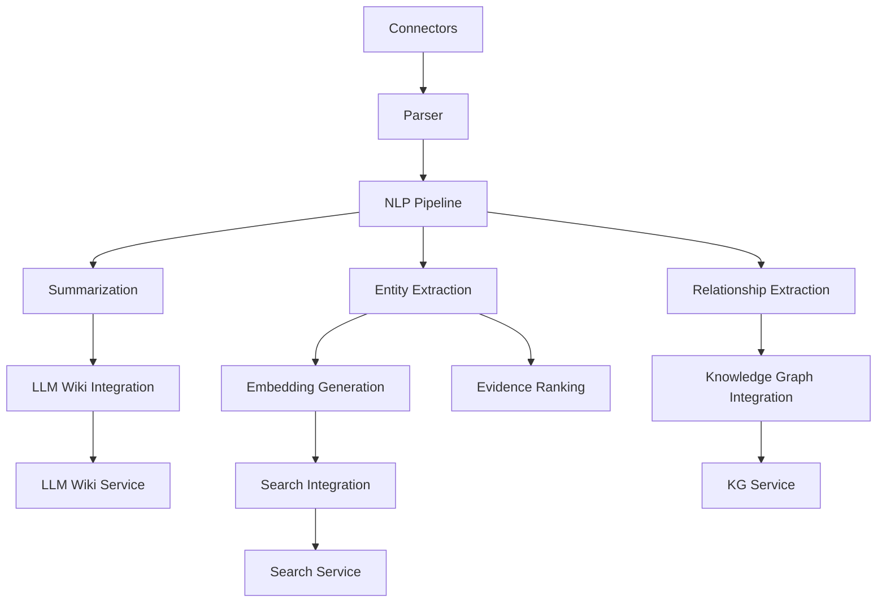
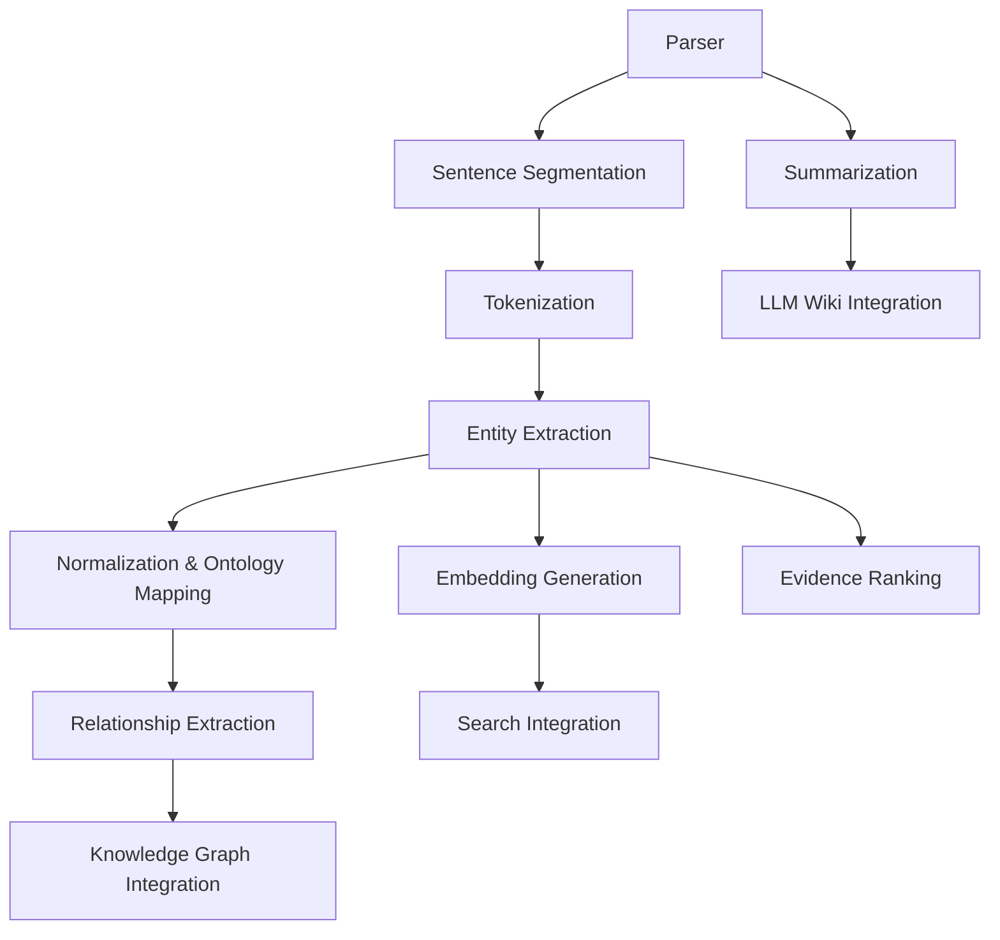

# AI-RxOS Literature Service

The Literature service is the Literature Intelligence bounded-context implementation for AI-RxOS. It provides ingestion, parsing, NLP extraction, summarization, evidence ranking, and structured handoff to external downstream services.

- Service port: **8082**
- Entry point: `app.main:app`
- Runtime: FastAPI

## Service Purpose

Prompt 6 status: fully completed for the Literature Intelligence bounded context. The service has been validated through static analysis, unit/integration tests, and live runtime smoke checks.

The Literature service prepares scientific and clinical literature for downstream knowledge systems by:

- ingesting content from literature sources and company websites
- parsing structured document metadata
- running biomedical NLP for entity and relationship extraction
- generating structured summaries
- producing deterministic embeddings
- integrating with search, knowledge graph, and LLM Wiki services
- exposing production health, readiness, and Prometheus metrics

## Architecture Overview



### High-level flow

1. Content is ingested through connectors.
2. Documents are normalized and parsed.
3. NLP performs sentence segmentation, tokenization, entity detection, normalization, mapping, and relationship extraction.
4. Summarization produces structured summaries.
5. Embeddings and external handoff services are prepared.
6. Metrics, health, and readiness are exposed for production observability.

## Folder Structure

```
services/literature/
├── app/
│   ├── connectors/        # Source connectors and adapters
│   ├── core/              # Configuration, security, lifespan
│   ├── database/          # PostgreSQL connection and schema management
│   ├── nlp/               # NLP pipeline, summarizer, entity extraction
│   ├── observability/     # Prometheus metrics definitions
│   ├── orchestrator/      # Ingestion job orchestration
│   ├── parsing/           # Document parsing and duplicate detection
│   ├── routers/           # FastAPI route definitions
│   ├── schemas.py         # Request/response data models
│   ├── services/          # External integrations (search, KG, LLM Wiki)
│   └── utils/             # Logging and helpers
├── tests/                 # Unit and integration tests
├── Dockerfile
└── requirements.txt
```

## Supported Literature Sources

The service supports ingestion from these sources:

- `pubmed` — PubMed API
- `pmc` — PubMed Central
- `clinicaltrials` — ClinicalTrials.gov
- `biorxiv` — bioRxiv
- `medrxiv` — medRxiv
- `patents` — Patent connector
- `company_website` — Company website HTML ingestion

## Pipeline

The Literature NLP pipeline executes the following stages:

1. Parser: normalize documents and extract structured metadata
2. Sentence segmentation
3. Tokenization
4. Entity extraction
5. Entity normalization and ontology mapping
6. Relationship extraction
7. Summarization
8. Embedding generation
9. Evidence ranking



## APIs

### Health and Observability

- `GET /healthz` — basic service liveness
- `GET /health` — API health
- `GET /live` — liveness indicator
- `GET /ready` — readiness check including dependencies
- `GET /metrics` — JSON service metrics
- `GET /metrics/prometheus` — Prometheus exposition format
- `GET /api/v1/health` — versioned health endpoint

### Document and NLP APIs

- `POST /api/v1/documents/parse`
  - Accepts document text content and format
  - Returns parsed metadata, duplicate detection status, and parser metrics

- `POST /api/v1/nlp/process`
  - Accepts document metadata
  - Returns NLP output including sentences, tokens, entities, relationships, and structured summary

### Ingestion APIs

- `POST /api/v1/ingestion`
  - Create an ingestion job for a supported source
- `GET /api/v1/ingestion/{job_id}`
  - Fetch ingestion job state
- `POST /api/v1/ingestion/{job_id}/trigger`
  - Trigger a queued job
- `POST /api/v1/ingestion/{job_id}/retry`
  - Retry a failed job
- `POST /api/v1/ingestion/{job_id}/cancel`
  - Cancel a job
- `GET /api/v1/ingestion/{job_id}/dead-letter`
  - Retrieve dead-letter items

### Paper APIs

- `GET /api/v1/papers` — list ingested papers
- `GET /api/v1/papers/{paper_id}` — retrieve a paper record

## Connectors

The connector layer handles source-specific ingestion and normalization.

- `app/connectors/*.py` contain connector implementations.
- `app/connectors/registry.py` maps source keys to connector implementations.
- `app/connectors/http_client.py` provides retry-safe HTTP access.

### Company Website Connector

- `app/connectors/company_website.py`
- Fetches HTML from a published company site
- Extracts metadata from `<meta>` tags
- Normalizes URL input
- Parses HTML to produce document metadata ready for the parser
- No NLP or KG processing is performed inside the connector

## Parser

The parser is responsible for document normalization and metadata extraction:

- `app/parsing/parser.py` handles HTML/XML parsing and PDF support
- `app/parsing/duplicates.py` detects duplicate documents by fingerprint
- `app/parsing/metrics.py` tracks parser-level metrics
- `app/parsing/__init__.py` exposes parser APIs

The parser produces canonical metadata such as title, authors, abstract, sections, references, tables, and figures.

## NLP

The NLP subsystem is implemented in `app/nlp/` and includes:

- Sentence segmentation (`SentenceSegmenter`)
- Biomedical tokenization (`BiomedicalTokenizer`)
- Entity extraction (`EntityExtractor`)
- Entity normalization (`EntityNormalizer`)
- Ontology mapping (`OntologyMapper`)
- Confidence scoring (`ConfidenceScorer`)
- Relationship extraction (`RelationshipExtractor`)
- Summarization (`SummarizerService`)

## Summarization

Summarization is handled by `app/nlp/summarizer.py`.

Responsibilities:

- generate an abstract summary
- extract key findings
- identify clinical relevance
- identify limitations
- produce a structured summary payload

## Entity Extraction

Entity extraction is performed in the NLP pipeline by:

- tokenizing source sentences
- applying rule-based biomedical entity heuristics
- normalizing entity values and mapping them to ontology identifiers
- assigning confidence scores

## Relationship Extraction

Relationship extraction is implemented in `app/nlp/relationship_extractor.py`.

Responsibilities:

- identify relationships between extracted entities
- infer predicates such as `treats`, `associated_with`, `interacts_with`, and `targets`
- attach provenance and confidence scoring
- capture relationships for downstream KG handoff

## Embedding Generation

Embeddings are generated by `app/nlp/embedding_service.py`.

This service:

- converts normalized NLP output into deterministic vector representations
- generates embedding batches
- exposes embedding metadata
- does not persist vectors internally

## Search Integration

Search integration is implemented in `app/services/search_integration.py`.

Responsibilities:

- prepare embedding payloads for the external search service
- submit payloads to `/api/v1/search/index`
- track handoff retries and failure metrics
- remain a thin client, not a search engine itself

## Knowledge Graph Integration

Knowledge graph handoff is implemented in `app/services/kg_integration.py`.

Responsibilities:

- translate literature entities and relationships into graph payloads
- publish nodes and relationships to external KG service endpoints
- support duplicate suppression and retries
- track KG handoff metrics

## LLM Wiki Integration

LLM Wiki integration is implemented in `app/services/llmwiki_integration.py`.

Responsibilities:

- package entities, relationships, and structured summaries into an LLM-ready payload
- submit updates to the LLM Wiki service
- retry on transient failures and emit update metrics

## Documentation files

This service also includes dedicated documentation for production usage and system understanding:

- `IMPLEMENTATION.md`
- `TESTING.md`
- `VALIDATION.md`
- `DEPLOYMENT.md`
- `API_REFERENCE.md`
- `ENVIRONMENT.md`
- `TROUBLESHOOTING.md`
- `PRODUCTION_CHECKLIST.md`
- `COMMANDS.md`

## Evidence Ranking

Evidence ranking is implemented in `app/services/evidence_ranking.py`.

Responsibilities:

- aggregate evidence from entities and relationships
- deduplicate overlapping evidence
- score evidence items using a lightweight ranking strategy
- attach provenance and ranking metadata

## Monitoring and Observability

Observability is built with Prometheus-compatible metrics and runtime instrumentation.

- `app/observability/metrics.py` defines Prometheus counters, gauges, and histograms
- HTTP middleware in `app/main.py` records
  - request count
  - request latency
  - in-flight requests
  - error counts
- service-specific metrics track NLP, embedding, search handoff, KG handoff, and evidence ranking

## Health Endpoints

Health endpoints expose runtime status and readiness.

- `/healthz` — basic liveness
- `/health` — service health
- `/live` — liveness indicator
- `/ready` — readiness and dependency status
- `/api/v1/health` — versioned health endpoint

Readiness includes:

- PostgreSQL connectivity
- search service availability
- KG service availability
- orchestrator metrics validity

## Metrics Endpoints

- `/metrics` — JSON health and metric summary
- `/metrics/prometheus` — Prometheus exposition format

## Configuration

Runtime configuration is defined in `app/core/config.py`.

Key configuration values:

- `environment`
- `log_level`
- `database_url`
- `redis_url`
- `neo4j_uri`, `neo4j_user`, `neo4j_password`
- `opensearch_url`
- `search_service_url`
- `search_service_timeout_seconds`
- `search_service_max_retries`
- `kg_service_url`
- `kg_service_timeout_seconds`
- `kg_service_max_retries`
- `llmwiki_service_url`
- `llmwiki_service_timeout_seconds`
- `llmwiki_service_max_retries`
- `jwt_secret`
- `pubmed_base_url`
- `pmc_base_url`
- `clinicaltrials_base_url`
- `biorxiv_base_url`
- `medrxiv_base_url`

## Environment Variables

The service supports configuration through environment variables matching `app/core/config.py` settings.

In production, sensitive values must not be checked in or left at defaults. `JWT_SECRET` is required and should be a strong secret value with at least 32 characters.

Common variables:

- `ENVIRONMENT`
- `LOG_LEVEL`
- `DATABASE_URL`
- `REDIS_URL`
- `NEO4J_URI`
- `NEO4J_USER`
- `NEO4J_PASSWORD`
- `OPENSEARCH_URL`
- `SEARCH_SERVICE_URL`
- `SEARCH_SERVICE_TIMEOUT_SECONDS`
- `SEARCH_SERVICE_MAX_RETRIES`
- `KG_SERVICE_URL`
- `KG_SERVICE_TIMEOUT_SECONDS`
- `KG_SERVICE_MAX_RETRIES`
- `LLMWIKI_SERVICE_URL`
- `LLMWIKI_SERVICE_TIMEOUT_SECONDS`
- `LLMWIKI_SERVICE_MAX_RETRIES`
- `JWT_SECRET`
- `CORS_ALLOWED_ORIGINS`
- `PUBMED_BASE_URL`
- `PMC_BASE_URL`
- `CLINICALTRIALS_BASE_URL`
- `BIORXIV_BASE_URL`
- `MEDRXIV_BASE_URL`

## Running Locally

Install dependencies and start the FastAPI app:

```bash
cd services/literature
python -m pip install -r requirements.txt
uvicorn app.main:app --reload --host 0.0.0.0 --port 8082
```

The service is available at `http://localhost:8082`.

## Running with Docker

Build the Docker image:

```bash
docker build -f services/literature/Dockerfile -t ai-rxos-literature:latest .
```

Run the container:

```bash
docker run --rm -p 8082:8082 \
  -e DATABASE_URL="postgresql://..." \
  -e SEARCH_SERVICE_URL="http://search:8084" \
  -e KG_SERVICE_URL="http://kg:8083" \
  -e LLMWIKI_SERVICE_URL="http://llmwiki:8086" \
  ai-rxos-literature:latest
```

## Testing

Run the Literature service test suite with pytest:

```bash
cd services/literature
python -m pytest -q
```

The repository includes targeted tests for connectors, NLP pipeline, ingest orchestration, and external service handoff.

## Production Deployment

In production, deploy the service with:

- PostgreSQL as the persistent store
- External search service available at `SEARCH_SERVICE_URL`
- External KG service available at `KG_SERVICE_URL`
- External LLM Wiki service available at `LLMWIKI_SERVICE_URL`
- Prometheus scraping `/metrics/prometheus`
- Readiness probes pointing to `/ready`

### Recommended container pattern

- Build from `services/literature/Dockerfile`
- Configure the service with environment variables
- Expose port `8082`
- Use a process manager or orchestration platform to manage lifecycle and health checks

## Notes

- The Literature service is intentionally lightweight and does not implement its own OpenSearch, Neo4j, vector database, or LLM hosting.
- External system integrations are handled through dedicated handoff clients.
- The service is designed for prompt 6 scope: structured literature intelligence, ingestion, extraction, summarization, and integration.
